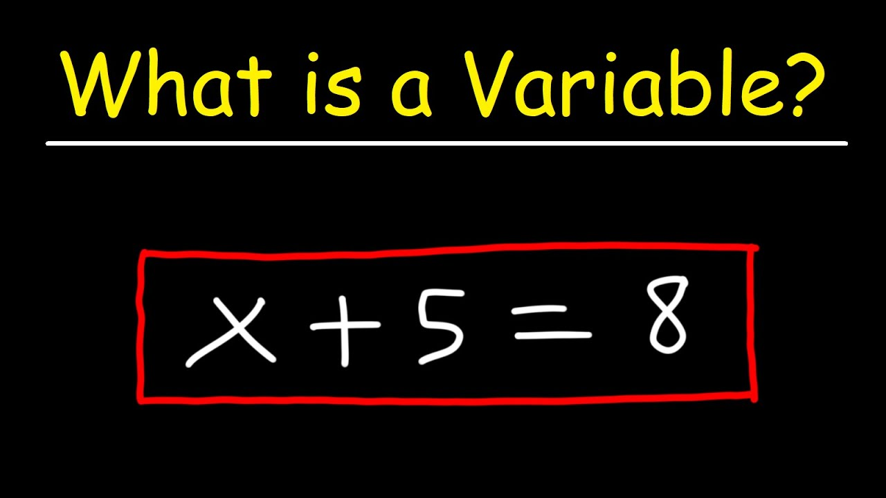

# BÀI 2 – BIẾN VÀ KIỂU DỮ LIỆU TRONG DART

## Mục lục

- [1. Mục tiêu buổi học](#1-mục-tiêu-buổi-học)
- [2. Biến là gì?](#2-biến-là-gì)
- [3. Kiểu dữ liệu cơ bản](#3-kiểu-dữ-liệu-cơ-bản)
- [4. Null safety cơ bản](#4-null-safety-cơ-bản)
- [5. Khai báo kiểu dữ liệu](#5-khai-báo-kiểu-dữ-liệu)
- [6. Hệ thống Toán tử trong Dart](#6-hệ-thống-toán-tử-trong-dart)
- [7. Chuyển kiểu số và làm tròn](#7-chuyển-kiểu-số-và-làm-tròn)
- [8. String interpolation](#8-string-interpolation)
- [9. Bộ bài tập thực hành (ĐỀ BÀI)](#9-bộ-bài-tập-thực-hành-đề-bài)
- [10. Bài tập về nhà](#10-bài-tập-về-nhà)
- [11. Ôn tập cuối buổi](#11-ôn-tập-cuối-buổi)
- [12. Tóm tắt nhanh](#12-tóm-tắt-nhanh)
- [PHỤ LỤC – LỜI GIẢI MẪU](#phụ-lục--lời-giải-mẫu)

---

## 1. Mục tiêu buổi học
Sau buổi học này, bạn sẽ:
- Hiểu biến và cách đặt tên biến.
- Sử dụng các kiểu dữ liệu cơ bản: **Numbers (`int`, `double`)**, `String`, `bool`, **Records**, **Collections** (List, Set, Map – mức cơ bản).
- Nắm **null safety**: non-nullable, nullable (`?`), khởi tạo an toàn.
- Phân biệt và sử dụng `var`, `final`, `const`.
- Nắm **hệ thống toán tử**: số học, so sánh, gán, logic, **ba ngôi**.
- Chuyển kiểu số và làm tròn; dùng **string interpolation**.

---

## 2. Biến là gì?

- Biến là “ô nhớ có tên” để lưu dữ liệu; giá trị có thể thay đổi trong lúc chạy.
- Quy tắc đặt tên: không bắt đầu bằng số; không dùng từ khoá; **camelCase**; tên có nghĩa: `studentName`, `targetScore`.

Ví dụ:
```dart
int age = 16;
String studentName = 'Lan Anh';
print('Tên: $studentName, Tuổi: $age');
```

---

## 3. Kiểu dữ liệu cơ bản


### 3.1. Numbers (Số học)
- `int`: số nguyên.
  ```dart
  int year = 2025;
  ```
- `double`: số thực (có phần thập phân).
  ```dart
  double height = 1.65;
  ```

### 3.2. String (Chuỗi)
```dart
String name = 'Minh';
```

### 3.3. bool (Logic)
```dart
bool isPassed = true;
```

### 3.4. Records (Bản ghi)
- Gom nhiều giá trị thành một nhóm (không cần class).
```dart
(String, int) student = ('Lan', 16);
print(student.$1); // Lan
print(student.$2); // 16
```

### 3.5. Collections (Tập hợp – mức cơ bản)
- **List** (có thứ tự, cho phép trùng):
  ```dart
  List<int> scores = [8, 9, 7];
  print(scores[0]); // 8
  ```
- **Set** (không trùng lặp):
  ```dart
  Set<String> fruits = {'apple', 'banana', 'apple'};
  print(fruits); // {apple, banana}
  ```
- **Map** (cặp key-value):
  ```dart
  Map<String, int> ages = {'Minh': 16, 'Lan': 17};
  print(ages['Lan']); // 17
  ```

---

## 4. Null safety cơ bản
- Mặc định biến là **non-nullable** (không được null).
- Thêm `?` để cho phép null (**nullable**).
```dart
int age = 18;   // non-nullable
int? grade;     // nullable
grade = null;   // hợp lệ vì có ?
```

---

## 5. Khai báo kiểu dữ liệu
- `var`: suy luận kiểu, **được phép** gán lại giá trị cùng kiểu.
- `final`: gán **một lần** lúc chạy.
- `const`: hằng số **biết tại thời điểm biên dịch**.
```dart
var score = 9;     // int
score = 10;        // OK

final piApprox = 3.14;
// piApprox = 3.14159; // Không được

const schoolName = 'ABC High School';
```

---

## 6. Hệ thống Toán tử trong Dart


### 6.1. Toán tử số học
| Toán tử | Ý nghĩa                  | Ví dụ      | Kết quả     |
|--------|--------------------------|------------|-------------|
| `+`    | cộng                     | `7 + 3`    | `10`        |
| `-`    | trừ                      | `7 - 3`    | `4`         |
| `*`    | nhân                     | `7 * 3`    | `21`        |
| `/`    | chia (kết quả `double`)  | `7 / 3`    | `2.333…`    |
| `%`    | chia lấy dư              | `7 % 3`    | `1`         |
| `~/`   | chia lấy phần nguyên     | `7 ~/ 3`   | `2`         |

> Tham khảo thêm: `++`, `--` (tăng/giảm 1).

### 6.2. Toán tử so sánh (trả về `bool`)
| Toán tử | Ý nghĩa             | Ví dụ     | Kết quả |
|--------|----------------------|-----------|---------|
| `==`   | bằng                 | `5 == 5`  | `true`  |
| `!=`   | khác                 | `5 != 3`  | `true`  |
| `>`    | lớn hơn              | `5 > 3`   | `true`  |
| `<`    | nhỏ hơn              | `5 < 3`   | `false` |
| `>=`   | lớn hơn hoặc bằng    | `5 >= 5`  | `true`  |
| `<=`   | nhỏ hơn hoặc bằng    | `3 <= 5`  | `true`  |

### 6.3. Toán tử gán
| Cú pháp     | Ý nghĩa                     | Ví dụ      |
|-------------|------------------------------|------------|
| `=`         | gán                          | `a = 5`    |
| `+=`, `-=`  | gán cộng/trừ                 | `a += 2`   |
| `*=`, `/=`  | gán nhân/chia                | `a *= 3`   |
| `~/=`, `%=` | gán chia nguyên/lấy dư       | `a ~/= 2`  |

### 6.4. Toán tử logic (trả về `bool`)
| Toán tử | Ý nghĩa        | Ví dụ             | Kết quả |
|--------|-----------------|-------------------|---------|
| `&&`   | và (AND)        | `true && false`   | `false` |
| `||`   | hoặc (OR)       | `true || false`   | `true`  |
| `!`    | phủ định (NOT)  | `!true`           | `false` |

### 6.5. Toán tử ba ngôi (ternary)
- Cú pháp: `condition ? valueIfTrue : valueIfFalse`
- Trả về **một giá trị** theo điều kiện.
```dart
int age = 18;
String canVote = (age >= 18) ? 'Được bầu cử' : 'Chưa đủ tuổi';
print(canVote);
```
- Có thể **lồng nhau** để thay thế chuỗi `if/else` đơn giản (lưu ý: dễ khó đọc nếu quá nhiều nhánh).

---

## 7. Chuyển kiểu số và làm tròn

### 7.1. Chuyển đổi giữa `int` và `double`
- **`toInt()`**: chuyển `double` thành `int` (cắt phần thập phân, không làm tròn).
- **`toDouble()`**: chuyển `int` thành `double`.

```dart
double x = 8.7;
print(x.toInt());    // 8

int y = 5;
print(y.toDouble()); // 5.0
```

### 7.2. Làm tròn số thực (`double`)
- **`toStringAsFixed(n)`**: chuyển số thành chuỗi, làm tròn đến `n` chữ số thập phân.
- **`toStringAsPrecision(n)`**: chuyển số thành chuỗi, giữ `n` chữ số có nghĩa.
- **`round()`**: làm tròn về số nguyên gần nhất.
- **`ceil()`**: làm tròn lên (luôn lớn hơn hoặc bằng).
- **`floor()`**: làm tròn xuống (luôn nhỏ hơn hoặc bằng).

```dart
double z = 3.14159;
print(z.toStringAsFixed(2));    // "3.14"
print(z.toStringAsPrecision(3)); // "3.14"
print(z.round());               // 3
print(z.ceil());                // 4
print(z.floor());               // 3
```

### 7.3. Chuyển đổi kiểu dữ liệu từ chuỗi
- **`int.parse()`**: chuyển chuỗi thành số nguyên.
- **`double.parse()`**: chuyển chuỗi thành số thực.

```dart
String s1 = '42';
int n1 = int.parse(s1);         // 42

String s2 = '3.14';
double n2 = double.parse(s2);   // 3.14
```

> **Lưu ý:** Nếu chuỗi không hợp lệ sẽ gây lỗi. Có thể dùng `tryParse()` để tránh lỗi khi chuyển đổi.

```dart
String s = 'abc';
int? n = int.tryParse(s); // null nếu không chuyển được
```

---

## 8. String interpolation
- `$variable` chèn biến; `${expression}` chèn biểu thức.
```dart
String name = 'Mai';
int age = 17;
print('Tên: $name, Năm sau: ${age + 1}');
```

---

## 9. Bộ bài tập thực hành (ĐỀ BÀI)


### Bài 1 – String interpolation
- Khai báo: `age` (int), `name` (String), `height` (double).
- In: `Xin chào, tôi là [name], năm nay tôi [age] tuổi và cao [height] mét.`

### Bài 2 – Tính toán
- Khai báo `number1`, `number2`.
- Tính tổng, hiệu, tích, thương.
- In kết quả bằng interpolation.

### Bài 3 – Thông tin sinh viên
- Khai báo: họ tên, tuổi, điểm TB, giới tính, MSSV.
- Gán giá trị và in thông tin.
- (Tuỳ chọn) Gom nhóm bằng Record.

### Bài 4 – Hình chữ nhật (homework)
- Tính diện tích và chu vi từ chiều dài, rộng.
- In kết quả bằng interpolation.

### Bài 5 – GPA & quy đổi điểm chữ (dùng toán tử ba ngôi)
- Tính `avg` từ 3 môn.
- GPA ≈ `avg / 2.5`.
- Quy đổi A/B/C/D/F bằng toán tử ba ngôi.

---

## 10. Bài tập về nhà
1. Hoàn thiện các bài 1–5.  
2. Viết thêm bài dùng `List<double>` lưu điểm 5 môn, tính trung bình bằng vòng lặp `for`.  
3. Nộp bài qua GitHub (thư mục `lesson02`).  

---

## 11. Ôn tập cuối buổi
1. Khác biệt `var`, `final`, `const`?  
2. `int` và `double` thuộc nhóm dữ liệu nào?  
3. Ý nghĩa của `?` trong Dart?  
4. Liệt kê 5 nhóm toán tử đã học.  

---

## 12. Tóm tắt nhanh
```dart
// Numbers
int a = 7;
double b = 3.5;

// String & bool
String name = 'Hoa';
bool ok = true;

// Record
(String, int) info = ('Nam', 17);

// Collections
List<int> xs = [1, 2, 3];
Set<String> tags = {'a', 'b'};
Map<String, int> map = {'A': 1, 'B': 2};

// Operators
var sum = a + b;            // số học
var same = (a == 7);        // so sánh
a += 2;                     // gán
bool canPass = ok && same;  // logic

// Ternary
String res = (a > 5) ? 'Lớn hơn 5' : 'Không lớn hơn 5';
```

---

## PHỤ LỤC – LỜI GIẢI MẪU

### Bài 1
```dart
void main() {
  int age = 16;
  String name = 'Nguyen Minh';
  double height = 1.68;
  print('Xin chào, tôi là $name, năm nay tôi $age tuổi và cao $height mét.');
}
```

### Bài 2
```dart
void main() {
  int number1 = 7;
  int number2 = 3;

  int sum = number1 + number2;
  int difference = number1 - number2;
  int product = number1 * number2;
  double quotient = number1 / number2;

  print('Tổng: $sum, Hiệu: $difference, Tích: $product, Thương: $quotient');
}
```

### Bài 3
```dart
void main() {
  String fullName = 'Tran Ha';
  int age = 17;
  double gpa = 8.2;
  String gender = 'Nữ';
  String studentId = 'SV2025A01';

  print('Sinh viên: $fullName, Tuổi: $age, GPA: $gpa, Giới tính: $gender, MSSV: $studentId');
}
```

### Bài 4
```dart
void main() {
  double length = 5.2;
  double width = 3.4;

  double area = length * width;
  double perimeter = 2 * (length + width);

  print('Diện tích: $area, Chu vi: $perimeter');
}
```

### Bài 5 (GPA với toán tử ba ngôi)
```dart
void main() {
  double math = 8.5, english = 7.0, physics = 9.0;

  double avg = (math + english + physics) / 3;
  double gpa = avg / 2.5;

  String grade = (avg >= 8.5) ? 'A'
                : (avg >= 7.0) ? 'B'
                : (avg >= 5.5) ? 'C'
                : (avg >= 4.0) ? 'D'
                : 'F';

  print('Điểm TB: ${avg.toStringAsFixed(2)}, GPA: ${gpa.toStringAsFixed(2)}, Điểm chữ: $grade');
}
```
