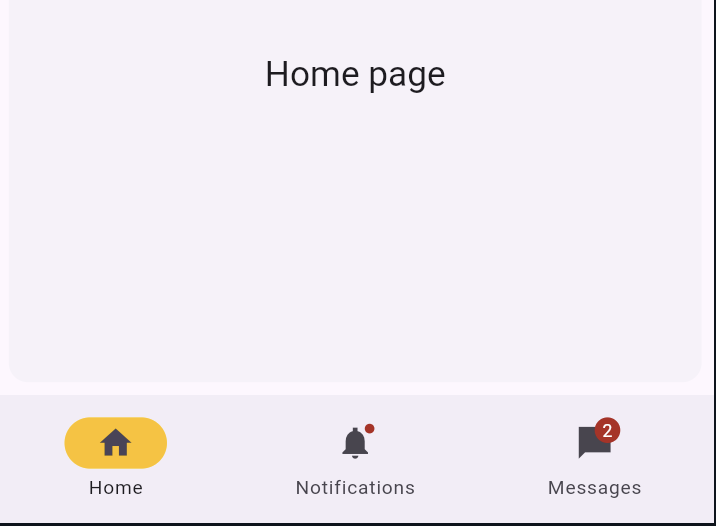
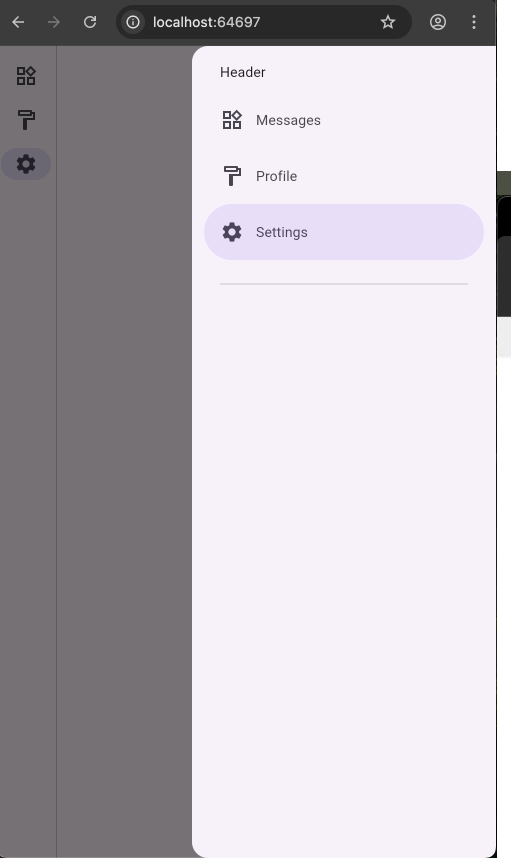
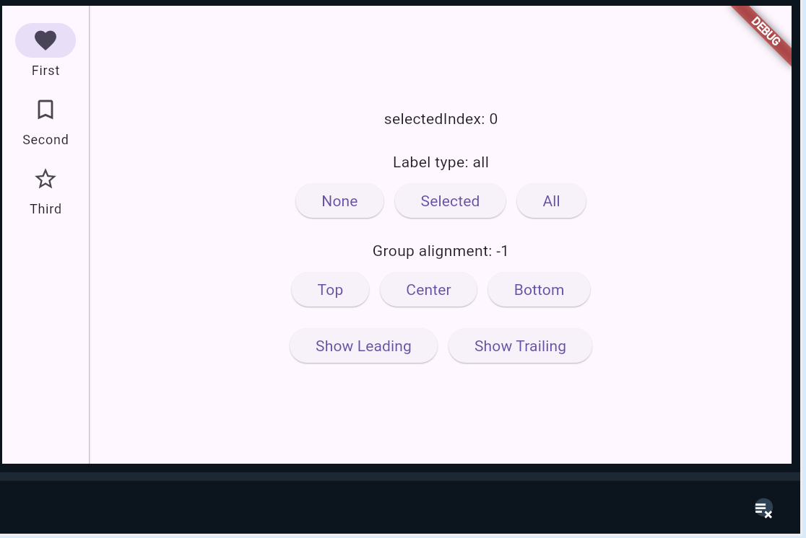

---

## **Flutter Navigation: 3 pattern Phổ Biến Cần Biết**

Navigation là xương sống của mọi ứng dụng. Trong Flutter, có nhiều cách để người dùng di chuyển qua lại giữa các màn hình. Đây là 3 widget navigation bạn sẽ gặp và dùng nhiều nhất: **NavigationBar**, **NavigationDrawer**, và **NavigationRail**.

Tại sao cần nhiều kiểu? Mỗi kiểu phục vụ một mục đích và phù hợp với kích thước màn hình khác nhau. Chọn đúng giúp app trực quan và dễ dùng hơn.

### **1. NavigationBar (Thanh điều hướng dưới cùng)**



- **Là gì:** Thanh bar cố định ở cuối màn hình, chứa các icon/label.
- **Khi dùng:** Phổ biến nhất cho app mobile. Dùng để chuyển giữa các màn hình chính, quan trọng, thường xuyên truy cập. Phù hợp với màn hình nhỏ.

**Code:**

**Dart**
```dart
`import 'package:flutter/material.dart';

void main() => runApp(const MyApp());

class MyApp extends StatelessWidget {
  const MyApp({Key? key}) : super(key: key);

  @override
  Widget build(BuildContext context) {
    return const MaterialApp(
      title: 'NavigationBar Demo',
      home: NavigationBarExample(),
    );
  }
}

class NavigationBarExample extends StatefulWidget {
  const NavigationBarExample({Key? key}) : super(key: key);

  @override
  State<NavigationBarExample> createState() => _NavigationBarExampleState();
}

class _NavigationBarExampleState extends State<NavigationBarExample> {
  int _selectedIndex = 0;
  static const List<Widget> _pages = <Widget>[
    Center(child: Text('Trang Chủ', style: TextStyle(fontSize: 30))),
    Center(child: Text('Cài Đặt', style: TextStyle(fontSize: 30))),
    Center(child: Text('Hồ Sơ', style: TextStyle(fontSize: 30))),
  ];

  void _onItemTapped(int index) {
    setState(() {
      _selectedIndex = index;
    });
  }

  @override
  Widget build(BuildContext context) {
    return Scaffold(
      appBar: AppBar(title: const Text('NavigationBar Demo')),
      body: _pages[_selectedIndex], // Hiển thị trang tương ứng
      bottomNavigationBar: NavigationBar(
        selectedIndex: _selectedIndex,
        onDestinationSelected: _onItemTapped, // Xử lý khi chọn item
        destinations: const <NavigationDestination>[
          NavigationDestination(
            icon: Icon(Icons.home),
            label: 'Home',
          ),
          NavigationDestination(
            icon: Icon(Icons.settings),
            label: 'Settings',
          ),
          NavigationDestination(
            icon: Icon(Icons.person),
            label: 'Profile',
          ),
        ],
      ),
    );
  }
}`
```

- **Giải thích:**
    - `Scaffold` có `bottomNavigationBar`.
    - `NavigationBar` cần `selectedIndex` (đang chọn mục nào) và `onDestinationSelected` (callback khi người dùng chạm).
    - `destinations` là list các `NavigationDestination`, mỗi cái là một item trên bar.
    - Trong `_onItemTapped`, update `_selectedIndex` bằng `setState` để rebuild widget, hiển thị trang mới.

### **2. NavigationDrawer (Menu trượt)**

- **Là gì:** Menu trượt ra từ cạnh màn hình (thường là trái), che phủ một phần hoặc toàn bộ màn hình.
- **Khi dùng:** Khi có nhiều mục điều hướng, ít quan trọng bằng các mục trên NavigationBar, hoặc dùng cho các chức năng phụ như cài đặt nâng cao, trợ giúp... Phù hợp khi không muốn thanh navigation cố định chiếm diện tích.

**Code:**

**Dart**
```dart
`import 'package:flutter/material.dart';

/// Flutter code sample for [NavigationDrawer].

void main() => runApp(const NavigationDrawerApp());

class NavigationDrawerApp extends StatelessWidget {
  const NavigationDrawerApp({super.key});

  @override
  Widget build(BuildContext context) {
    return MaterialApp(
      debugShowCheckedModeBanner: false,
      theme: ThemeData(useMaterial3: true),
      home: const NavigationDrawerExample(),
    );
  }
}

class NavigationDrawerExample extends StatefulWidget {
  const NavigationDrawerExample({super.key});

  @override
  State<NavigationDrawerExample> createState() =>
      _NavigationDrawerExampleState();
}

class _NavigationDrawerExampleState extends State<NavigationDrawerExample> {
  final GlobalKey<ScaffoldState> scaffoldKey = GlobalKey<ScaffoldState>();

  int screenIndex = 0;

  void handleScreenChanged(int selectedScreen) {
    setState(() {
      screenIndex = selectedScreen;
      scaffoldKey.currentState!.closeEndDrawer();
    });
  }

  void openDrawer() {
    scaffoldKey.currentState!.openEndDrawer();
  }

  @override
  Widget build(BuildContext context) {
    return Scaffold(
      key: scaffoldKey,
      appBar: AppBar(
        title: const Text('Navigation Drawer Example'),
        actions: <Widget>[
          IconButton(
            icon: const Icon(Icons.menu),
            onPressed: () {
              scaffoldKey.currentState!.openEndDrawer();
            },
          ),
        ],
      ),
      body: SafeArea(
        child: Center(child: Text('Page Index = $screenIndex')),
      ),
      endDrawer: NavigationDrawer(
        onDestinationSelected: handleScreenChanged,
        selectedIndex: screenIndex,
        children: const <Widget>[
          NavigationDrawerDestination(
            icon: Icon(Icons.widgets_outlined),
            label: Text('Messages'),
          ),
          NavigationDrawerDestination(
            icon: Icon(Icons.format_paint_outlined),
            label: Text('Profile'),
          ),
          NavigationDrawerDestination(
            icon: Icon(Icons.settings_outlined),
            label: Text('Settings'),
          ),
          Padding(
            padding: EdgeInsets.fromLTRB(28, 16, 28, 10),
            child: Divider(),
          ),
        ],
      ),
    );
  }
}`
```

- **Giải thích:**
    - Thêm widget `Drawer` vào thuộc tính `drawer` của `Scaffold`.
    - Bên trong `Drawer` thường dùng `ListView` chứa các `ListTile` đại diện cho từng mục.
    - Khi chạm vào `ListTile`, xử lý navigation và gọi `Navigator.pop(context)` để đóng drawer.
    - Icon menu 3 gạch sẽ tự động xuất hiện trên AppBar nếu có `drawer`.

### **3. NavigationRail (Thanh điều hướng bên)**


- **Là gì:** Thanh điều hướng cố định nằm ở cạnh màn hình (thường là trái), hiển thị liên tục.
- **Khi dùng:** Phù hợp với màn hình lớn hơn (tablet, desktop) nơi có đủ không gian. Cung cấp khả năng truy cập nhanh các mục điều hướng chính mà không cần đóng mở như Drawer.

**Code:**

**Dart**
```dart
`import 'package:flutter/material.dart';

void main() => runApp(const MyApp());

class MyApp extends StatelessWidget {
  const MyApp({Key? key}) : super(key: key);

  @override
  Widget build(BuildContext context) {
    return const MaterialApp(
      title: 'NavigationRail Demo',
      home: NavigationRailExample(),
    );
  }
}

class NavigationRailExample extends StatefulWidget {
  const NavigationRailExample({Key? key}) : super(key: key);

  @override
  State<NavigationRailExample> createState() => _NavigationRailExampleState();
}

class _NavigationRailExampleState extends State<NavigationRailExample> {
  int _selectedIndex = 0;
  static const List<Widget> _pages = <Widget>[
    Center(child: Text('Dashboard', style: TextStyle(fontSize: 30))),
    Center(child: Text('Orders', style: TextStyle(fontSize: 30))),
    Center(child: Text('Customers', style: TextStyle(fontSize: 30))),
  ];

  @override
  Widget build(BuildContext context) {
    return Scaffold(
      body: Row( // Dùng Row để đặt NavigationRail và nội dung cạnh nhau
        children: <Widget>[
          NavigationRail(
            selectedIndex: _selectedIndex,
            onDestinationSelected: (int index) {
              setState(() {
                _selectedIndex = index;
              });
            },
            labelType: NavigationRailLabelType.all, // Hiển thị cả icon và label
            destinations: const <NavigationRailDestination>[
              NavigationRailDestination(
                icon: Icon(Icons.dashboard),
                selectedIcon: Icon(Icons.dashboard),
                label: Text('Dashboard'),
              ),
              NavigationRailDestination(
                icon: Icon(Icons.workspaces_outline),
                selectedIcon: Icon(Icons.workspaces),
                label: Text('Orders'),
              ),
              NavigationRailDestination(
                icon: Icon(Icons.person_outline),
                selectedIcon: Icon(Icons.person),
                label: Text('Customers'),
              ),
            ],
          ),
          const VerticalDivider(thickness: 1, width: 1), // Đường phân cách
          Expanded( // Phần còn lại của màn hình hiển thị nội dung
            child: _pages[_selectedIndex],
          ),
        ],
      ),
    );
  }
}`
```
- **Giải thích:**
    - Thường đặt `NavigationRail` bên trong một `Row` cùng với nội dung chính của trang (thường bọc trong `Expanded`).
    - Cần `selectedIndex`, `onDestinationSelected`, và `destinations` tương tự `NavigationBar`.
    - `labelType` điều khiển cách hiển thị label (icon thôi, label thôi, hay cả hai).
    - `NavigationRailDestination` cũng có `icon` và `label`.

### **Tóm Lại**

- **NavigationBar:** Dưới cùng, màn hình nhỏ, các mục chính.
- **NavigationDrawer:** Kéo từ cạnh, nhiều mục, ít ưu tiên hơn, màn hình nhỏ/lớn đều dùng được.
- **NavigationRail:** Cạnh bên, cố định, màn hình lớn, các mục chính/phụ.

Chọn đúng widget navigation giúp app của bạn chuyên nghiệp và dễ dùng hơn. Thực hành code trên để nắm rõ nhé. Chúc bạn code vui vẻ!

---