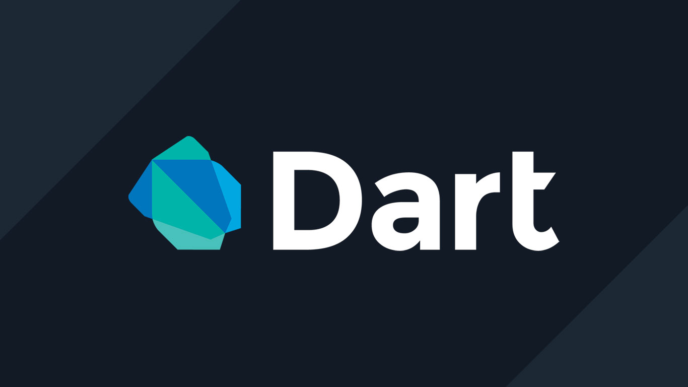
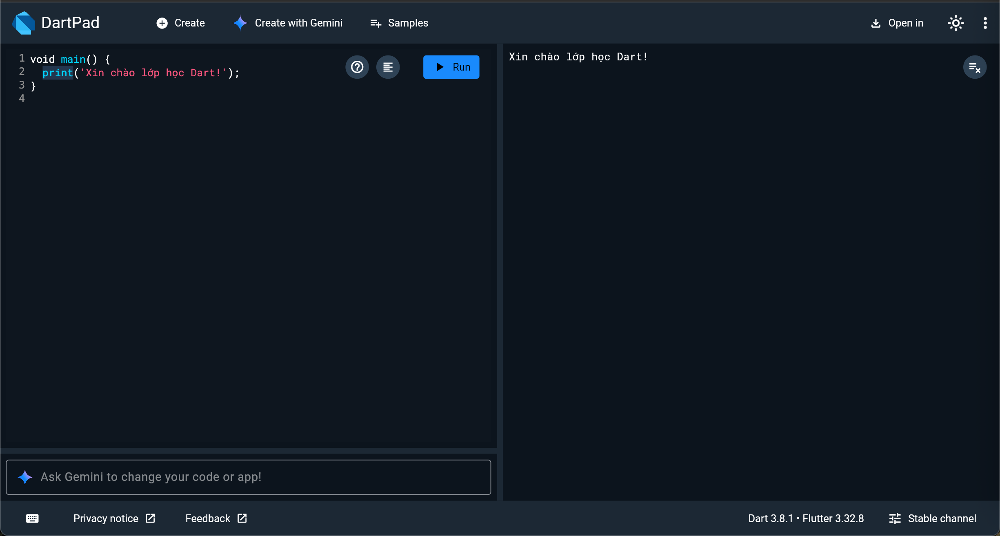
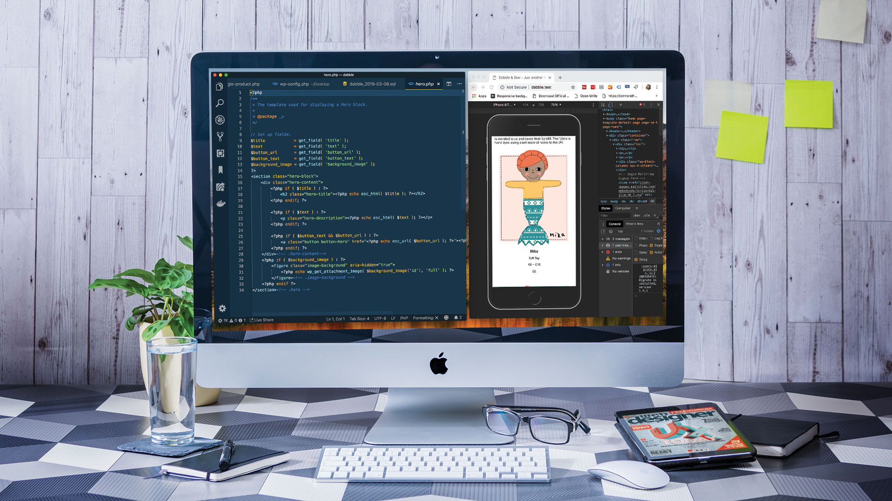

# BÀI 1 – GIỚI THIỆU LẬP TRÌNH VỚI DART

## Mục lục

- [1. Mục tiêu buổi học](#1-mục-tiêu-buổi-học)
- [2. Lập trình là gì?](#2-lập-trình-là-gì)
- [3. Làm quen với ngôn ngữ Dart](#3-làm-quen-với-ngôn-ngữ-dart)
- [4. Viết chương trình đầu tiên với DartPad](#4-viết-chương-trình-đầu-tiên-với-dartpad)
- [5. Cài đặt môi trường lập trình](#5-cài-đặt-môi-trường-lập-trình)
- [6. Làm quen với terminal / command prompt](#6-làm-quen-với-terminal--command-prompt)
- [7. Giới thiệu Git và GitHub](#7-giới-thiệu-git-và-github)
- [8. Mini Project: Hồ sơ học sinh – Phần 1](#8-mini-project-hồ-sơ-học-sinh--phần-1)
- [9. Bài tập về nhà](#9-bài-tập-về-nhà)
- [10. Ôn tập cuối buổi](#10-ôn-tập-cuối-buổi)
- [11. Tóm tắt lệnh quan trọng](#11-tóm-tắt-lệnh-quan-trọng)

---

## 1. Mục tiêu buổi học

Sau buổi hôm nay, bạn sẽ:

- Hiểu lập trình là gì và vì sao nó quan trọng.
- Biết các ngôn ngữ lập trình phổ biến và mục đích sử dụng của chúng.
- Làm quen với ngôn ngữ Dart.
- Viết được chương trình đầu tiên bằng Dart.
- Biết sử dụng DartPad, cài đặt VS Code và Dart extension.
- Làm quen với terminal và GitHub.
- Hoàn thành Mini Project: Hồ sơ Học sinh – Phần 1.

---

## 2. Lập trình là gì?


### 2.1. Định nghĩa

Lập trình là quá trình tạo ra các chỉ dẫn (mã lệnh) để máy tính thực hiện những nhiệm vụ cụ thể theo yêu cầu của con người, như: tính toán, hiển thị thông tin, lưu trữ dữ liệu, xử lý hình ảnh, kết nối mạng, v.v.

### 2.2. Ứng dụng thực tế

- Ứng dụng điện thoại (Zalo, Tiktok, Grab)
- Website (báo điện tử, học trực tuyến, ngân hàng online)
- Game, phần mềm đồ họa, AI, điều khiển robot, máy bay không người lái, v.v.

### 2.3. Một số ngôn ngữ lập trình phổ biến

| Ngôn ngữ   | Mục đích sử dụng chính                                       |
|------------|---------------------------------------------------------------|
| Python     | Dễ học, dùng nhiều trong AI, tự động hóa, xử lý dữ liệu      |
| Java       | Ứng dụng doanh nghiệp, Android, hệ thống lớn                 |
| JavaScript | Web, giao diện người dùng                                    |
| C/C++      | Điều khiển phần cứng, game engine, hệ điều hành              |
| C#         | Ứng dụng Windows, web, game với Unity             |
| Dart       | Dùng để viết ứng dụng mobile, web và desktop với Flutter     |

---

## 3. Làm quen với ngôn ngữ Dart
Bạn có thể sử dụng ảnh minh họa về khả năng đa nền tảng của Flutter:



### 3.1. Dart là gì?

- Dart là ngôn ngữ do **Google phát triển**.
- Được thiết kế để viết ứng dụng **đa nền tảng**: 
  - **Mobile**: iOS, Android
  - **Web**: Progressive Web Apps (PWA), web applications
  - **Desktop**: Windows, macOS, Linux
  - **Embedded**: IoT devices, smart displays
- Sử dụng phổ biến với **Flutter** – framework làm app hiện đại.

### 3.2. Ưu điểm của Dart

- Cú pháp rõ ràng, dễ học với người mới bắt đầu.
- Tích hợp tốt với công cụ như DartPad và VS Code.
- Được cộng đồng lập trình viên hỗ trợ mạnh mẽ.

---

## 4. Viết chương trình đầu tiên với DartPad


### 4.1. Dùng công cụ DartPad

- Truy cập: https://dartpad.dev
- Viết và chạy code trực tiếp trên trình duyệt.

### 4.2. Mã ví dụ

```dart
void main() {
  print('Xin chào lớp học Dart!');
}
```

### 4.3. Giải thích

- `main()` là điểm bắt đầu của chương trình.
- `print()` dùng để in ra nội dung.
- `'...'` là chuỗi văn bản.
- `//` là dòng chú thích (comment).
- `Run button` là nút chạy chương trình.
- `Ctrl+Enter` hoặc `CMD+Enter` là nút chạy chương 

### 4.4. Thực hành

- Thay đổi lời chào thành phần giới thiệu thông tin của bạn
- Thêm dòng in ra lớp, trường, số điện thoại, địa chỉ, sở thích và ước mơ nghề nghiệp tương lai

---

## 5. Cài đặt môi trường lập trình




### 5.1. Cài đặt VS Code

- Truy cập: https://code.visualstudio.com
- Tải về và cài đặt.

### 5.2. Cài Dart và Flutter Extension

- Mở VS Code → mở tab Extensions (`Ctrl+Shift+X`)
- Tìm và cài:
  - Dart
  - Flutter
- Khởi động lại VS Code sau khi cài xong.

---

## 6. Làm quen với terminal / command prompt

### 6.1. Terminal là gì?

Công cụ dòng lệnh giúp thao tác nhanh hơn: tạo thư mục, chạy chương trình, quản lý mã nguồn...

### 6.2. Một số lệnh cơ bản
| Tác vụ                | Windows           | macOS/Linux        |
|-----------------------|-------------------|--------------------|
| Liệt kê thư mục       | `dir`             | `ls`               |
| Vào thư mục           | `cd <ten>`        | `cd <ten>`         |
| Lùi một cấp           | `cd ..`           | `cd ..`            |
| Tạo thư mục mới       | `mkdir <ten>`     | `mkdir <ten>`      |
| Xóa file              | `del <ten>.txt`   | `rm <ten>.txt`     |
| Xóa thư mục           | `rmdir <ten>`     | `rm -r <ten>`      |
| Xem đường dẫn hiện tại| `cd`              | `pwd`              |
| Xóa màn hình          | `cls`             | `clear`            |
| Kiểm tra git version  | `git --version`   | `git --version`    |
| Kiểm tra dart version | `dart --version`  | `dart --version`   |
| Kiểm tra flutter setup| `flutter doctor`  | `flutter doctor`   |

### 6.3. Thực hành

- Tạo thư mục `dart101`, sau đó tạo `lesson01` bên trong.
- Mở thư mục này bằng VS Code.

---
## 7. Giới thiệu Git và GitHub


### 7.1. Git là gì?

- Git là hệ thống quản lý phiên bản mã nguồn.
- Giúp lưu lại lịch sử thay đổi của file và code.

### 7.2. GitHub là gì?

- Nền tảng lưu trữ và chia sẻ mã nguồn trực tuyến.
- Dễ dàng hợp tác và nộp bài.
- Truy cập: [https://github.com](https://github.com)


### 7.3. Quy trình cơ bản

```bash
# Khởi tạo Git
git init

# Tạo file ví dụ
echo "// Hello Dart" > main.dart

# Lưu phiên bản
git add .
git commit -m "Bài học đầu tiên"

# Tạo repo trên GitHub (web) → liên kết
git remote add origin https://github.com/<user>/<repo>.git
git branch -M main
git push -u origin main
```

---

## 8. Mini Project: Hồ sơ học sinh – Phần 1


### 8.1. Mục tiêu

Viết chương trình in ra lời chào và thông tin cá nhân (tên, trường, môn học yêu thích).
và ý tưởng về một phần mềm bạn sẽ làm trong tương lai.

### 8.2. Ví dụ

```dart
void main() {
  print('Xin chào, mình là Minh!');
  print('Mình đang học trường THPT Chu Văn An')
  print('Môn yêu thích: Toán');
  print('Mình muốn thiết kế một phần mềm giúp mọi người học ngoại ngữ hiệu quả hơn');
}
```

### 8.3. Yêu cầu

- Viết đúng cú pháp, tối thiểu 4 dòng thông tin.
- Dùng comment nếu muốn ghi chú thêm.
- Đưa mã lên GitHub và nộp link.

---

## 9. Bài tập về nhà

- Cài VS Code và Dart Extension (nếu chưa).
- Tạo thư mục `dart101/lesson01-homework`.
- Viết file `profile.dart` với thông tin mở rộng: sở thích, mục tiêu ngắn hạn, lời nhắn cho tương lai.
- Commit, push lên GitHub.
- Gửi link repo cho giáo viên.

---

## 10. Ôn tập cuối buổi

Trả lời các câu hỏi sau:

1. Hàm nào là điểm bắt đầu của chương trình Dart?
2. Lệnh nào dùng để in chữ ra màn hình?
3. Kể 2 lệnh terminal đã học hôm nay?

---

## 11. Tóm tắt lệnh quan trọng

### Dart

```dart
void main() {
  print('Xin chào');
  // Đây là comment
}
```

### Terminal

- `cd <tên>`: vào thư mục  
- `cd ..`: quay lại thư mục cha  
- `mkdir <tên>`: tạo thư mục mới  
- `ls` / `dir`: xem thư mục  
- `flutter doctor`: kiểm tra cài đặt Flutter

### Git

```bash
git init
git add .
git commit -m "..."
git remote add origin <url>
git push -u origin main
```
