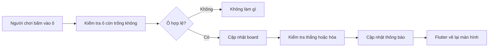
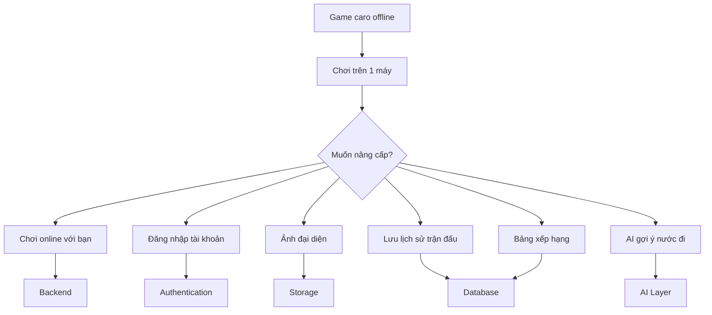
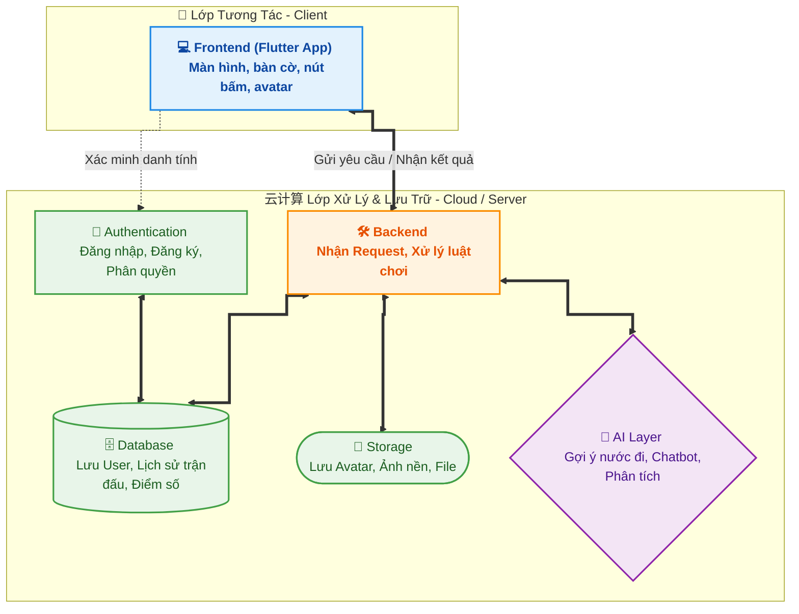
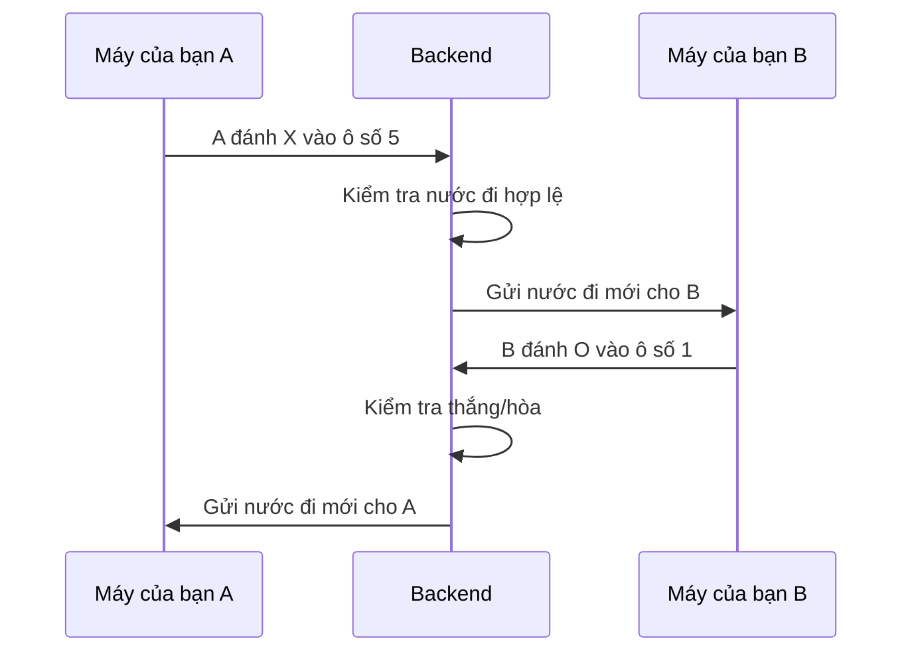
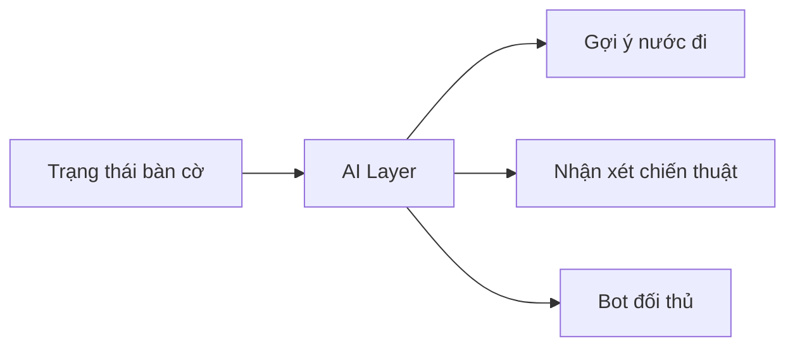
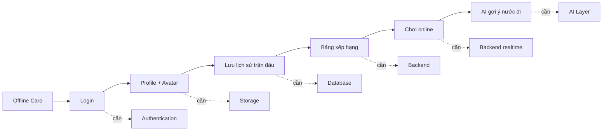
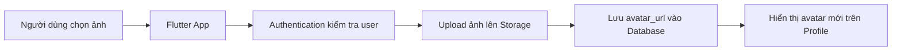

# Buổi 1: Tổng quan kiến trúc hệ thống, frontend, backend, database, storage, authentication và AI layer

## Mục tiêu bài học

Sau buổi học này, học sinh sẽ:

- Khởi động khóa học bằng cách dùng AI để tạo một game caro đơn giản bằng Flutter.
- Hiểu rằng một ứng dụng offline đơn giản có thể được nâng cấp dần thành một sản phẩm hoàn chỉnh hơn.
- Nhận biết vai trò cơ bản của các thành phần: frontend, backend, database, storage, authentication và AI layer.
- Biết liên hệ mỗi thành phần kỹ thuật với một tính năng quen thuộc trong ứng dụng hằng ngày.
- Bắt đầu hình thành thói quen làm việc với AI: mô tả yêu cầu rõ ràng, kiểm tra kết quả và đặt câu hỏi nâng cấp sản phẩm.

---

## 1. Khởi động: Dùng AI tạo game caro

Ở kỳ 1, chúng ta đã học nhiều về Dart, Flutter, UI, biến, hàm, class, list, điều kiện, vòng lặp và xử lý bất đồng bộ. Sang kỳ 2, chúng ta sẽ không chỉ làm giao diện nữa, mà sẽ học cách biến ứng dụng thành một hệ thống thật hơn.

Nhưng trước khi nói về backend, database hay cloud, chúng ta sẽ bắt đầu bằng một hoạt động nhẹ nhàng hơn: **dùng AI để tạo một game caro offline**.

Game caro hôm nay chỉ cần phiên bản đơn giản nhất:

- Chơi 2 người trên cùng một máy.
- Có bàn cờ caro tối thiểu 20x20 để chơi thoải mái trên Flutter Web.
- Người chơi lần lượt đánh `X` và `O`.
- App kiểm tra thắng khi có 5 ô liên tiếp theo hàng ngang, hàng dọc hoặc đường chéo.
- Có thể kéo/xem toàn bộ bàn cờ nếu màn hình không đủ rộng.
- Có nút chơi lại.
- Chưa cần đăng nhập.
- Chưa cần chơi online.
- Chưa cần lưu lịch sử trận đấu.
- Chưa cần avatar.

### Bức tranh ban đầu

```text
+------------------------------------------------+
|                 Flutter App                    |
|                                                |
|  +------------------------------------------+  |
|  |              Game Caro Offline            |  |
|  |                                          |  |
|  |      X  |  O  |  X                       |  |
|  |     ----+-----+----                      |  |
|  |      O  |  X  |                          |  |
|  |     ----+-----+----                      |  |
|  |         |  O  |  X                       |  |
|  |                                          |  |
|  |        [Chơi lại]                        |  |
|  +------------------------------------------+  |
|                                                |
+------------------------------------------------+

Tất cả logic hiện đang nằm trong app.
Không có server. Không có tài khoản. Không có cloud.
```

---

## 2. Prompt mẫu để tạo game caro

Học sinh có thể mở GitHub Copilot, ChatGPT hoặc một AI coding assistant khác, sau đó dùng prompt sau.

<details>
<summary>Prompt mẫu phiên bản ngắn</summary>

```text
Hãy giúp tôi tạo một game caro đơn giản bằng Flutter.

Yêu cầu:
- Chạy tốt trên Flutter Web.
- Chơi 2 người trên cùng một thiết bị.
- Bàn cờ tối thiểu 20x20.
- Người chơi lần lượt đánh X và O.
- Người thắng là người có 5 ô liên tiếp theo hàng ngang, hàng dọc hoặc đường chéo.
- Có thông báo khi thắng hoặc hòa.
- Có nút chơi lại.
- Code rõ ràng, phù hợp cho học sinh mới học Flutter.
```

</details>

---

## 3. Nhìn vào game như một lập trình viên

Sau khi AI tạo code, chúng ta không copy rồi bỏ qua. Chúng ta cần đọc lại để hiểu game gồm những phần nào.

Một game caro đơn giản thường có 3 phần chính:

```text
+-----------------------+
|        UI             |
|  Bàn cờ, nút reset,   |
|  dòng thông báo       |
+-----------+-----------+
            |
            v
+-----------------------+
|      Game State       |
|  Lượt hiện tại        |
|  Các ô đã đánh        |
|  Trạng thái thắng/hòa |
+-----------+-----------+
            |
            v
+-----------------------+
|      Game Logic       |
|  Đánh vào ô           |
|  Đổi lượt             |
|  Kiểm tra thắng       |
+-----------------------+
```

Ví dụ trạng thái bàn cờ có thể được biểu diễn như sau. Đây chỉ là một phần nhỏ của bàn cờ 20x20 để dễ nhìn trong bài:

```dart
final board = [
  ['X', 'O', '', '', ''],
  ['', 'X', 'O', '', ''],
  ['', '', 'X', '', ''],
  ['', '', '', 'X', 'O'],
  ['', '', '', '', 'X'],
];
```

Khi người chơi bấm vào một ô, app sẽ thay đổi dữ liệu trong `board`, sau đó Flutter vẽ lại giao diện.



Đến đây, mọi thứ vẫn chỉ nằm trong app Flutter. Đây là một sản phẩm offline.

---

## 4. Hoạt động lớp: Chia nhóm chơi caro

---

## 5. Từ game offline đến app thật

Game caro offline chỉ cần Flutter là đủ. Nhưng khi muốn nâng cấp thành một sản phẩm thật, chúng ta sẽ cần thêm nhiều thành phần khác.



### So sánh nhanh

| Phiên bản | Cần những gì? | Ví dụ tính năng |
|---|---|---|
| Caro offline | Flutter app | Hai người chơi trên cùng một máy |
| Caro có tài khoản | Flutter + Authentication | Đăng nhập để biết người chơi là ai |
| Caro có avatar | Flutter + Auth + Storage | Upload ảnh đại diện |
| Caro có lịch sử | Flutter + Backend + Database | Lưu các trận đã chơi |
| Caro online | Flutter + Backend realtime | Hai máy thấy nước đi của nhau |
| Caro có AI | Flutter + AI layer | Máy gợi ý nước đi hoặc làm đối thủ |

---

## 6. Các thành phần trong một hệ thống ứng dụng

Hãy tưởng tượng một app hoàn chỉnh giống như một đội làm việc. Mỗi thành phần có một nhiệm vụ riêng.



### 6.1 Frontend là gì?

**Frontend** là phần người dùng nhìn thấy và tương tác trực tiếp.

Trong app Flutter, frontend gồm:

- Màn hình caro.
- Ô trên bàn cờ.
- Nút reset.
- Form đăng nhập.
- Ảnh đại diện.
- Danh sách trận đấu.
- Màn hình bảng xếp hạng.

```text
Người dùng nhìn thấy gì?
Người dùng bấm vào đâu?
Thông tin hiển thị như thế nào?

=> Đó thường là frontend.
```

### 6.2 Backend là gì?

**Backend** là phần đứng phía sau app, thường chạy trên server hoặc cloud. Backend nhận yêu cầu từ app, xử lý dữ liệu, kiểm tra quyền và trả kết quả về.

Ví dụ với caro online:



Nếu không có backend, hai máy sẽ rất khó biết trạng thái mới nhất của cùng một trận đấu.

### 6.3 Authentication là gì?

**Authentication** là hệ thống xác thực người dùng. Nói đơn giản: app cần biết bạn là ai.

```text
[Nhập email/password]
          |
          v
[Authentication kiểm tra]
          |
    +-----+-----+
    |           |
  đúng         sai
    |           |
    v           v
[Session]   [Thông báo lỗi]
```

Ví dụ:

- Đăng nhập TikTok.
- Đăng nhập Facebook.
- Đăng ký tài khoản game.
- Quên mật khẩu.
- Giữ trạng thái đăng nhập khi mở lại app.

Trong game caro, authentication giúp app biết:

- Người chơi này là ai?
- Đây có phải tài khoản thật không?
- Có được xem lịch sử trận đấu này không?
- Điểm thắng thua này thuộc về ai?

### 6.4 Database là gì?

**Database** là nơi lưu dữ liệu có cấu trúc.

Ví dụ dữ liệu có cấu trúc:

```text
User
+----+----------+----------------------+
| id | name     | email                |
+----+----------+----------------------+
| 1  | An       | an@example.com       |
| 2  | Binh     | binh@example.com     |
+----+----------+----------------------+

Match
+----+----------+----------+--------+
| id | player_x | player_o | winner |
+----+----------+----------+--------+
| 1  | An       | Binh     | An     |
| 2  | Binh     | An       | Draw   |
+----+----------+----------+--------+
```

Trong game caro, database có thể lưu:

- Danh sách người chơi.
- Lịch sử trận đấu.
- Người thắng.
- Điểm số.
- Bảng xếp hạng.

### 6.5 Storage là gì?

**Storage** là nơi lưu file: ảnh, video, âm thanh, tài liệu.

Database lưu dữ liệu có cấu trúc. Storage lưu file.

```text
Database lưu:
- user_id: 12
- name: Minh
- avatar_url: https://storage.app/avatar/minh.png

Storage lưu:
- file ảnh minh.png
```

Ví dụ:

- Ảnh đại diện Facebook.
- Video TikTok.
- Ảnh sản phẩm trên Shopee.
- File bài nộp của học sinh.
- Ảnh bìa sách trong app Book Exchange.

Trong game caro, storage có thể lưu:

- Avatar người chơi.
- Ảnh nền bàn cờ.
- Huy hiệu thành tích.

### 6.6 AI Layer là gì?

**AI layer** là phần sử dụng AI để tạo ra trải nghiệm thông minh hơn.

Trong game caro, AI có thể giúp:

- Gợi ý nước đi tiếp theo.
- Làm đối thủ máy.
- Phân tích vì sao người chơi thua.
- Đặt tên vui cho trận đấu.
- Tóm tắt lịch sử chơi của người dùng.



AI không thay thế toàn bộ app. AI chỉ là một thành phần được dùng ở những chỗ phù hợp.

---

## 7. Mỗi tính năng cần thành phần nào?

Khi xây dựng sản phẩm, chúng ta không bắt đầu bằng câu hỏi "học công nghệ gì?". Chúng ta bắt đầu bằng câu hỏi "muốn app làm được gì?".

| Tính năng muốn thêm | Câu hỏi gợi mở | Thành phần liên quan |
|---|---|---|
| Chơi caro với bạn ở nhà | Làm sao hai máy biết nước đi của nhau? | Backend / realtime |
| Đăng nhập tài khoản | Làm sao app biết em là ai? | Authentication |
| Avatar người chơi | Ảnh đại diện được lưu ở đâu? | Storage |
| Lưu số trận thắng thua | Lần sau mở lại app, dữ liệu nằm ở đâu? | Database |
| Bảng xếp hạng | App lấy danh sách người chơi mạnh nhất từ đâu? | Database + Backend |
| Gợi ý nước đi | Ai phân tích bàn cờ và đề xuất nước tiếp theo? | AI Layer |
| Chống sửa điểm gian lận | Vì sao không nên lưu điểm chỉ trong app? | Backend + Database |
| Màn hình đẹp hơn | Người dùng nhìn thấy phần nào? | Frontend |

### Sơ đồ nâng cấp game caro



---

## 8. Thử thách nhanh: Nhìn tính năng đoán component

Hãy trả lời nhanh: tính năng sau thuộc thành phần nào?

### Câu hỏi

1. Ảnh đại diện của các em trên Facebook được lưu ở đâu?
2. Tính năng đăng nhập trên TikTok thuộc component nào?
3. Danh sách video các em đã like được lưu ở đâu?
4. Màn hình bàn cờ caro, nút reset và thông báo thắng thua thuộc phần nào?
5. Khi hai người chơi caro online, phần nào giúp hai máy gửi nước đi cho nhau?
6. Khi YouTube gợi ý video tiếp theo, có thể có thành phần nào tham gia?
7. Khi Shopee lưu danh sách đơn hàng của em, dữ liệu đó thường nằm ở đâu?
8. Khi app kiểm tra em có được xem dữ liệu cá nhân này không, phần nào thường xử lý?

<details>
<summary>Đáp án gợi ý</summary>

1. Storage.
2. Authentication.
3. Database.
4. Frontend.
5. Backend hoặc realtime backend.
6. AI layer hoặc recommendation system.
7. Database.
8. Backend kết hợp authentication/authorization.

</details>

---

## 9. Mini challenge tại lớp

Mỗi nhóm chọn một tính năng muốn thêm vào game caro, sau đó vẽ sơ đồ thành phần cần dùng.

Gợi ý tính năng:

- Đăng nhập người chơi.
- Upload avatar.
- Lưu lịch sử trận đấu.
- Bảng xếp hạng.
- Chơi online.
- AI gợi ý nước đi.

Mẫu trình bày:

```text
Tính năng nhóm chọn: __________________________

Người dùng làm gì?
-> ____________________________________________

App cần gửi dữ liệu gì?
-> ____________________________________________

Dữ liệu cần lưu ở đâu?
-> ____________________________________________

Thành phần cần dùng:
[ ] Frontend
[ ] Backend
[ ] Database
[ ] Storage
[ ] Authentication
[ ] AI Layer
```

Ví dụ với tính năng upload avatar:



---

## 10. Tổng kết bài học

Hôm nay chúng ta bắt đầu từ một game caro rất đơn giản. Ban đầu, game chỉ cần Flutter app là đủ.

Nhưng khi muốn biến game thành một sản phẩm thật hơn, chúng ta bắt đầu cần nhiều thành phần khác:

```text
Offline app
    |
    v
App có người dùng thật
    |
    +--> Authentication: biết người dùng là ai
    +--> Database: lưu dữ liệu có cấu trúc
    +--> Storage: lưu file, ảnh, video
    +--> Backend: xử lý logic và kết nối nhiều thiết bị
    +--> AI Layer: thêm tính năng thông minh
```

Điều quan trọng nhất của buổi hôm nay:

> Một công nghệ không tự nhiên xuất hiện. Nó xuất hiện vì sản phẩm cần một tính năng nào đó.

Khi hiểu được mối liên hệ giữa **tính năng** và **thành phần hệ thống**, chúng ta sẽ biết vì sao kỳ 2 cần học backend, database, storage, authentication, cloud và AI.