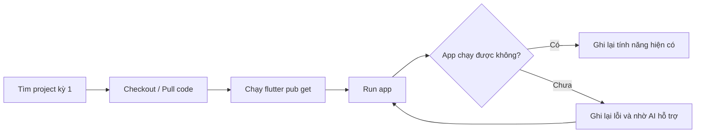
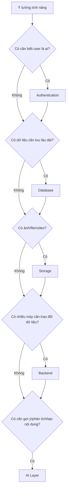
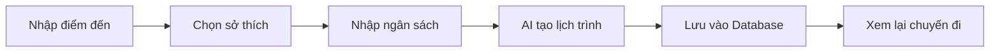
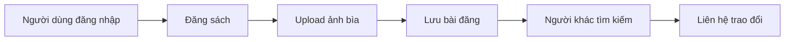
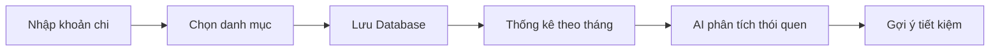
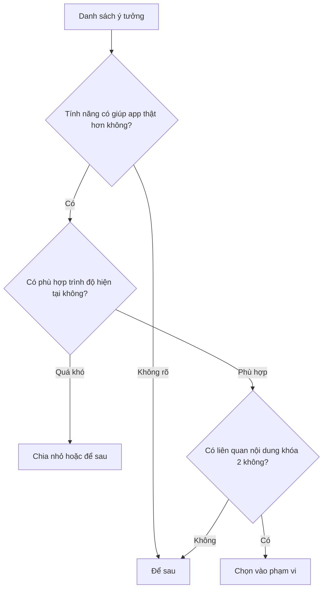

# Buổi 2: Rà soát project khóa 1 và xác định hướng nâng cấp cho từng sản phẩm

## Mục tiêu bài học

Sau buổi học này, học sinh sẽ:

- Mở lại, checkout và build được project đã làm ở kỳ 1.
- Nhìn lại project cũ dưới góc nhìn sản phẩm: app đang có gì, thiếu gì, người dùng sẽ cần gì tiếp theo.
- Đề xuất được các ý tưởng nâng cấp liên quan đến frontend, backend, database, storage, authentication và AI layer.
- Biết tìm hiểu một số sản phẩm tương tự trên internet để học cách quan sát đối thủ cạnh tranh.
- Có một bảng định hướng nâng cấp ban đầu cho project của nhóm.

---

## 1. Khởi động: Mở lại project kỳ 1

Ở buổi 1, chúng ta đã dùng game caro offline để nhìn thấy một app có thể được nâng cấp thành hệ thống hoàn chỉnh hơn như thế nào.

Hôm nay, chúng ta quay lại với chính project kỳ 1 của mình.

Mục tiêu không phải là sửa hết lỗi ngay trong buổi này. Mục tiêu là mở lại project, chạy được app cũ, rồi nhìn nó bằng con mắt mới:

```text
Project kỳ 1 của mình đang là app offline hay app có dữ liệu thật?
Nếu muốn biến nó thành sản phẩm hoàn chỉnh hơn, mình cần thêm thành phần nào?
```

### Checklist mở lại project

```text
[ ] Tìm lại repo/project kỳ 1
[ ] Checkout hoặc pull code mới nhất
[ ] Mở project bằng VS Code
[ ] Chạy flutter pub get
[ ] Build/chạy lại project trên web hoặc mobile
[ ] Ghi lại lỗi nếu app chưa chạy được
[ ] Ghi lại các tính năng hiện có
```

### Luồng làm việc gợi ý



---

## 2. Nhìn lại project như một sản phẩm

Khi app đã chạy được, mỗi nhóm hãy mở app và trả lời các câu hỏi sau.

| Câu hỏi | Ghi chú của nhóm |
|---|---|
| App của nhóm giải quyết vấn đề gì? |  |
| Người dùng chính là ai? |  |
| App hiện có những màn hình nào? |  |
| App hiện dùng dữ liệu giả, dữ liệu local hay dữ liệu thật? |  |
| App có đăng nhập chưa? |  |
| App có lưu dữ liệu sau khi tắt/mở lại chưa? |  |
| App có upload ảnh/file chưa? |  |
| App có tính năng AI nào chưa? |  |
| Nếu có thêm 3 tuần phát triển, nhóm muốn nâng cấp gì nhất? |  |

Một app cũ có thể nhìn rất đơn giản, nhưng khi đặt đúng câu hỏi, chúng ta sẽ bắt đầu thấy đường nâng cấp.

```text
[App kỳ 1]
    |
    +--> Giao diện đã có gì?
    +--> Dữ liệu đang nằm ở đâu?
    +--> Người dùng là ai?
    +--> Có gì cần lưu lâu dài?
    +--> Có file/ảnh nào cần upload?
    +--> Có chỗ nào AI có thể hỗ trợ?
```

---

## 3. Gắn ý tưởng nâng cấp với component hệ thống

Mỗi nhóm hãy đề xuất các ý tưởng mới cho app, sau đó đánh dấu component cần dùng.

| Ý tưởng nâng cấp | Frontend | Backend | Auth | Database | Storage | AI Layer |
|---|---:|---:|---:|---:|---:|---:|
| Ví dụ: Đăng nhập tài khoản | Có | Có | Có | Có | Không | Không |
| Ví dụ: Upload ảnh đại diện | Có | Có | Có | Có | Có | Không |
|  |  |  |  |  |  |  |
|  |  |  |  |  |  |  |
|  |  |  |  |  |  |  |

### Cách suy nghĩ nhanh



---

## 4. Tìm hiểu đối thủ cạnh tranh trên internet

Một sản phẩm tốt không chỉ đến từ việc nghĩ trong đầu. Chúng ta cần quan sát các app tương tự để học cách họ giải quyết vấn đề.

Hôm nay, mỗi nhóm hãy tìm 2 đến 3 app/web tương tự với project của mình.

### Gợi ý từ khóa tìm kiếm

| Loại project | Từ khóa có thể tìm |
|---|---|
| AI Travel Itinerary | `AI travel planner`, `trip itinerary app`, `travel budget planner` |
| Book Exchange | `book swap app`, `used book marketplace`, `student book exchange` |
| Daily Expense Diary | `expense tracker app`, `student budget app`, `personal finance tracker` |

### Bảng quan sát đối thủ

| Tên app/web | App này làm gì hay? | Tính năng nào nhóm muốn học theo? | Component liên quan |
|---|---|---|---|
|  |  |  |  |
|  |  |  |  |
|  |  |  |  |

Khi quan sát đối thủ, không cần copy y nguyên. Chúng ta chỉ cần học cách họ tổ chức tính năng, cách họ hiển thị thông tin và cách họ giải quyết vấn đề người dùng.

---

## 5. Gợi ý nâng cấp cho các project mẫu

Các project dưới đây dựa trên những ý tưởng cuối khóa kỳ 1: AI Travel Itinerary, Book Exchange và Daily Expense Diary.

Mỗi nhóm có thể dùng bảng này để tham khảo, sau đó chọn tính năng phù hợp với project thật của mình.

### 5.1 AI Travel Itinerary

Ứng dụng lập kế hoạch du lịch thông minh giúp người dùng nhập điểm đến, sở thích và ngân sách để tạo lịch trình từng ngày.

| Tính năng nâng cấp | Người dùng nhận được gì? | Component chính | Độ khó gợi ý |
|---|---|---|---|
| Đăng nhập và lưu chuyến đi cá nhân | Mỗi bạn có danh sách lịch trình riêng | Auth + Database | Dễ |
| Hồ sơ sở thích du lịch | App nhớ người dùng thích biển, núi, ăn uống hay khám phá | Auth + Database | Dễ |
| Lưu nhiều lịch trình | Người dùng tạo và xem lại nhiều chuyến đi | Database | Dễ |
| Upload ảnh đại diện hoặc ảnh chuyến đi | Lịch trình có hình ảnh cá nhân hơn | Storage + Database | Trung bình |
| Tìm kiếm lịch trình cũ | Dễ tìm lại chuyến đi theo thành phố hoặc ngày | Database | Trung bình |
| Lọc lịch trình theo ngân sách | Xem các chuyến đi rẻ, vừa hoặc cao cấp | Database + Frontend | Trung bình |
| AI gợi ý lịch trình theo ngân sách | App tự đề xuất kế hoạch phù hợp số tiền | AI Layer + Backend | Khó |
| AI viết mô tả chuyến đi | Tạo đoạn giới thiệu đẹp để chia sẻ | AI Layer | Trung bình |



### 5.2 Book Exchange

Nền tảng giúp học sinh/sinh viên đăng sách cũ, tìm sách cần đổi và kết nối với người khác.

| Tính năng nâng cấp | Người dùng nhận được gì? | Component chính | Độ khó gợi ý |
|---|---|---|---|
| Đăng nhập người dùng | Biết ai là người đăng sách | Auth + Database | Dễ |
| Hồ sơ người dùng | Xem tên, lớp, thông tin liên hệ cơ bản | Auth + Database | Dễ |
| Đăng sách cần đổi | Người dùng tạo bài đăng sách | Database | Dễ |
| Upload ảnh bìa sách | Bài đăng dễ nhìn, dễ tin tưởng hơn | Storage + Database | Trung bình |
| Tìm kiếm sách theo tên | Tìm nhanh sách cần mua/đổi | Database | Trung bình |
| Lọc sách theo thể loại/lớp | Dễ tìm sách phù hợp nhu cầu | Database + Frontend | Trung bình |
| Trạng thái sách: còn/đã đổi | Tránh liên hệ sách không còn | Database | Dễ |
| AI gợi ý mô tả sách | Viết mô tả bài đăng nhanh hơn | AI Layer | Trung bình |
| AI nhận diện thông tin từ ảnh bìa | Gợi ý tên sách/tác giả từ ảnh | AI Layer + Storage | Khó |



### 5.3 Daily Expense Diary

Ứng dụng ghi chép thu chi cá nhân, xem thống kê và giúp học sinh hình thành thói quen quản lý tiền.

| Tính năng nâng cấp | Người dùng nhận được gì? | Component chính | Độ khó gợi ý |
|---|---|---|---|
| Đăng nhập tài khoản | Mỗi bạn có dữ liệu thu chi riêng | Auth + Database | Dễ |
| Lưu khoản thu/chi trên cloud | Đổi máy vẫn xem lại dữ liệu | Database | Dễ |
| Danh mục chi tiêu | Phân loại ăn uống, học tập, đi lại, giải trí | Database + Frontend | Dễ |
| Bộ lọc theo ngày/tháng | Xem lại chi tiêu theo thời gian | Database + Frontend | Trung bình |
| Biểu đồ chi tiêu | Nhìn nhanh tiền đi đâu nhiều nhất | Frontend + Database | Trung bình |
| Đặt hạn mức chi tiêu | Cảnh báo khi sắp vượt ngân sách | Database + Backend | Trung bình |
| Upload ảnh hóa đơn | Lưu bằng chứng/ghi chú cho khoản chi | Storage + Database | Trung bình |
| AI phân tích thói quen chi tiêu | Nhận xét tháng này tiêu nhiều ở đâu | AI Layer + Database | Khó |
| AI gợi ý tiết kiệm | Đề xuất cách giảm chi tiêu phù hợp | AI Layer | Trung bình |



---

## 6. Chốt hướng nâng cấp cho nhóm

Cuối buổi, mỗi nhóm chọn 3 đến 5 tính năng muốn nâng cấp trong khóa 2.

| Tính năng nhóm chọn | Vì sao chọn? | Component cần học | Ưu tiên |
|---|---|---|---|
|  |  |  | Cao / Vừa / Thấp |
|  |  |  | Cao / Vừa / Thấp |
|  |  |  | Cao / Vừa / Thấp |
|  |  |  | Cao / Vừa / Thấp |
|  |  |  | Cao / Vừa / Thấp |

### Sơ đồ quyết định phạm vi



Kết thúc buổi học, mỗi nhóm nên có một định hướng rõ hơn:

```text
Project cũ của nhóm là gì?
    |
    v
Muốn nâng cấp thành sản phẩm như thế nào?
    |
    v
Cần học component nào trong khóa 2?
```