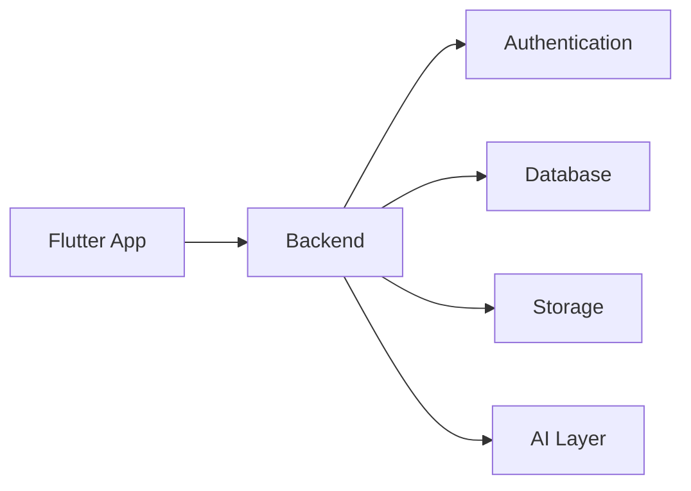
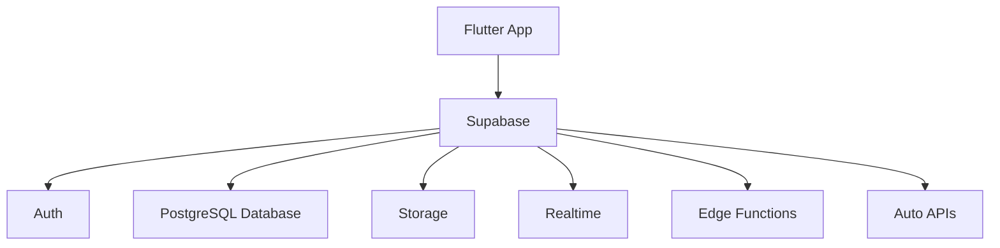
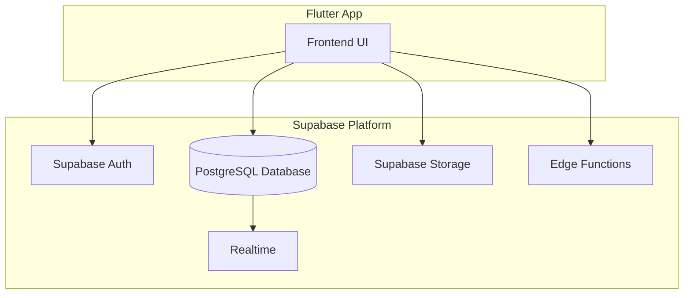
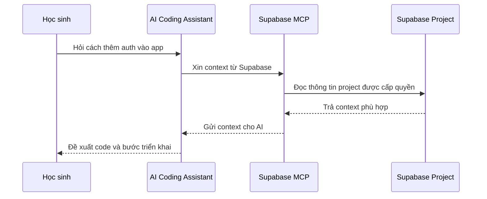
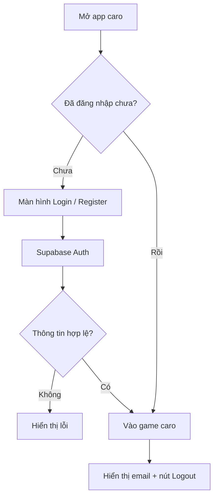
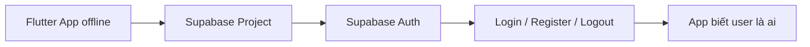

# Buổi 3: Thiết lập backend foundation và triển khai auth cơ bản

## Mục tiêu bài học

Sau buổi học này, học sinh sẽ:

- Nhắc lại được các thành phần chính của một hệ thống ứng dụng: frontend, backend, database, storage, authentication và AI layer.
- Hiểu cloud và serverless ở mức high-level: vì sao các app hiện đại thường dùng cloud thay vì tự quản lý server.
- Biết Supabase là gì và vì sao Supabase phù hợp để dùng trong kỳ 2.
- Map được các tính năng của Supabase với các component hệ thống đã học.
- Tạo được tài khoản Supabase, tạo project Supabase đầu tiên và chuẩn bị thông tin kết nối.
- Hiểu cách setup MCP để AI có thể hỗ trợ làm việc với Supabase.
- Có prompt mẫu để triển khai Supabase Auth cho game caro offline.

---

## 1. Nhắc lại: Một app thật thường có những thành phần nào?

Ở buổi 1 và 2, chúng ta đã thấy một app Flutter ban đầu có thể chỉ gồm giao diện và logic chạy trên máy người dùng. Nhưng khi muốn app giống sản phẩm thật hơn, chúng ta cần thêm nhiều thành phần phía sau.



### Ghi nhớ nhanh

| Component | Trả lời câu hỏi nào? | Ví dụ trong app caro |
|---|---|---|
| Frontend | Người dùng nhìn thấy gì và bấm vào đâu? | Bàn cờ, nút reset, màn hình login |
| Backend | Ai xử lý logic phía sau và kết nối dữ liệu? | Tạo phòng chơi, kiểm tra quyền, đồng bộ nước đi |
| Authentication | App biết người dùng là ai bằng cách nào? | Đăng ký, đăng nhập, logout |
| Database | Dữ liệu chữ/số/danh sách được lưu ở đâu? | User, lịch sử trận đấu, điểm số |
| Storage | Ảnh/file/video được lưu ở đâu? | Avatar, ảnh nền, huy hiệu |
| AI Layer | App thông minh hơn bằng cách nào? | Gợi ý nước đi, bot, nhận xét trận đấu |

Trong buổi 3, chúng ta sẽ bắt đầu phần backend foundation bằng component đầu tiên: **authentication**.

---

## 2. Cloud và serverless là gì?

Trước đây, nếu muốn làm backend, lập trình viên thường phải tự thuê server, cài hệ điều hành, cài database, cấu hình bảo mật, backup dữ liệu và tự xử lý rất nhiều việc phía sau.

Với học sinh mới học làm sản phẩm, cách đó quá nặng.

Cloud và serverless giúp chúng ta bắt đầu nhanh hơn.

```text
Cách truyền thống

[App Flutter]
      |
      v
[Server tự quản lý]
      |
      +--> Cài database
      +--> Cài auth
      +--> Cấu hình storage
      +--> Backup
      +--> Bảo mật
      +--> Theo dõi lỗi

Cách hiện đại với cloud/serverless

[App Flutter]
      |
      v
[Cloud Platform]
      |
      +--> Auth có sẵn
      +--> Database có sẵn
      +--> Storage có sẵn
      +--> API có sẵn
      +--> Scale dễ hơn
```

### Cloud là gì?

**Cloud** là hạ tầng máy chủ, database, storage và dịch vụ backend được cung cấp qua internet. Thay vì chạy mọi thứ trên máy cá nhân, chúng ta dùng dịch vụ đã được vận hành sẵn.

Ví dụ:

- Ảnh Facebook nằm trên cloud storage.
- Video TikTok nằm trên cloud storage và CDN.
- Dữ liệu đơn hàng Shopee nằm trong database trên cloud.
- Tài khoản đăng nhập của một app thường được quản lý bởi hệ thống auth trên cloud.

### Serverless là gì?

**Serverless** không có nghĩa là không có server. Nó có nghĩa là mình không phải trực tiếp quản lý server.

```text
Có server thật ở phía sau.
Nhưng mình không phải tự cài, tự bật, tự vá lỗi, tự scale từng server.
```

### Vì sao cloud/serverless phổ biến?

| Lý do | Ý nghĩa với học sinh |
|---|---|
| Bắt đầu nhanh | Có thể có auth/database/storage trong vài phút |
| Không cần quản lý server | Tập trung vào tính năng sản phẩm thay vì hạ tầng |
| Có free tier | Phù hợp để học và làm project nhỏ |
| Dễ tích hợp với Flutter | Có SDK, API và tài liệu sẵn |
| Dễ scale khi app lớn hơn | Không phải thiết kế hạ tầng từ đầu |

---

## 3. Supabase là gì?

Trong kỳ 2, chúng ta sẽ dùng **Supabase** làm backend foundation.

Supabase là một nền tảng backend-as-a-service. Nói đơn giản, Supabase cung cấp nhiều thành phần backend có sẵn để app Flutter có thể dùng ngay.



### Các thành phần chính của Supabase

| Supabase cung cấp | Dùng để làm gì? | Ví dụ trong khóa học |
|---|---|---|
| Authentication | Đăng ký, đăng nhập, quản lý session | Login/logout cho app caro hoặc project nhóm |
| PostgreSQL Database | Lưu dữ liệu có cấu trúc | Lịch sử trận đấu, sách, khoản chi, lịch trình |
| Storage | Lưu file/ảnh | Avatar, ảnh bìa sách, ảnh hóa đơn |
| Realtime | Nhận cập nhật dữ liệu gần như tức thì | Có thể dùng cho caro online hoặc chat sau này |
| Edge Functions | Chạy code backend nhỏ trên cloud | Gọi AI API, xử lý logic riêng |
| Auto APIs | Tạo API từ database | Flutter có thể đọc/ghi dữ liệu dễ hơn |

### Vì sao chọn Supabase cho kỳ 2?

| Lý do | Vì sao phù hợp với lớp học? |
|---|---|
| Có Auth, Database, Storage trong cùng một nơi | Học sinh dễ nhìn thấy bức tranh hệ thống |
| Có giao diện web trực quan | Giáo viên có thể demo trực tiếp |
| Có Flutter SDK | Tích hợp vào app Flutter thuận tiện |
| Có free tier | Phù hợp cho project học tập |
| Có MCP hỗ trợ AI workflow | Học sinh có thể làm việc với AI có context tốt hơn |

---

## 4. Supabase map với các component đã học như thế nào?

Supabase không phải là một component duy nhất. Nó là một platform chứa nhiều component backend khác nhau.



| Component hệ thống | Trong Supabase là gì? | Project có thể dùng như thế nào? |
|---|---|---|
| Authentication | Supabase Auth | Đăng ký, đăng nhập, logout, giữ session |
| Database | PostgreSQL Database | Lưu user profile, bài đăng sách, khoản chi, lịch trình |
| Storage | Supabase Storage | Upload avatar, ảnh sách, ảnh hóa đơn, ảnh chuyến đi |
| Backend | Auto APIs + Edge Functions | Đọc/ghi dữ liệu, xử lý logic riêng khi cần |
| Realtime Backend | Supabase Realtime | Đồng bộ dữ liệu live, chat, caro online sau này |
| AI Layer | Edge Functions + AI API bên ngoài | Gọi AI để gợi ý lịch trình, phân tích chi tiêu, viết mô tả |

Điểm quan trọng: hôm nay chúng ta chưa cần dùng hết mọi thứ. Chúng ta bắt đầu từ Auth trước.

---

## 5. Thực hành 1: Tạo tài khoản và project Supabase

### Bước 1: Tạo tài khoản

Truy cập Supabase:

```text
https://supabase.com
```

Tạo tài khoản bằng GitHub hoặc email.

### Bước 2: Tạo project mới

Trong Supabase dashboard:

```text
New project
  -> Chọn organization
  -> Đặt tên project
  -> Chọn region gần Việt Nam/Singapore nếu có
  -> Tạo database password
  -> Create project
```

Gợi ý tên project cho bài học:

```text
caro-auth-demo
```

### Bước 3: Lấy thông tin kết nối cho Flutter

Trong project Supabase, mở:

```text
Project Settings -> API
```

Ghi lại 2 thông tin:

| Thông tin | Dùng để làm gì? | Có bí mật không? |
|---|---|---|
| Project URL | Flutter app kết nối tới project Supabase | Không quá nhạy cảm |
| anon public key | Flutter app gọi Supabase với quyền public đã giới hạn | Public key, nhưng vẫn cần dùng đúng RLS/policy |

Không dùng service role key trong Flutter app.

```text
service_role key = quyền rất mạnh
Không đưa vào app Flutter
Không paste vào code frontend
Không commit lên GitHub
```

### Bước 4: Chuẩn bị Auth cho demo

Vào phần Authentication trong Supabase để quan sát:

```text
Authentication
  -> Users
  -> Providers
  -> URL Configuration
```

Với demo trên lớp, giáo viên có thể hướng dẫn học sinh dùng email/password trước. Nếu email confirmation làm chậm quá trình test, giáo viên có thể quyết định cấu hình demo phù hợp trong Authentication settings.

---

## 6. Thực hành 2: Setup MCP cho Supabase

MCP là viết tắt của **Model Context Protocol**. Trong buổi này, có thể hiểu đơn giản:

```text
MCP giúp AI coding assistant kết nối với công cụ bên ngoài.

AI không chỉ nhìn code trong máy,
mà còn có thể được cấp quyền để hiểu project Supabase,
đọc schema hoặc hỗ trợ tạo thay đổi phù hợp hơn.
```

### Luồng làm việc với MCP



### Có 2 lựa chọn setup

Trong lớp học, học sinh có thể dùng **Supabase MCP** hoặc **Supabase CLI**. Cả hai đều có thể hoạt động tốt, chỉ khác mục đích sử dụng.

| Lựa chọn | Phù hợp khi nào? | Cách làm việc chính |
|---|---|---|
| Supabase MCP | Muốn AI coding assistant hiểu project Supabase tốt hơn | AI gọi MCP để đọc context Supabase |
| Supabase CLI | Muốn thao tác bằng terminal, kiểm tra project, link project, quản lý local workflow | Gõ lệnh `supabase ...` trong terminal |

Không bắt buộc cả lớp phải dùng cùng một cách nếu máy/công cụ khác nhau. Giáo viên có thể chọn một flow chính để demo, còn flow còn lại dùng cho nhóm nào phù hợp hơn.

---

### Option A: Setup bằng Supabase MCP

Tùy công cụ AI đang dùng, cách thêm MCP server có thể khác nhau. Ý tưởng chung là thêm một MCP server tên là Supabase, trỏ tới endpoint MCP chính thức của Supabase.

Một cấu hình phổ biến có dạng:

```json
{
  "mcpServers": {
    "supabase": {
      "serverUrl": "https://mcp.supabase.com/mcp"
    }
  }
}
```

Trong lớp học, giáo viên sẽ hướng dẫn vị trí cấu hình cụ thể theo công cụ đang dùng.

#### Authenticate một lần với Supabase

Sau khi MCP server được thêm, công cụ AI thường sẽ yêu cầu authenticate với Supabase một lần. Luồng thường gặp:

```text
Add Supabase MCP
  -> Start MCP server
  -> Authenticate / Sign in to Supabase
  -> Trình duyệt mở trang Supabase login
  -> Cho phép quyền truy cập
  -> MCP lưu phiên đăng nhập/token nội bộ
  -> Những lần sau tự dùng lại phiên đã lưu
```

Điểm quan trọng cho học sinh:

```text
Không cần tự generate access token nếu công cụ MCP đã hỗ trợ login một lần.
Không paste token vào bài nộp, chat nhóm hoặc GitHub.
Nếu công cụ yêu cầu token thủ công, giáo viên sẽ hướng dẫn riêng như phương án dự phòng.
```

#### Kiểm tra MCP đã hoạt động chưa

Sau khi authenticate xong, thử hỏi AI:

```text
Hãy kiểm tra Supabase MCP đã kết nối được chưa.
Nếu kết nối được, hãy liệt kê project Supabase mà em có quyền truy cập.
Không thay đổi gì trong project, chỉ đọc thông tin.
```

Nếu AI có thể nhìn thấy project Supabase, MCP đã sẵn sàng.

---

### Option B: Setup bằng Supabase CLI

Supabase CLI phù hợp khi học sinh quen dùng terminal hoặc khi giáo viên muốn học sinh thao tác rõ ràng bằng lệnh.

```text
Flutter project folder
  -> terminal
  -> supabase login
  -> supabase projects list
  -> supabase link --project-ref <project-ref>
```

#### Cài Supabase CLI

Trên macOS, có thể cài bằng Homebrew:

```bash
brew install supabase/tap/supabase
```

Hoặc dùng npm nếu máy đã có Node.js:

```bash
npm install -g supabase
```

Kiểm tra CLI đã cài xong:

```bash
supabase --version
```

#### Login một lần

```bash
supabase login
```

Sau khi login, CLI sẽ lưu thông tin xác thực trên máy. Những lần sau có thể dùng lại mà không cần login lại liên tục.

#### Kiểm tra project Supabase

```bash
supabase projects list
```

Nếu terminal liệt kê được project Supabase của học sinh, CLI đã hoạt động.

#### Link project nếu cần

Khi làm trong folder Flutter project, có thể link tới project Supabase cụ thể:

```bash
supabase link --project-ref <project-ref>
```

Project ref có thể lấy trong Supabase dashboard hoặc từ danh sách project của CLI.

---

### Chọn MCP hay CLI?

| Nhu cầu | Nên dùng |
|---|---|
| Muốn AI đọc context Supabase và hỗ trợ code tốt hơn | Supabase MCP |
| Muốn thao tác rõ bằng terminal | Supabase CLI |
| Muốn kiểm tra project nhanh bằng lệnh | Supabase CLI |
| Muốn hỏi AI về schema/project Supabase | Supabase MCP |
| Máy học sinh không setup được MCP | Supabase CLI |
| Máy học sinh không setup được CLI | Supabase MCP |

### Phương án khác: Access token thủ công

Một số công cụ hoặc môi trường có thể chưa hỗ trợ login tự động. Khi đó giáo viên có thể hướng dẫn học sinh tạo access token trong Supabase dashboard:

```text
Account -> Access Tokens -> Generate new token
```

Nếu dùng cách này, token là thông tin nhạy cảm:

- Không gửi token vào chat công khai.
- Không commit token lên GitHub.
- Nếu lộ token, cần revoke token trong Supabase.

---

## 7. Thực hành 3: Prompt triển khai Supabase Auth cho game caro

Trong buổi 1, chúng ta đã tạo game caro offline. Bây giờ, thử nâng cấp game đó bằng tính năng authentication.

Mục tiêu hôm nay:

```text
Trước khi chơi caro, người dùng cần đăng nhập.
Sau khi đăng nhập, app hiển thị email người chơi.
Người dùng có thể logout.
Game vẫn chơi offline như cũ, chưa cần lưu trận đấu.
```

### Flow auth đơn giản



### Prompt mẫu cho AI dùng Supabase CLI

<details>
<summary>Prompt ngắn triển khai auth cho game caro</summary>

```text
Project Supabase của tôi tên là: <TEN_PROJECT_SUPABASE>.
Tôi đã login Supabase CLI trước đó và đang mở đúng Flutter project.

Hãy dùng Supabase CLI để tìm/link project Supabase này nếu cần, sau đó thêm Supabase Auth vào app Flutter Web game caro hiện tại.

Yêu cầu:
- Dùng package supabase_flutter.
- Tạo màn hình Login/Register đơn giản bằng email và password.
- Nếu chưa đăng nhập thì hiển thị Login/Register.
- Nếu đã đăng nhập thì hiển thị game caro như hiện tại.
- Trong màn hình game, hiển thị email user và nút Logout.
- Giữ game caro offline, chưa cần lưu lịch sử trận đấu vào database.
- Code đơn giản, dễ hiểu cho học sinh mới học Flutter.
```

</details>

### Checklist kiểm tra sau khi thêm auth

| Việc cần kiểm tra | Kết quả |
|---|---|
| App mở lên và hiển thị login khi chưa đăng nhập |  |
| Đăng ký user mới bằng email/password |  |
| Đăng nhập thành công |  |
| Sau khi đăng nhập, vào được game caro |  |
| App hiển thị email user đang đăng nhập |  |
| Logout xong quay lại màn hình login |  |
| Refresh trình duyệt vẫn giữ session nếu chưa logout |  |

---

## 8. Gợi ý next step: Auth cho project thật của nhóm

Trong buổi này, chúng ta dùng game caro để thực hành auth vì nó đơn giản và vui. Nhưng mục tiêu thật của kỳ 2 là áp dụng vào project của từng nhóm.

Buổi sau, mỗi nhóm sẽ bắt đầu đưa auth vào project của mình.

| Project | Auth dùng để làm gì? | Sau khi login có thể làm gì tiếp? |
|---|---|---|
| AI Travel Itinerary | Biết lịch trình thuộc về ai | Lưu chuyến đi cá nhân, profile sở thích |
| Book Exchange | Biết sách do ai đăng | Quản lý sách của tôi, trao đổi với người khác |
| Daily Expense Diary | Bảo vệ dữ liệu tài chính cá nhân | Lưu khoản thu/chi theo từng user |

### Câu hỏi chuẩn bị cho buổi sau

| Câu hỏi | Câu trả lời của nhóm |
|---|---|
| Project của nhóm có cần đăng nhập không? |  |
| Người dùng sau khi login sẽ thấy màn hình nào đầu tiên? |  |
| Dữ liệu nào cần gắn với user đang đăng nhập? |  |
| Có cần profile người dùng không? |  |
| Có cần avatar không? |  |

---

## 9. Tổng kết bài học

Hôm nay chúng ta bắt đầu bước đầu tiên để app trở thành sản phẩm thật hơn: **authentication**.



Điều quan trọng nhất cần nhớ:

> Supabase giúp chúng ta có backend foundation nhanh hơn: auth, database, storage, realtime và backend functions. Nhưng trong mỗi buổi, chúng ta sẽ học từng phần nhỏ, bắt đầu từ auth.