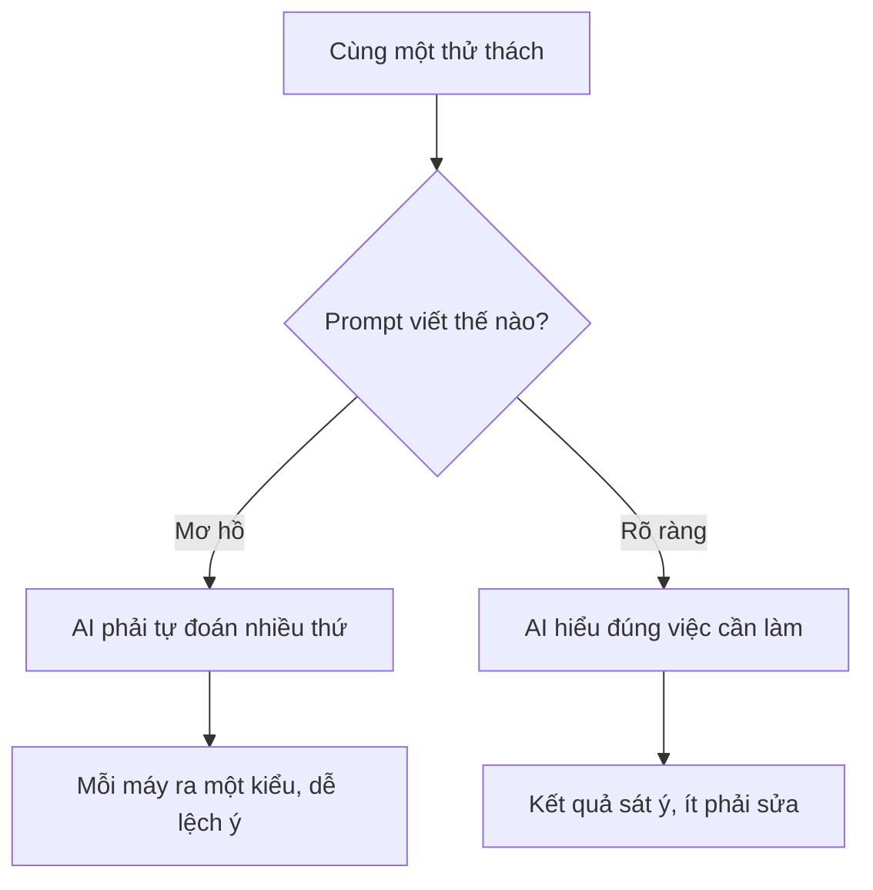
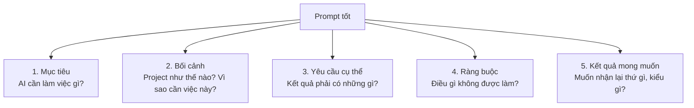
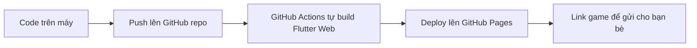
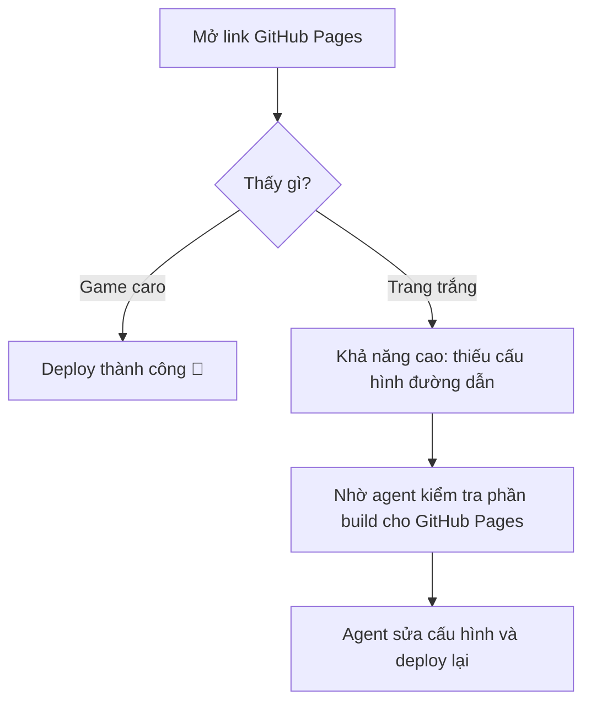
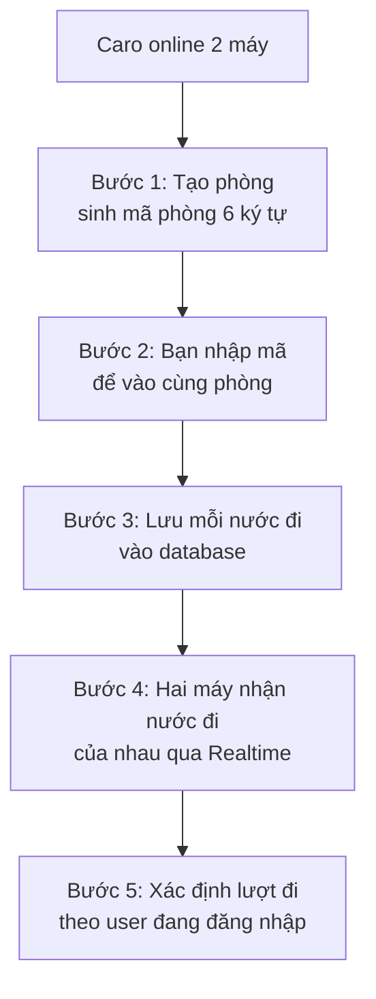

# Buổi 5: Prompt engineering cơ bản cho việc xây dựng ứng dụng

## Mục tiêu bài học

Sau buổi học này, học sinh sẽ:

- Tự trải nghiệm việc prompt AI để thêm tính năng mới vào game caro, không cần hướng dẫn trước.
- Rút ra được vì sao cùng một yêu cầu nhưng prompt khác nhau cho kết quả khác hẳn nhau.
- Nắm được khung 5 phần của một prompt tốt: Mục tiêu, Bối cảnh, Yêu cầu cụ thể, Ràng buộc, Kết quả mong muốn.
- Dùng prompt để nâng cấp game caro: animation, deploy lên GitHub Pages và chế độ đấu với máy.
- Biết chia nhỏ một tính năng lớn thành nhiều prompt nhỏ trước khi giao việc cho AI.

---

## 1. Thử thách mở màn: Thêm âm thanh vào game caro (15 phút)

Không lý thuyết, không hướng dẫn. Vào việc luôn.

```text
🎯 THỬ THÁCH

Game caro của em đang im lặng. Hãy dùng AI để thêm âm thanh:

- Có âm thanh khi người chơi đánh một quân.
- Có âm thanh vui hơn khi có người thắng.

⏱️ Thời gian: 15 phút.
📋 Luật chơi: Prompt bằng bất cứ cách nào em muốn. Không hỏi giáo viên,
   không hỏi bạn. Chỉ có em và AI.
```

```text
        BÂY GIỜ                              SAU 15 PHÚT NỮA

+----------------------+              +----------------------+
|  X | O |   |   |     |              |  X | O |   |   |     |
| ---+---+---+---+---  |              | ---+---+---+---+---  |
|  O | X |   |   |     |    =====>    |  O | X |   |   |     |  ♪ tách!
| ---+---+---+---+---  |              | ---+---+---+---+---  |
|    |   | X |   |     |              |    |   | X |   |     |
|                      |              |                      |
|    (im lặng...)      |              |    X THẮNG!  ♪♫♪     |
+----------------------+              +----------------------+
```

Trong lúc làm, mỗi bạn **lưu lại các prompt mình đã gửi** (copy vào một file note). Lát nữa cả lớp sẽ cần đến chúng.

Lưu ý cho giáo viên: không gợi ý gì trong 15 phút này. Kết quả lệch nhau chính là chất liệu cho phần tiếp theo — nhóm làm được, nhóm làm sai ý, nhóm bị AI sửa mất code cũ... đều là ví dụ tốt.

---

## 2. Cùng soi kết quả: Prompt nào ra kết quả nào?

Hết giờ. Mời 3 đến 5 bạn lên trình diễn, mỗi bạn 2 phút:

1. Demo game của mình: âm thanh đã chạy chưa, nghe thế nào?
2. Chiếu **prompt đã dùng** lên màn hình cho cả lớp đọc.

Cả lớp quan sát và ghi vào bảng:

| Bạn | Prompt viết thế nào? (ngắn/dài, có gì, thiếu gì) | Kết quả ra sao? | AI đã tự quyết những gì? |
| ---- | --------------------------------------------------------- | ----------------- | ------------------------------ |
| 1    |                                                           |                   |                                |
| 2    |                                                           |                   |                                |
| 3    |                                                           |                   |                                |

### Câu hỏi thảo luận

Sau khi xem hết, cả lớp cùng trả lời:

```text
1. Prompt nào cho kết quả sát ý nhất? Prompt đó có gì khác những prompt còn lại?

2. Với những prompt ngắn kiểu "thêm âm thanh vào game":
   - AI đã tự chọn package nào? Có giống nhau giữa các bạn không?
   - AI lấy file âm thanh từ đâu? Có bạn nào bị kẹt ở bước tìm file không?
   - Có bạn nào bị AI sửa cả những phần không liên quan không?

3. Nếu được làm lại, em sẽ viết thêm điều gì vào prompt?
```

### Điều cả lớp vừa tự khám phá ra



> AI không đọc được suy nghĩ. AI chỉ đọc được những gì chúng ta viết ra.
> Mỗi thông tin thiếu trong prompt là một thứ AI phải **tự đoán** — và đoán thì có lúc trúng, lúc trượt.

Vậy một prompt "rõ ràng" cụ thể gồm những gì? Đó là phần tiếp theo.

---

## 3. Cấu trúc một prompt tốt

Phần này dựa trên chính [tài liệu prompt engineering chính thức của Anthropic](https://platform.claude.com/docs/en/build-with-claude/prompt-engineering/overview) — đội ngũ tạo ra Claude. Chúng ta gói lại thành một khung 5 phần dễ nhớ.

### Nguyên tắc vàng

Tài liệu chính thức có một nguyên tắc kiểm tra rất hay:

> **Hãy đưa prompt của em cho một người bạn chưa biết gì về project đọc thử.
> Nếu bạn ấy đọc xong mà bối rối, thì AI cũng sẽ bối rối.**

Hãy coi AI như một người bạn code rất giỏi nhưng **vừa mới gặp project của em lần đầu**: không biết em đang làm app gì, dùng công nghệ gì, đã có những gì. Mọi thứ quan trọng đều phải nói ra.

### Khung 5 phần



| Phần                | Trả lời câu hỏi                                            | Ví dụ với game caro                                                        |
| -------------------- | -------------------------------------------------------------- | ----------------------------------------------------------------------------- |
| Mục tiêu           | AI cần làm việc gì chính?                                 | "Thêm âm thanh vào game caro"                                              |
| Bối cảnh           | Project là gì, công nghệ gì, đang có gì, vì sao cần? | "Game caro Flutter Web, đã có login Supabase, muốn game sinh động hơn" |
| Yêu cầu cụ thể   | Kết quả phải gồm những gì?                               | "Âm thanh khi đánh quân, âm thanh khi thắng"                            |
| Ràng buộc          | Điều gì không được đổi, giới hạn gì?               | "Không thay đổi logic game và giao diện hiện tại"                      |
| Kết quả mong muốn | Muốn nhận code, hướng dẫn hay giải thích?               | "Code đơn giản, comment tiếng Việt, kèm bước cài đặt"              |

### Giải phẫu một prompt tốt

```text
+----------------------------------------------------------------------+
|                                                                      |
|  Thêm hiệu ứng âm thanh vào game caro của tôi.     <== 1. MỤC TIÊU   |
|                                                                      |
|  Game caro Flutter Web, hai người chơi cùng máy,   <== 2. BỐI CẢNH   |
|  đã có login Supabase. Chưa có âm thanh nào,                         |
|  tôi muốn game sinh động hơn.                                        |
|                                                                      |
|  - Âm thanh ngắn khi đánh một quân.                <== 3. YÊU CẦU    |
|  - Âm thanh vui khi có người thắng.                                  |
|  - Chọn giúp package phù hợp Flutter Web,                            |
|    phổ biến, còn được cập nhật.                                      |
|                                                                      |
|  Không thay đổi logic game và giao diện,           <== 4. RÀNG BUỘC  |
|  vì chúng đang chạy đúng.                                            |
|                                                                      |
|  Code đơn giản, comment tiếng Việt,                <== 5. KẾT QUẢ    |
|  kèm các bước cài đặt.                                 MONG MUỐN     |
|                                                                      |
+----------------------------------------------------------------------+
```

Ba mẹo đáng nhớ:

- **Nói lý do, AI sẽ tự suy rộng đúng hướng.** "Không thay đổi logic game **vì logic đang chạy đúng rồi**" tốt hơn chỉ nói "không thay đổi logic game". Khi hiểu vì sao, AI sẽ cẩn thận cả với những chỗ em chưa kịp liệt kê.
- **Nói điều cần làm, thay vì chỉ điều không được làm.** "Chỉ sửa file game_screen.dart" rõ hơn "đừng sửa lung tung".
- **Không biết tên công nghệ? Mô tả tiêu chí.** Em không cần biết package âm thanh nào tốt nhất — đó là việc của AI. Em chỉ cần nói rõ tiêu chí chọn:

```text
Thay vì:  "Dùng package XYZ"   (em đã làm bao giờ đâu mà biết tên?)

Hãy viết: "Hãy chọn giúp tôi một package phát âm thanh phù hợp:
           - Hỗ trợ cả Flutter Web và mobile.
           - Phổ biến, nhiều người dùng.
           - Vẫn đang được cập nhật thường xuyên.
           Giải thích ngắn gọn vì sao chọn package đó."
```

Tiêu chí là thứ em luôn nói được, kể cả khi chưa biết gì về công nghệ đó. Và yêu cầu AI **giải thích lựa chọn** giúp em học được luôn cách đánh giá một package.

### Quay lại thử thách: prompt chuẩn cho âm thanh

Bây giờ áp khung 5 phần vào chính thử thách lúc nãy. So sánh với prompt em đã viết:

<details>
<summary>Prompt mẫu thêm âm thanh theo khung 5 phần</summary>

```text
Mục tiêu: Thêm hiệu ứng âm thanh vào game caro của tôi.

Bối cảnh:
- Đây là game caro Flutter chạy trên Flutter Web.
- Hai người chơi luân phiên trên cùng một máy, đã có đăng nhập bằng Supabase Auth.
- Project chưa có âm thanh nào. Tôi muốn game sinh động hơn khi chơi.

Yêu cầu cụ thể:
- Phát một âm thanh ngắn khi người chơi đánh một quân.
- Phát một âm thanh vui khi có người thắng.
- Tôi chưa biết package âm thanh nào, hãy chọn giúp tôi một package: hỗ trợ tốt Flutter Web, phổ biến và vẫn đang được cập nhật. Giải thích ngắn gọn vì sao chọn nó.
- Hãy tự generate file audio đơn giản trong project để tôi chạy được luôn.
- Hãy tự thực hiện các khai báo hoặc tạo thư mục cần thiết; đừng yêu cầu tôi tự tìm file âm thanh hay tự cấu hình thủ công.
- Sau khi làm xong, hãy chia sẻ một note ngắn gọn: file audio nằm ở đâu, đã khai báo những gì, và sau này tôi cần thay file nào nếu muốn đổi âm thanh.

Ràng buộc:
- Không thay đổi logic game và giao diện hiện tại, vì chúng đang chạy đúng.
- Âm thanh phải hoạt động được trên Flutter Web.

Kết quả mong muốn: Code đơn giản, dễ hiểu, có comment tiếng Việt, kèm các bước cài đặt rõ ràng.
```

</details>

Bạn nào lúc nãy chưa xong hoặc kết quả lệch ý: chạy lại bằng prompt này và so sánh. Đây chính là thí nghiệm "prompt mơ hồ vs prompt tốt" bằng trải nghiệm thật của em.

### Lưu ý quan trọng

Không phải prompt nào cũng cần đủ 5 phần. Việc càng nhỏ thì prompt càng ngắn.

| Loại việc                           | Cần những phần nào?                            |
| ------------------------------------- | -------------------------------------------------- |
| Sửa một dòng code, đổi một màu | Mục tiêu là đủ                                |
| Thêm tính năng nhỏ                | Mục tiêu + Yêu cầu + Ràng buộc               |
| Thêm tính năng lớn                | Đủ 5 phần, và thường phải chia nhỏ trước |

Tài liệu chính thức còn các kỹ thuật nâng cao như **đưa ví dụ mẫu** (few-shot) và **giao vai trò cho AI** (role) — chúng ta sẽ gặp dần ở các buổi sau khi cần.

### Các lỗi thường gặp khi viết prompt

| Lỗi                                    | Ví dụ                                                     | Hậu quả                                     |
| --------------------------------------- | ----------------------------------------------------------- | --------------------------------------------- |
| Mô tả quá chung chung                | "Làm game hay hơn"                                        | AI tự đoán và làm lệch ý               |
| Gộp quá nhiều việc vào một prompt | "Thêm âm thanh, animation, bot, online, bảng xếp hạng" | Code rối, khó kiểm tra, dễ hỏng          |
| Quên nói bối cảnh                   | Không nói app dùng Supabase                              | AI đề xuất Firebase, làm lại từ đầu   |
| Quên ràng buộc                       | Không nói "giữ nguyên logic game"                       | AI viết lại cả file, mất code cũ         |
| Nhận code xong không kiểm tra        | Copy và chạy luôn                                        | Lỗi tích tụ, càng về sau càng khó sửa |

### Template dùng cho phần còn lại của buổi học

```text
Mục tiêu: ________________________________________

Bối cảnh:
- Project: _______________________________________
- Công nghệ: _____________________________________
- Hiện tại đã có: ________________________________
- Vì sao cần việc này: ___________________________

Yêu cầu cụ thể:
- ________________________________________________
- ________________________________________________

Ràng buộc:
- ________________________________________________

Kết quả mong muốn: _______________________________
```

---

## 4. Thực hành 1: Thêm animation

Tính năng tiếp theo khó hơn một chút, vì vậy phần **Ràng buộc** trở nên quan trọng hơn: bàn cờ 20x20 có 400 ô, animation viết ẩu sẽ làm game giật lag.

Hai hiệu ứng cần làm:

```text
Hiệu ứng 1: Quân cờ phóng to khi xuất hiện (~200ms)

      .    -->    x    -->    X
    (nhỏ)       (vừa)     (kích thước thật)


Hiệu ứng 2: Đường thắng sáng lên và nhấp nháy

   Trước khi thắng:                  Khi có người thắng:

   +---+---+---+---+---+            +---+---+---+---+---+
   | X |   | O |   |   |            |[X]|   | O |   |   |
   +---+---+---+---+---+            +---+---+---+---+---+
   | O | X | O |   |   |            | O |[X]| O |   |   |
   +---+---+---+---+---+    ==>     +---+---+---+---+---+
   |   | O | X |   |   |            |   | O |[X]|   |   |
   +---+---+---+---+---+            +---+---+---+---+---+
   |   |   | O | X |   |            |   |   | O |[X]|   |
   +---+---+---+---+---+            +---+---+---+---+---+
   |   |   |   |   | X |            |   |   |   |   |[X]|
   +---+---+---+---+---+            +---+---+---+---+---+

                                     5 ô [X] nhấp nháy ✨
```

Lần này, hãy **tự viết prompt theo khung 5 phần trước** (hai hình trên chính là "đề bài" để em mô tả), rồi mới mở prompt mẫu ra so sánh.

<details>
<summary>Prompt mẫu thêm animation</summary>

```text
Mục tiêu: Thêm hiệu ứng animation vào game caro của tôi.

Bối cảnh:
- Game caro Flutter Web, bàn cờ 20x20, đã có âm thanh khi đánh quân và khi thắng.
- Tôi muốn các nước đi có cảm giác sống động hơn.

Yêu cầu cụ thể:
- Khi đánh một quân, quân X hoặc O xuất hiện với hiệu ứng phóng to từ nhỏ đến kích thước thật trong khoảng 200ms.
- Khi có người thắng, 5 ô tạo thành đường thắng được tô màu nổi bật và nhấp nháy nhẹ.
- Chỉ ô vừa được đánh có animation, các ô khác không vẽ lại hiệu ứng.

Ràng buộc:
- Không dùng package animation bên ngoài, chỉ dùng widget có sẵn của Flutter.
- Không làm game bị giật khi bàn cờ 20x20 hiển thị đầy đủ, vì bàn cờ có tới 400 ô.
- Không thay đổi logic kiểm tra thắng thua.

Kết quả mong muốn: Code rõ ràng, có comment tiếng Việt giải thích từng hiệu ứng.
```

</details>

### Checklist kiểm tra

| Việc cần kiểm tra                       | Kết quả |
| ------------------------------------------ | --------- |
| Quân mới đánh có hiệu ứng phóng to |           |
| Đường 5 ô thắng được highlight     |           |
| Bàn cờ không bị giật khi chơi nhanh  |           |
| Logic thắng thua vẫn đúng              |           |

### Quan sát nhanh

Hãy để ý: trong prompt trên, dòng nào giúp tránh việc game bị lag? Nếu thiếu dòng đó, điều gì có thể xảy ra?

```text
Ràng buộc không phải để làm khó AI.
Ràng buộc để bảo vệ những thứ đang chạy tốt.
```

---

## 5. Thực hành 2: Deploy game lên GitHub Pages

Đến giờ, game caro chỉ chạy trên máy của mình. Bây giờ chúng ta đưa nó lên internet để ai cũng chơi được qua một đường link.

Chúng ta dùng **GitHub Pages** vì các em đã có tài khoản GitHub từ kỳ 1, không cần đăng ký thêm dịch vụ mới.

```text
   TRƯỚC: chỉ chạy trên máy mình          SAU: ai có link đều chơi được

+----------------------------+        +----------------------------------+
| ⌂  localhost:8080          |        | ⌂  Link GitHub Pages             |
+----------------------------+        +----------------------------------+
|                            |        |                                  |
|        GAME CARO           |        |          GAME CARO               |
|                            |        |                                  |
|   (tắt máy là hết chơi)    |        |   (gửi link là bạn bè vào chơi)  |
|                            |        |                                  |
+----------------------------+        +----------------------------------+
```



### Đây là một loại prompt khác: prompt quy trình

Hai bài thực hành trước, chúng ta nhờ AI **viết code tính năng**. Lần này, chúng ta nhờ AI **thiết lập một quy trình** gồm nhiều bước. Với loại việc này, phần Kết quả mong muốn nên yêu cầu AI liệt kê rõ từng bước.

<details>
<summary>Prompt mẫu deploy lên GitHub Pages</summary>

```text
Mục tiêu: Deploy game caro Flutter Web của tôi lên GitHub Pages, tự động deploy mỗi khi push code.

Bối cảnh:
- Project Flutter Web đang nằm trong repo GitHub private tên là <TEN_REPO>.
- Tôi đã push code lên GitHub.
- App có dùng Supabase Auth để đăng nhập.

Yêu cầu cụ thể:
- Hãy tự thiết lập GitHub Actions và GitHub Pages để game có link chạy online.
- Hãy chủ động dùng GitHub CLI (`gh`) cho các tác vụ trên GitHub nếu máy đã đăng nhập sẵn.
- Hãy tự tạo hoặc chỉnh các file cần thiết; đừng yêu cầu tôi phải hiểu trước các cấu hình kỹ thuật phức tạp.
- Chỉ yêu cầu tôi thao tác thủ công khi có việc thật sự không thể làm bằng lệnh.

Ràng buộc:
- Không thay đổi code Flutter hiện tại.
- Chỉ dùng GitHub Actions, không dùng dịch vụ deploy bên ngoài.

Kết quả mong muốn: Sau khi làm xong, hãy ghi một file Markdown note ngắn trong project: đã tạo/chỉnh file nào, đã dùng lệnh GitHub nào, còn việc gì tôi cần tự bấm nếu có, và xem link deploy ở đâu.
```

</details>

### Lỗi kinh điển: màn hình trắng

Rất nhiều bạn deploy xong, mở link lên và thấy... một trang trắng tinh.

```text
+----------------------------------+        +----------------------------------+
| ⌂  Link GitHub Pages             |        | ⌂  Link GitHub Pages             |
+----------------------------------+        +----------------------------------+
|                                  |        |  X | O |   |                     |
|                                  |        | ---+---+---                      |
|                                  |        |  O | X |   |     GAME CARO       |
|          (trắng tinh...)         |        | ---+---+---                      |
|                                  |        |    |   | X |                     |
|                                  |        |                                  |
+----------------------------------+        +----------------------------------+
       Thiếu cấu hình đường dẫn                  Đã cấu hình đúng cho Pages
```



Đây chính là bài học về **Bối cảnh** trong prompt: nếu chỉ nói "deploy app Flutter Web của tôi" mà không nói rõ "lên GitHub Pages", AI có thể bỏ sót cấu hình cần thiết và chúng ta sẽ gặp trang trắng.

```text
AI không sai. AI chỉ thiếu thông tin.
Người cung cấp thông tin là chúng ta.
```

### Bước cuối: cập nhật Supabase Auth

App đã có đăng nhập từ buổi 3 và 4. Khi app có URL mới trên internet, cần cho Supabase biết URL này:

```text
Supabase Dashboard
  -> Authentication
  -> URL Configuration
  -> Thêm https://username.github.io/ten-repo/ vào Site URL / Redirect URLs
```

Đăng nhập bằng email/password vẫn chạy ngay cả khi chưa làm bước này, nhưng các email xác nhận và reset password sẽ cần URL đúng để chuyển hướng về app.

### Checklist kiểm tra

| Việc cần kiểm tra                                          | Kết quả |
| ------------------------------------------------------------- | --------- |
| Workflow chạy xanh trong tab Actions                         |           |
| Mở URL công khai thấy game caro, không phải trang trắng |           |
| Đăng nhập hoạt động trên URL công khai                |           |
| Âm thanh và animation hoạt động trên URL công khai     |           |
| Đã gửi link cho ít nhất một bạn trong lớp chơi thử  |           |

---

## 6. Thực hành 3: Đấu với máy

Bây giờ game caro sẽ có thêm chế độ chơi với máy. Không cần làm máy quá phức tạp, nhưng cũng không dùng kiểu đánh hoàn toàn ngẫu nhiên vì chơi như vậy không thú vị.

Mục tiêu của phần này rất rõ:

- Người chơi có thể chọn **2 người** hoặc **Đấu với máy**.
- Nếu đấu với máy, người chơi chọn **Dễ** hoặc **Khó**.
- Mức **Dễ** chơi kém hơn để người chơi có cơ hội thắng.
- Mức **Khó** chơi tốt hơn: biết tìm nước hợp lý, biết thắng khi có cơ hội và biết chặn khi người chơi sắp thắng.

<details>
<summary>Prompt mẫu thêm chế độ đấu với máy</summary>

```text
Mục tiêu: Thêm chế độ chơi với máy vào game caro của tôi, có 2 mức Dễ và Khó.

Bối cảnh:
- Game caro Flutter Web 20x20, hai người chơi luân phiên trên cùng một máy.
- Đã có âm thanh, animation và đăng nhập Supabase Auth.

Yêu cầu cụ thể:
- Trước khi vào game, người chơi chọn một trong hai chế độ: "2 người" hoặc "Đấu với máy".
- Nếu chọn "Đấu với máy", người chơi chọn thêm mức "Dễ" hoặc "Khó".
- Trong chế độ đấu với máy, người chơi cầm X, máy cầm O.
- Sau khi người chơi đánh, máy tự động đánh sau khoảng 0.5 giây.
- Mức Dễ phải chơi kém hơn mức Khó để người chơi có cơ hội thắng.
- Mức Khó phải chơi tốt hơn rõ rệt: biết tìm nước đi hợp lý, biết thắng khi có cơ hội, biết chặn khi người chơi sắp thắng và biết tạo thế có lợi.
- Hãy tự chọn cách triển khai phù hợp để máy ra quyết định nhanh trên bàn 20x20.
- Chế độ 2 người vẫn hoạt động như cũ.

Ràng buộc:
- Không thay đổi logic kiểm tra thắng thua.
- Không dùng cách đánh hoàn toàn ngẫu nhiên vì chơi không có giá trị.
- Bot phải ra quyết định nhanh, không làm đứng game trên bàn 20x20.

Kết quả mong muốn: Code rõ ràng, tách logic máy chọn nước đi thành hàm riêng, có comment tiếng Việt và note ngắn giải thích mức Dễ khác mức Khó như thế nào.
```

</details>

### Checklist kiểm tra

| Việc cần kiểm tra                                           | Kết quả |
| -------------------------------------------------------------- | --------- |
| Chọn được chế độ 2 người hoặc đấu máy             |           |
| Chọn được mức Dễ hoặc Khó khi đấu máy               |           |
| Bot đánh sau người chơi khoảng 0.5 giây                 |           |
| Mức Dễ chơi kém hơn, người chơi có cơ hội thắng    |           |
| Mức Khó biết chặn khi mình sắp có 5 ô liên tiếp      |           |
| Mức Khó tự thắng khi có cơ hội                          |           |
| Chế độ 2 người vẫn hoạt động như cũ                 |           |

---

## 7. Thử thách mở rộng: Caro online 2 máy

Phần này **không bắt buộc**, dành cho nhóm xong sớm hoặc làm ở nhà.

Chúng ta đã có đăng nhập từ buổi 3 và 4, nghĩa là app đã biết mỗi người chơi là ai. Supabase còn có tính năng **Realtime** giúp hai máy nhận được thay đổi dữ liệu gần như ngay lập tức. Ghép hai thứ này lại, chúng ta có thể làm caro online.

```text
      MÁY CỦA AN                              MÁY CỦA BÌNH

+--------------------+                  +--------------------+
|  Phòng: ABC123     |                  |  Nhập mã phòng:    |
|                    |    gửi mã qua    |                    |
|  Đang chờ đối thủ  |  ============>   |   [ A B C 1 2 3 ]  |
|  vào phòng...      |   Zalo/Discord   |                    |
|                    |                  |    [ VÀO PHÒNG ]   |
+--------------------+                  +--------------------+
          |                                       |
          |        An đánh X vào ô (5,7)          |
          +-------------+           +-------------+
                        v           v
                  +------------------------+
                  |    Supabase Realtime   |
                  |  (đồng bộ nước đi cho  |
                  |    cả hai máy ngay)    |
                  +------------------------+
```

Đây là tính năng lớn nhất từ đầu khóa, vì vậy việc đầu tiên không phải là viết prompt, mà là **chia nhỏ**:



<details>
<summary>Prompt khởi đầu cho bước 1</summary>

```text
Mục tiêu: Bắt đầu làm tính năng caro online cho game của tôi. Bước đầu tiên chỉ cần tạo và tham gia phòng chơi.

Bối cảnh:
- Game caro Flutter Web 20x20, đã có đăng nhập bằng Supabase Auth.
- Tôi đã setup Supabase MCP/CLI từ buổi trước.

Yêu cầu cụ thể:
- Tạo bảng rooms trong Supabase để lưu phòng chơi: mã phòng 6 ký tự, người tạo, người tham gia, trạng thái phòng.
- Trong app: nút "Tạo phòng" hiển thị mã phòng, nút "Vào phòng" cho phép nhập mã.
- Khi hai người đã ở cùng phòng, hiển thị tên/email của cả hai.

Ràng buộc:
- Chưa cần đồng bộ nước đi, chưa cần chơi được. Bước này chỉ cần vào được cùng phòng.
- Không phá chế độ chơi offline hiện có.

Kết quả mong muốn: Hướng dẫn tạo bảng kèm code Flutter, comment tiếng Việt.
```

</details>

Sau khi xong bước 1, hãy tự viết tiếp prompt cho các bước sau theo khung 5 phần. Buổi 6 chúng ta sẽ học thêm cách cung cấp context và review output để làm các tính năng lớn kiểu này an toàn hơn.

---

## 8. Gợi ý nội dung buổi sau: context engineering và security

Buổi sau chúng ta sẽ tiếp tục với 2 chủ đề quan trọng hơn khi làm việc với AI agent:

- **Context engineering:** đưa cho agent đúng thông tin cần thiết để agent hiểu project, hiểu file nào quan trọng và hiểu giới hạn nào không được phá.
- **Security:** kiểm tra xem code hiện tại có đang để lộ thông tin nhạy cảm hoặc cấu hình chưa an toàn không.

Một ví dụ rất gần với project hiện tại là phần kết nối Supabase.

Ở các buổi đầu, code của các em có thể đang để cấu hình Supabase trực tiếp trong code để chạy nhanh hơn khi học. Cách đó tiện cho demo, nhưng **chưa chắc đã an toàn** khi đưa project lên GitHub hoặc deploy online.

Buổi sau, chúng ta sẽ học cách prompt agent nâng cấp phần này:

```text
Hãy kiểm tra cách app Flutter của tôi đang cấu hình Supabase.

Nếu project đang để URL/key trực tiếp trong code, hãy đề xuất cách an toàn hơn:
- Dùng environment setting cho cấu hình khi chạy app.
- Dùng GitHub Secrets cho các giá trị cần dùng trong GitHub Actions.
- Không làm lộ thông tin nhạy cảm trong code hoặc commit.

Sau khi sửa, hãy tạo một file Markdown note ngắn giải thích:
- Cấu hình nào đã được chuyển ra ngoài code.
- Giá trị nào cần đặt trong máy local.
- Giá trị nào cần đặt trong GitHub Secrets.
- Cách kiểm tra app vẫn chạy sau khi đổi cấu hình.
```

Điểm quan trọng cần nhớ trước buổi sau:

> Code chạy được chưa chắc đã an toàn. Khi app bắt đầu có login, database, deploy và GitHub Actions, chúng ta phải học cách yêu cầu agent kiểm tra cả phần bảo mật, không chỉ viết thêm tính năng.

---

## 9. Tổng kết bài học

Hôm nay game caro đã tiến một bước dài: có âm thanh, có animation, có bot để đấu, và quan trọng nhất là **đã lên internet** với một đường link gửi được cho bạn bè.

Nhưng thứ đáng giá nhất mang về không phải các tính năng, mà là khung tư duy khi giao việc cho AI:

```text
Trước khi gửi prompt, tự hỏi:

[ ] Mục tiêu: AI có biết việc chính cần làm không?
[ ] Bối cảnh: AI có biết project đang như thế nào và vì sao cần việc này không?
[ ] Yêu cầu: AI có phải tự đoán chi tiết nào quan trọng không?
[ ] Ràng buộc: những thứ đang chạy tốt đã được bảo vệ chưa?
[ ] Kết quả: AI có biết mình muốn nhận lại thứ gì không?

Nguyên tắc vàng: một người bạn ít context đọc prompt này có hiểu không?

Và một câu hỏi cuối:
[ ] Việc này có quá lớn cho một prompt không? Nếu có, chia nhỏ.
```

| Hoạt động                   | Bài học về prompt                                                       |
| ------------------------------ | -------------------------------------------------------------------------- |
| Thử thách âm thanh 15 phút | Cùng một yêu cầu, prompt khác nhau ra kết quả khác hẳn nhau       |
| Soi kết quả của cả lớp    | Mỗi thông tin thiếu là một thứ AI phải tự đoán                   |
| Animation                      | Ràng buộc bảo vệ những thứ đang chạy tốt                          |
| Deploy GitHub Pages            | Thiếu bối cảnh thì AI không sai, AI chỉ thiếu thông tin            |
| Bot đấu với máy            | Tính năng lớn phải chia nhỏ, mỗi prompt một việc kiểm tra được |

Điều quan trọng nhất cần nhớ:

> AI làm tốt nhất khi chúng ta giao việc rõ ràng: nói rõ mục tiêu, cung cấp bối cảnh và lý do, liệt kê yêu cầu, đặt ràng buộc và mô tả kết quả mong muốn. Tính năng lớn thì chia nhỏ trước khi prompt.

---

## 10. Bài tập về nhà

1. **Hoàn thiện chế độ đấu máy:** Nếu trên lớp chưa kịp, hoàn thiện chế độ **Dễ / Khó** và kiểm tra game vẫn chạy ổn trên GitHub Pages.
2. **Viết prompt cho project của nhóm:** Chọn 2 tính năng trong bảng định hướng nâng cấp mà nhóm đã chốt ở buổi 2. Với mỗi tính năng, viết một prompt hoàn chỉnh theo khung 5 phần. **Chưa cần chạy prompt**, chỉ cần viết và mang đến lớp — buổi 6 chúng ta sẽ dùng chính các prompt này để học về context engineering và cách review output của AI.
3. **Chia sẻ link game:** Gửi link GitHub Pages của game caro vào nhóm lớp. Chơi thử game của ít nhất 2 bạn khác và ghi lại một điều mình thấy hay muốn học theo.

---

_Chúc các em prompt vui! 💪_
