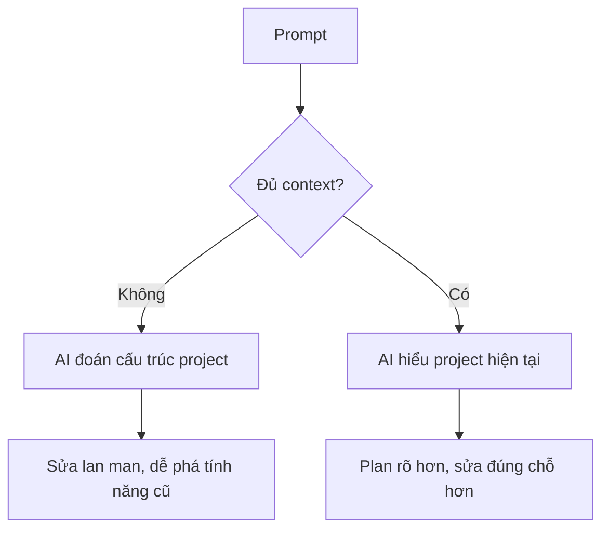
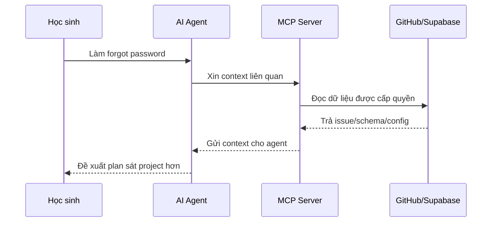
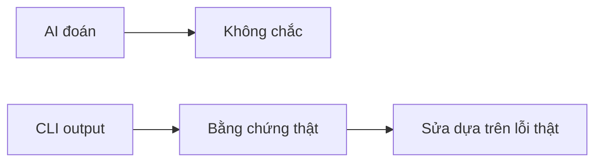
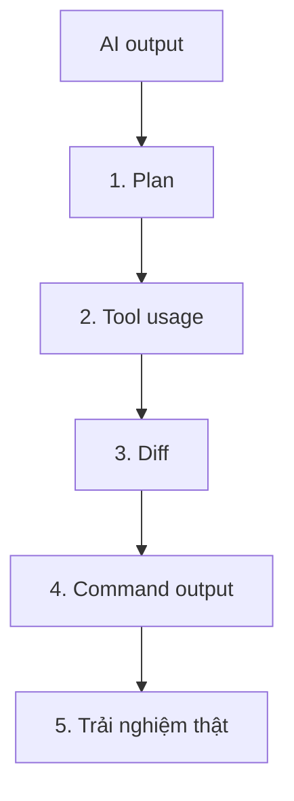
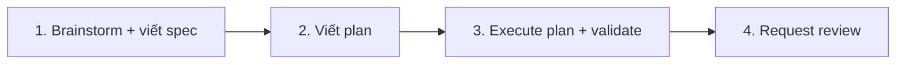

# Buổi 6: Context engineering và quy trình review output của AI

## Mục tiêu bài học

Sau buổi học này, học sinh sẽ:

- Hiểu vì sao **context engineering** quan trọng khi làm việc với AI agent.
- Phân biệt được **prompt**, **context**, **skills**, **MCP** và **CLI tools**.
- Giải thích được vì sao CLI output thường tiết kiệm token hơn việc copy nhiều nội dung vào chat.
- Biết review plan, tool usage, diff và kết quả kiểm tra của AI trước khi nhận code.
- Dùng Superpower plugin/package để tổ chức workflow làm tính năng **forgot password**, dựa trên app đã có login/logout.

---

## 1. Vì sao prompt tốt vẫn chưa đủ?

Ở buổi 5, chúng ta đã học cách viết prompt rõ ràng:

```text
Mục tiêu + Bối cảnh + Yêu cầu cụ thể + Ràng buộc + Kết quả mong muốn
```

Nhưng với project thật, prompt tốt vẫn chưa đủ. Ví dụ:

```text
Hãy thêm tính năng quên mật khẩu cho app của tôi.
```

AI vẫn chưa biết:

```text
Màn hình login nằm ở file nào?
Đã có login/logout chưa?
Dùng Supabase project nào?
Supabase Auth đã cấu hình redirect URL chưa?
Cần mở màn hình reset password trong app hay chỉ gửi email?
Kiểm tra xong bằng lệnh nào?
```

Nếu thiếu context, AI phải tự đoán. Đoán đúng thì may, đoán sai thì code dễ lệch và khó review.



> **Context engineering** không chỉ là viết prompt dài hơn. Đó là cách chuẩn bị môi trường để agent có đúng thông tin, đúng tool và đúng quy trình kiểm tra.

---

## 2. Context engineering là gì?

**Context engineering** là việc chọn lọc và kết nối các nguồn thông tin cần thiết cho AI agent trước khi giao việc.

```text
                    CONTEXT CHO AI AGENT

                        [ Prompt ]
                             |
      +----------------------+----------------------+
      |                      |                      |
 [ Repo files ]          [ MCP ]              [ CLI tools ]
 Code hiện có        GitHub, Supabase        gh, flutter, git
      |                      |                      |
      +----------------------+----------------------+
                             |
                         [ Skills ]
                  Quy trình chuyên môn có sẵn
```

### 5 loại context cần nhớ

| Loại context | Ví dụ với forgot password |
|---|---|
| Code context | File login, auth service, Supabase client |
| Product context | Người dùng quên mật khẩu và cần nhận email reset |
| Platform context | Supabase project, Auth URL configuration, redirect URL |
| Tool context | Agent được dùng GitHub CLI, Supabase CLI, Flutter command |
| Review context | Chạy `flutter analyze`, test gửi email reset |

### Bài tập nhanh

Với yêu cầu sau, hãy viết 6 thông tin context AI cần biết trước khi code:

```text
Thêm tính năng quên mật khẩu.
```

Gợi ý:

```text
[ ] App hiện tại chạy web hay mobile?
[ ] Đã có login/logout chưa?
[ ] Dùng Supabase hay backend khác?
[ ] Màn hình login nằm ở file nào?
[ ] Redirect URL reset password nên trỏ về đâu?
[ ] Kiểm tra xong bằng lệnh nào?
```

---

## 3. Skills là gì?

**Skill** là một quy trình chuyên môn được đóng gói sẵn để AI agent dùng lại khi gặp một loại việc quen thuộc.

Nếu prompt là “làm việc gì”, thì skill là “làm việc đó theo cách nào cho đúng”.

```text
Prompt:
Hãy chuyển màn hình HTML này sang Flutter.

Skill:
- Phân tích layout trước.
- Chọn widget Flutter tương ứng.
- Tách component nếu màn hình phức tạp.
- Giữ responsive layout.
- Chạy format/analyze sau khi sửa.
```

### Ví dụ skills gần với khóa học

| Skill | Dùng khi nào? |
|---|---|
| Convert HTML sang Flutter | Có thiết kế HTML/CSS và muốn chuyển thành Flutter widget |
| Supabase schema review | Cần kiểm tra bảng, policy, quan hệ dữ liệu |
| Code review | Cần đọc diff và tìm lỗi trước khi nhận code |
| Debug build error | App lỗi build/analyze và cần sửa theo log thật |
| Product planning | Chia tính năng lớn thành nhiều bước nhỏ |

### Khi nào nên dùng skill?

| Việc cần làm | Cách phù hợp |
|---|---|
| Đổi màu button | Prompt ngắn là đủ |
| Sửa lỗi nhỏ | Prompt + log lỗi |
| Convert cả màn hình UI | Nên dùng skill |
| Thiết kế database/RLS | Nên dùng skill hoặc checklist |
| Review output của AI | Nên dùng skill/checklist review |

Ghi nhớ:

```text
Skill giúp biến kinh nghiệm lặp lại thành quy trình có thể dùng lại.
```

---

## 4. MCP là gì?

Các em đã dùng Supabase MCP ở buổi trước. Hôm nay chúng ta nhắc lại bản chất.

**MCP** là viết tắt của **Model Context Protocol**.

```text
MCP là cầu nối giúp AI agent đọc hoặc thao tác với dịch vụ bên ngoài theo một cách có kiểm soát.
```

Ví dụ:

- **GitHub MCP:** đọc issue, pull request, workflow, repo metadata.
- **Supabase MCP:** đọc project, database, auth, storage trong phạm vi được cấp quyền.
- **Browser/DevTools MCP:** quan sát app web đang chạy.



### Điều cần hiểu đúng

| Hiểu sai | Hiểu đúng |
|---|---|
| Có MCP là AI tự làm đúng hết | MCP chỉ cung cấp context/tool, vẫn phải review |
| MCP là database | MCP là cầu nối tới dịch vụ |
| MCP thay thế CLI | MCP và CLI bổ sung cho nhau |
| Càng bật nhiều MCP càng tốt | Chỉ bật tool cần cho task |

---

## 5. CLI tool dùng thế nào và vì sao tiết kiệm token?

**CLI** là công cụ chạy bằng lệnh trong terminal.

| CLI tool | Dùng để làm gì? |
|---|---|
| `flutter` | Chạy, build, analyze app Flutter |
| `git` | Xem diff, branch, lịch sử thay đổi |
| `gh` | Đọc issue, PR, workflow GitHub |
| `supabase` | Làm việc với Supabase project, migration, local dev |
| `dart` | Format, analyze, chạy Dart file |

Khi làm việc với AI, **token** là lượng chữ AI phải đọc và xử lý. Copy cả dashboard, cả log dài hoặc cả file lớn vào chat sẽ tốn token và dễ nhiễu. CLI giúp lấy đúng phần cần thiết.

```text
Cách tốn token:
- Copy toàn bộ log GitHub Actions.
- Copy cả file code rất dài.
- Copy nguyên schema/database không chọn lọc.

Cách tiết kiệm token:
- Dùng lệnh lấy đúng issue, đúng lỗi, đúng diff.
- Cho agent đọc output ngắn và có bằng chứng thật.
```

Ví dụ:

```bash
gh issue view 12 --comments
supabase status
flutter analyze
git diff
```

CLI quan trọng vì nó tạo ra **bằng chứng thật**:



Ghi nhớ nhanh:

```text
Prompt giúp agent biết mục tiêu.
Skills giúp agent làm theo quy trình tốt.
MCP giúp agent nhìn ra hệ thống bên ngoài.
CLI giúp agent kiểm tra bằng bằng chứng thật và tiết kiệm token.
```

---

## 6. Review output của AI

Khi agent nói “Done”, chưa có nghĩa là xong. Chúng ta cần review theo 5 lớp:



| Lớp review | Câu hỏi cần hỏi |
|---|---|
| Plan | Agent có hiểu đúng việc và chia nhỏ hợp lý không? |
| Tool usage | Agent đã đọc đúng repo, GitHub, Supabase chưa? |
| Diff | Agent sửa đúng phạm vi hay rewrite lan man? |
| Command output | `flutter analyze`, build hoặc test có chạy không? |
| Trải nghiệm thật | Người dùng có đi được đúng flow không? |

### Dấu hiệu phải dừng lại

```text
[ ] Agent muốn xóa nhiều file không liên quan
[ ] Agent hard-code secret/token
[ ] Agent sửa lại toàn bộ auth flow đang chạy
[ ] Agent bỏ chế độ offline hiện có
[ ] Agent không chạy kiểm tra nào
```

---

## 7. Thực hành chính: Dùng Superpowers để làm forgot password

Superpowers là một **phương pháp làm việc với coding agent bằng skills**, không chỉ là một plugin để cài cho vui. Ý tưởng chính: agent không nhảy thẳng vào code, mà đi qua các cửa kiểm soát.

Với lớp mình, ta gói lại thành 4 pha dễ nhớ:



Project hiện tại đã có login/logout bằng Supabase Auth, và học sinh đã tiếp xúc với Supabase MCP/CLI, GitHub CLI, AI agent. Hôm nay ta dùng mô hình trên để làm một tính năng nhỏ nhưng thực tế: **forgot password**.

### Pha 1: Brainstorming và viết spec

Mục tiêu của pha này là làm rõ “muốn xây cái gì” trước khi code. Agent cần hỏi, đọc context, đề xuất hướng làm và viết lại thành một spec ngắn.

```text
Yêu cầu ban đầu:
Thêm tính năng quên mật khẩu cho app.

Spec sau brainstorming:
- Màn hình login có link "Quên mật khẩu?".
- User nhập email để nhận link reset password.
- App gọi Supabase Auth gửi email reset.
- App hiển thị thông báo rõ ràng sau khi gửi.
- Nếu có màn hình reset password trong app, user nhập mật khẩu mới và xác nhận mật khẩu.
- Không làm hỏng login/logout hiện có.
```

Câu hỏi agent nên làm rõ:

```text
[ ] Chỉ cần gửi email reset hay cần cả màn hình đặt mật khẩu mới trong app?
[ ] Redirect URL sau khi bấm link email là URL nào?
[ ] Nếu email không tồn tại, app hiển thị thông báo thế nào?
[ ] Có validate email rỗng/sai định dạng không?
[ ] Có cần giữ style giống màn hình login hiện tại không?
```

Pha này kết thúc khi giáo viên/học sinh đọc spec và nói: “Đúng, làm theo hướng này”.

### Pha 2: Writing plan

Spec trả lời “làm gì”. Plan trả lời “làm theo thứ tự nào, sửa file nào, kiểm tra ra sao”.

Một plan tốt phải đủ nhỏ để agent không bị lạc:

```text
1. Đọc code login/logout và Supabase client hiện tại.
2. Thêm link "Quên mật khẩu?" ở màn hình login.
3. Thêm màn hình/form nhập email để gửi reset password.
4. Gọi Supabase Auth reset password API với redirect URL đúng.
5. Nếu cần, thêm màn hình nhập mật khẩu mới sau khi mở link reset.
6. Chạy flutter analyze và test flow gửi email reset.
```

Context pack cho agent:

```text
Project hiện tại:
- Login/logout Supabase Auth đã hoạt động.
- App đã có màn hình login.
- Cần giữ nguyên login/logout hiện có.

Nguồn context cần đọc:
- File login.
- File Supabase client.
- File auth/login/logout.
- pubspec.yaml.
- Supabase Auth URL configuration qua MCP hoặc dashboard/CLI nếu cần.

Ràng buộc:
- Không phá login/logout.
- Không hard-code secret/token.
- Không rewrite toàn bộ app.
- Không tự đổi cấu hình Supabase nếu chưa giải thích rõ.
```

Nếu agent bắt đầu sửa code ngay khi chưa có plan, hãy dừng lại.

### Pha 3: Execute plan và validate

Pha này mới bắt đầu code. Agent làm từng bước trong plan, và sau mỗi bước phải có bằng chứng kiểm tra.

Validate bằng CLI và trải nghiệm thật:

```text
[ ] `flutter analyze` không có lỗi nghiêm trọng.
[ ] Màn hình login vẫn đăng nhập được.
[ ] Link "Quên mật khẩu?" mở đúng form.
[ ] Email rỗng hoặc sai định dạng được báo lỗi rõ ràng.
[ ] Email hợp lệ gọi được Supabase reset password.
[ ] App hiển thị thông báo kiểm tra email sau khi gửi.
[ ] Logout/login hiện có vẫn hoạt động.
```

Nguyên tắc của Superpowers ở pha này là: **evidence before claims** — phải có bằng chứng trước khi nói “xong”.

### Pha 4: Request review

Sau khi agent làm xong, ta không nhận code ngay. Ta yêu cầu review.

Review tập trung vào:

```text
[ ] Có đúng spec không?
[ ] Có sửa lan man ngoài plan không?
[ ] Có phá login/logout không?
[ ] Có hard-code secret/token không?
[ ] Redirect URL/reset flow có rõ ràng không?
[ ] Error message cho email sai/rỗng có dễ hiểu không?
[ ] Các lệnh validate đã chạy thật chưa?
```

Nếu review có lỗi **Critical** hoặc **Important**, sửa trước khi đi tiếp. Lỗi nhỏ có thể ghi lại để xử lý sau.

### Prompt thực hành cho lớp

```text
Hãy dùng workflow Superpowers để triển khai tính năng forgot password cho project Flutter hiện tại.

Làm theo 4 pha:
1. Brainstorm và viết spec ngắn. Chưa code.
2. Sau khi spec được duyệt, viết implementation plan từng bước.
3. Sau khi plan được duyệt, execute từng bước và validate bằng CLI/trải nghiệm thật.
4. Sau khi xong, request review trước khi nhận code.

Context:
- Login/logout Supabase Auth đã hoạt động.
- Cần thêm link "Quên mật khẩu?" và flow gửi email reset password.
- Có thể cần kiểm tra Supabase Auth redirect URL.
- Có thể dùng Supabase MCP/CLI, GitHub CLI, Flutter CLI và skill review nếu cần.

Ràng buộc:
- Không rewrite toàn bộ app.
- Không hard-code secret/token.
- Không thay đổi auth flow nếu không cần.
- Nếu cần thay đổi cấu hình Supabase, hãy giải thích trước để tôi review.

Bắt đầu bằng pha 1: hỏi các câu cần làm rõ và viết spec ngắn.
```

---

## 8. Tổng kết bài học

Hôm nay chúng ta không học tool mới, mà học lại bản chất của những tool đã dùng:

```text
Prompt  = giao việc
Context = giúp agent hiểu tình huống
Skill   = quy trình chuyên môn có thể dùng lại
MCP     = cầu nối tới hệ thống bên ngoài
CLI     = bằng chứng thật, ngắn gọn, tiết kiệm token
Review  = lớp bảo vệ cuối trước khi nhận code
```

Một agent mạnh không chỉ vì model giỏi. Agent mạnh vì có đúng mục tiêu, đúng context, đúng tool, đúng skill và đúng quy trình review.

> Context engineering là kỹ năng biến AI từ một chatbot đoán câu trả lời thành một cộng sự có thể hiểu project, dùng công cụ và tạo thay đổi kiểm tra được.

---

## 9. Bài tập về nhà

1. **Hoàn thiện context pack cho project nhóm:** mục tiêu, file liên quan, tool được phép dùng, ràng buộc và checklist review.
2. **Review output của agent:** ghi lại plan, file đã sửa và kết quả kiểm tra bằng CLI nếu nhóm đã làm forgot password.
3. **Tạo một mini skill:** viết checklist 5 đến 8 dòng cho một việc nhóm hay lặp lại, ví dụ review code Flutter, convert UI sang Flutter, debug Supabase error hoặc kiểm tra deploy GitHub Pages.

---

_Chúc các em điều khiển agent thật tỉnh táo! 💪_