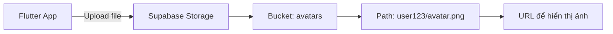
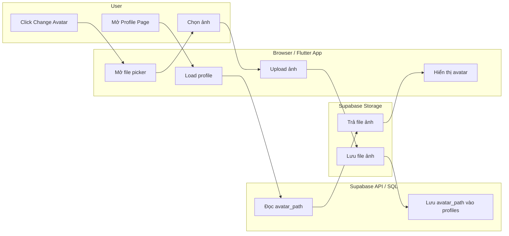
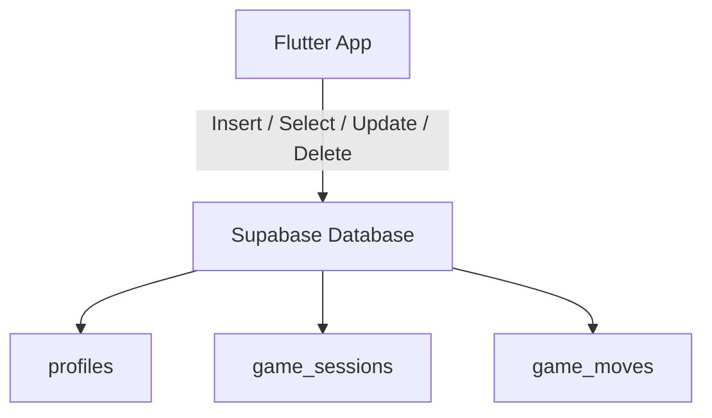
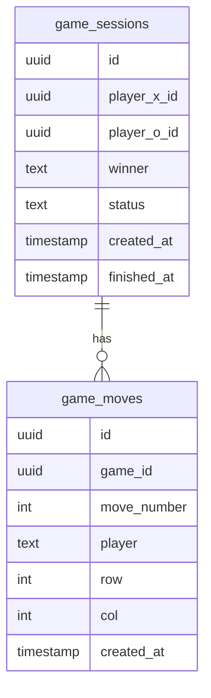
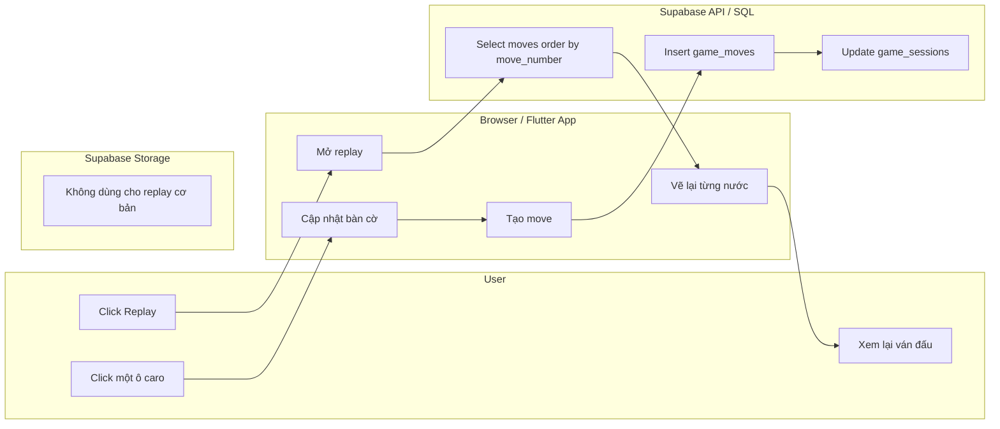

# Buổi 7: Database và Storage - Lưu avatar, file và replay game caro

## Mục tiêu bài học

Sau buổi học này, học sinh sẽ:

- Phân biệt được **Database** và **Storage** trong một app thật.
- Hiểu cách Supabase Storage lưu file, ảnh avatar và file người dùng upload.
- Hiểu vì sao database thường lưu metadata hoặc đường dẫn file, không lưu trực tiếp file lớn.
- Biết mô hình hóa dữ liệu replay cho một ván game caro.
- Thiết kế được bảng `game_sessions` và `game_moves` để replay lại một ván đấu.
- Viết được context pack/prompt để AI agent triển khai tính năng upload avatar, upload file hoặc replay game caro.

---

## 1. App thật cần lưu những loại dữ liệu nào?

Ở các buổi trước, chúng ta đã có app Flutter, Supabase Auth, login/logout và cách làm việc với AI agent. Nhưng một app thật không chỉ cần biết người dùng là ai. App còn cần **lưu dữ liệu**.

Với game caro hoặc project nhóm, dữ liệu có thể chia thành hai nhóm lớn:

```text
                 DỮ LIỆU TRONG APP

        +-------------------+-------------------+
        |                                       |
        v                                       v
 [ File / ảnh / media ]              [ Dữ liệu có cấu trúc ]
      Storage                               Database

 Avatar, ảnh bài đăng, file PDF       User profile, lịch sử ván,
 ảnh hóa đơn, ảnh bìa sách            từng nước đi, điểm số
```

### Ví dụ trong app caro

| Dữ liệu cần lưu                | Dùng gì? | Vì sao?                                  |
| ---------------------------------- | ---------- | ----------------------------------------- |
| Ảnh avatar của người chơi     | Storage    | Đây là file ảnh                       |
| Đường dẫn avatar               | Database   | Đây là text ngắn gắn với user       |
| Tên hiển thị của người chơi | Database   | Dữ liệu có cấu trúc                  |
| Một file luật chơi PDF          | Storage    | Đây là file upload                     |
| Ai thắng một ván caro           | Database   | Dữ liệu dạng dòng/cột                |
| Từng nước đi trong ván caro   | Database   | Cần sắp xếp và query lại để replay |

Ghi nhớ nhanh:

```text
Storage lưu file thật.
Database lưu thông tin có cấu trúc và đường dẫn tới file.
```

---

## 2. Storage là gì?

**Storage** là nơi lưu file trên cloud. File có thể là ảnh, video, PDF, âm thanh hoặc bất kỳ file nào người dùng upload.

Trong Supabase, Storage thường có 3 khái niệm quan trọng:

| Khái niệm                 | Giải thích đơn giản                     | Ví dụ                  |
| --------------------------- | -------------------------------------------- | ------------------------ |
| Bucket                      | Một khu vực/thư mục lớn để chứa file | `avatars`, `uploads` |
| Object path                 | Đường dẫn của file trong bucket         | `user_123/avatar.png`  |
| Public URL hoặc signed URL | Link để app tải/hiển thị file           | Link ảnh avatar         |



### Ví dụ: Upload avatar

Khi người dùng đổi avatar, app thường làm theo flow sau:



Flow này chỉ cần nhớ 4 thành phần chính:

| Thành phần          | Vai trò trong upload avatar                                    |
| --------------------- | --------------------------------------------------------------- |
| User                  | Bấm `Change Avatar`, chọn ảnh, mở lại profile            |
| Browser / Flutter App | Mở file picker, upload file, đọc profile và hiển thị ảnh |
| Supabase API / SQL    | Lưu và đọc `avatar_path` trong bảng `profiles`          |
| Supabase Storage      | Lưu file ảnh thật và trả ảnh khi app cần hiển thị      |

Điểm quan trọng: database không cần lưu toàn bộ file ảnh. Database chỉ cần lưu đường dẫn:

```text
profiles
+----+----------------+--------------------------+
| id | display_name   | avatar_path              |
+----+----------------+--------------------------+
| 1  | Minh           | avatars/1/avatar.png     |
| 2  | Lan            | avatars/2/avatar.png     |
+----+----------------+--------------------------+
```

### Vì sao không lưu trực tiếp ảnh vào database?

| Lưu ảnh trực tiếp trong database | Lưu ảnh trong Storage, path trong database |
| ------------------------------------ | -------------------------------------------- |
| Database nặng hơn                  | Database gọn hơn                           |
| Query chậm và khó quản lý       | Query nhanh hơn                             |
| Khó dùng CDN/cache                 | Dễ lấy URL để hiển thị                 |
| Không phù hợp cho file lớn       | Đúng mục đích của Storage              |

### Ví dụ Dart minh họa upload avatar

Đây là code minh họa ý tưởng. Khi làm project thật, tên bucket, path và cách chọn file có thể khác.

```dart
Future<void> uploadAvatar({
  required String userId,
  required Uint8List imageBytes,
}) async {
  final filePath = '$userId/avatar.png';

  await Supabase.instance.client.storage
      .from('avatars')
      .uploadBinary(
        filePath,
        imageBytes,
        fileOptions: const FileOptions(upsert: true),
      );

  await Supabase.instance.client
      .from('profiles')
      .update({'avatar_path': filePath})
      .eq('id', userId);
}
```

### Upload file khác avatar

Avatar là một ví dụ đặc biệt vì mỗi user thường chỉ có một ảnh đại diện hiện tại. Với file upload thông thường, app có thể lưu nhiều file cho một user.

Ví dụ bảng `user_files`:

| Column         | Ý nghĩa                   |
| -------------- | --------------------------- |
| `id`         | Mã file                    |
| `user_id`    | File thuộc user nào       |
| `file_name`  | Tên file gốc              |
| `file_path`  | Đường dẫn trong Storage |
| `file_type`  | Loại file                  |
| `created_at` | Thời điểm upload         |

```text
Storage:
uploads/user_1/homework.pdf

Database:
user_files.file_path = uploads/user_1/homework.pdf
```

### Bài tập nhanh

Hãy chọn đúng nơi lưu cho từng dữ liệu sau:

```text
[ ] Ảnh đại diện của user
[ ] Tên hiển thị của user
[ ] File PDF hướng dẫn chơi game
[ ] Đường dẫn tới file PDF
[ ] Thời điểm user upload file
[ ] Ảnh bìa sách trong app Book Exchange
```

---

## 3. Database là gì?

**Database** là nơi lưu dữ liệu có cấu trúc để app có thể thêm, sửa, xóa, tìm kiếm, lọc và sắp xếp.

Nếu Storage giống một kho file, thì Database giống một hệ thống bảng có quy tắc rõ ràng.

```text
Database
  |
  +-- Table: profiles
  |     +-- Row: một user profile
  |     +-- Column: display_name, avatar_path, created_at
  |
  +-- Table: game_sessions
  |     +-- Row: một ván caro
  |     +-- Column: player_x_id, player_o_id, winner, status
  |
  +-- Table: game_moves
        +-- Row: một nước đi
        +-- Column: game_id, move_number, player, row, col
```

### Các khái niệm cần nhớ

| Khái niệm | Giải thích                  | Ví dụ                                               |
| ----------- | ----------------------------- | ----------------------------------------------------- |
| Table       | Bảng dữ liệu               | `game_moves`                                        |
| Row         | Một dòng dữ liệu          | Một nước đi trong ván caro                       |
| Column      | Một loại thông tin         | `row`, `col`, `player`                          |
| Primary key | ID duy nhất của mỗi dòng  | `id`                                                |
| Foreign key | Liên kết sang bảng khác   | `game_moves.game_id` trỏ tới `game_sessions.id` |
| Query       | Câu hỏi gửi đến database | Lấy tất cả nước đi của ván này               |



### Ví dụ query bằng Supabase Dart

Lấy danh sách nước đi của một ván caro, sắp xếp theo thứ tự:

```dart
Future<List<Map<String, dynamic>>> loadMoves(String gameId) async {
  final moves = await Supabase.instance.client
      .from('game_moves')
      .select()
      .eq('game_id', gameId)
      .order('move_number', ascending: true);

  return List<Map<String, dynamic>>.from(moves);
}
```

---

## 4. Minh họa database bằng replay game caro

Replay nghĩa là app có thể phát lại một ván đấu đã diễn ra.

Với game caro, replay không cần lưu video. Chúng ta chỉ cần lưu **danh sách nước đi**.

```text
Ván caro đã chơi:

Lượt 1: X đánh vào hàng 10, cột 10
Lượt 2: O đánh vào hàng 10, cột 11
Lượt 3: X đánh vào hàng 11, cột 11
Lượt 4: O đánh vào hàng 9, cột 10
Lượt 5: X đánh vào hàng 12, cột 12

Replay:
Vẽ lại bàn cờ từ lượt 1 đến lượt 5 theo đúng thứ tự.
```

### Thiết kế bảng `game_sessions`

Bảng này lưu thông tin tổng quan của một ván đấu.

| Column          | Kiểu dữ liệu gợi ý | Ý nghĩa                             |
| --------------- | ----------------------- | ------------------------------------- |
| `id`          | UUID                    | Mã ván đấu                        |
| `player_x_id` | UUID                    | Người chơi X                       |
| `player_o_id` | UUID                    | Người chơi O                       |
| `winner`      | text                    | `X`, `O`, `draw` hoặc `null` |
| `status`      | text                    | `playing`, `finished`             |
| `created_at`  | timestamp               | Thời điểm bắt đầu               |
| `finished_at` | timestamp               | Thời điểm kết thúc               |

### Thiết kế bảng `game_moves`

Bảng này lưu từng nước đi.

| Column          | Kiểu dữ liệu gợi ý | Ý nghĩa               |
| --------------- | ----------------------- | ----------------------- |
| `id`          | UUID                    | Mã nước đi          |
| `game_id`     | UUID                    | Thuộc ván nào        |
| `move_number` | int                     | Số thứ tự nước đi |
| `player`      | text                    | `X` hoặc `O`       |
| `row`         | int                     | Hàng được đánh    |
| `col`         | int                     | Cột được đánh     |
| `created_at`  | timestamp               | Thời điểm đánh     |



### Vì sao replay nên lưu từng nước đi?

Có hai cách phổ biến để lưu ván caro:

| Cách lưu                             | Ưu điểm                                        | Nhược điểm                     |
| -------------------------------------- | ------------------------------------------------- | ---------------------------------- |
| Lưu trạng thái bàn cờ cuối cùng | Dễ hiển thị kết quả cuối                    | Không replay được từng bước |
| Lưu từng nước đi                  | Replay được, debug được, thống kê được | Cần thêm bảng và query         |

Vì mục tiêu của chúng ta là replay, lưu từng nước đi là lựa chọn phù hợp hơn.



Trong flow replay cơ bản, Supabase Storage không phải thành phần chính vì replay caro chỉ cần dữ liệu dạng bảng. Nếu sau này replay hiển thị avatar người chơi, app có thể dùng thêm Storage để load avatar giống flow profile ở trên.

Các bước cần hiểu:

| Bước             | Điều xảy ra                                                               |
| ------------------ | ---------------------------------------------------------------------------- |
| User click một ô | Browser/Flutter kiểm tra nước đi và cập nhật UI                       |
| App lưu move      | Supabase API/SQL insert một dòng vào `game_moves`                       |
| Ván kết thúc    | Supabase API/SQL cập nhật `winner` và `status` trong `game_sessions`    |
| User mở replay    | App query lại toàn bộ moves theo `game_id`                              |
| App phát replay   | App sắp xếp theo `move_number` và vẽ lại bàn cờ từng bước         |

### Ví dụ dữ liệu replay

```text
game_moves
+----+---------+-------------+--------+-----+-----+
| id | game_id | move_number | player | row | col |
+----+---------+-------------+--------+-----+-----+
| 1  | game_7  | 1           | X      | 10  | 10  |
| 2  | game_7  | 2           | O      | 10  | 11  |
| 3  | game_7  | 3           | X      | 11  | 11  |
| 4  | game_7  | 4           | O      | 9   | 10  |
| 5  | game_7  | 5           | X      | 12  | 12  |
+----+---------+-------------+--------+-----+-----+
```

Nếu app replay đến lượt 3, bàn cờ chỉ cần vẽ 3 nước đầu:

```text
Lượt 1: X tại 10,10
Lượt 2: O tại 10,11
Lượt 3: X tại 11,11
```

### Code Dart minh họa replay từng bước

```dart
class GameMove {
  GameMove({
    required this.moveNumber,
    required this.player,
    required this.row,
    required this.col,
  });

  final int moveNumber;
  final String player;
  final int row;
  final int col;
}

List<List<String>> buildBoardAtMove({
  required List<GameMove> moves,
  required int boardSize,
  required int currentMoveNumber,
}) {
  final board = List.generate(
    boardSize,
    (_) => List.generate(boardSize, (_) => ''),
  );

  final visibleMoves = moves.where(
    (move) => move.moveNumber <= currentMoveNumber,
  );

  for (final move in visibleMoves) {
    board[move.row][move.col] = move.player;
  }

  return board;
}
```

Trong UI Flutter, `currentMoveNumber` có thể tăng dần khi bấm nút Next hoặc khi dùng timer để tự phát replay.

---

## 5. Storage và Database phối hợp với nhau như thế nào?

Trong app thật, Storage và Database thường đi cùng nhau.

Ví dụ profile user:

```text
User upload avatar
      |
      v
Storage lưu file ảnh
      |
      v
Database lưu avatar_path trong profiles
      |
      v
Flutter app đọc profile và lấy ảnh từ Storage
```

Ví dụ file upload:

```text
User upload homework.pdf
      |
      v
Storage lưu file uploads/user_1/homework.pdf
      |
      v
Database lưu file_name, file_path, user_id, created_at
      |
      v
App hiển thị danh sách file của user
```

Ví dụ replay caro:

```text
User đánh cờ
      |
      v
Database lưu từng nước đi
      |
      v
App query lại moves
      |
      v
Replay ván đấu
```

### Bảng quyết định nhanh

| Câu hỏi                                               | Nếu câu trả lời là có | Nên dùng         |
| ------------------------------------------------------- | --------------------------- | ------------------ |
| Đây có phải file/ảnh/video/PDF không?             | Có                         | Storage            |
| Có cần lọc, sort, tìm kiếm theo cột không?       | Có                         | Database           |
| Có cần lưu quan hệ giữa user và dữ liệu không? | Có                         | Database           |
| Có cần lấy link để hiển thị file không?         | Có                         | Storage + Database |
| Có cần replay theo thứ tự thời gian không?        | Có                         | Database           |

---

## 6. Thực hành với AI agent

Ở buổi 6, chúng ta đã học context engineering và review output AI. Hôm nay hãy áp dụng lại quy trình đó.

### Context pack cho upload avatar

```text
Mục tiêu:
Thêm tính năng upload avatar cho user đã đăng nhập.

Context:
- App Flutter đã có Supabase Auth login/logout.
- Supabase client đã được cấu hình.
- Cần dùng Supabase Storage bucket avatars.
- Database có hoặc sẽ có bảng profiles để lưu avatar_path.

Ràng buộc:
- Không hard-code secret/token.
- Không phá login/logout hiện có.
- Không lưu trực tiếp ảnh vào database.
- Giữ UI cùng style với màn hình profile hiện tại.

Validate:
- Chạy flutter analyze.
- Đăng nhập được.
- Chọn ảnh và upload được.
- Reload app vẫn hiển thị avatar đúng.
```

### Context pack cho upload file

```text
Mục tiêu:
Thêm tính năng upload file cho user đã đăng nhập.

Context:
- File thật lưu trong Supabase Storage bucket uploads.
- Metadata lưu trong bảng user_files.
- Mỗi user chỉ thấy file của chính mình.

Ràng buộc:
- Không cho user xem file của user khác.
- Không lưu file lớn trong database.
- Hiển thị trạng thái loading và lỗi upload rõ ràng.

Validate:
- Upload một file thành công.
- Danh sách file hiển thị file vừa upload.
- Đăng xuất/đăng nhập lại vẫn thấy file.
```

### Context pack cho replay game caro

```text
Mục tiêu:
Thêm tính năng lưu và replay lại một ván caro.

Context:
- App đã có game caro offline hoặc caro local 2 người.
- Cần lưu mỗi ván vào game_sessions.
- Cần lưu từng nước đi vào game_moves.
- Replay lấy moves theo game_id và sắp xếp theo move_number.

Ràng buộc:
- Không rewrite toàn bộ game logic.
- Không làm hỏng flow chơi hiện tại.
- Nếu chưa có login, có thể dùng guest/local user tạm thời hoặc giải thích cần auth.
- Replay phải phát lại đúng thứ tự nước đi.

Validate:
- Chơi một ván mới và lưu được moves.
- Mở replay của ván đó.
- Bấm Next để thấy bàn cờ được dựng lại từng bước.
- Thứ tự X/O đúng với ván thật.
```

### Prompt thực hành cho lớp

```text
Hãy giúp tôi thiết kế và triển khai tính năng replay game caro bằng Supabase Database.

Làm theo quy trình:
1. Đọc code game caro hiện tại và xác định nơi xử lý nước đi.
2. Đề xuất schema gồm game_sessions và game_moves.
3. Viết implementation plan từng bước, chưa code ngay.
4. Sau khi tôi duyệt plan, triển khai lưu nước đi và màn hình replay.
5. Validate bằng flutter analyze và test một ván replay thật.

Context:
- Game caro hiện tại chơi được offline/local.
- Cần lưu từng nước đi để replay lại ván đấu.
- Dùng Supabase Database.
- Nếu cần user login, giải thích rõ trước khi sửa.

Ràng buộc:
- Không rewrite toàn bộ game.
- Không hard-code secret/token.
- Không sửa lan man ngoài tính năng replay.
- Replay phải lấy moves theo move_number tăng dần.

Bắt đầu bằng việc hỏi các câu cần làm rõ và đề xuất schema.
```

---

## 7. Checklist review output của AI

Khi agent làm xong tính năng database/storage, hãy review theo checklist sau:

```text
[ ] Agent có phân biệt đúng file trong Storage và metadata trong Database không?
[ ] Có hard-code secret/token không?
[ ] Có tạo bucket/table đúng mục đích không?
[ ] Có policy/quyền truy cập phù hợp với user không?
[ ] Có giữ login/logout hiện có không?
[ ] Upload avatar/file có trạng thái loading và error không?
[ ] Replay caro có lưu từng nước đi đúng thứ tự không?
[ ] Query replay có order by move_number không?
[ ] Có chạy flutter analyze hoặc kiểm tra tương đương không?
[ ] Có test trải nghiệm thật chưa?
```

Dấu hiệu phải dừng lại:

```text
[ ] Agent muốn lưu ảnh trực tiếp vào database mà không giải thích lý do
[ ] Agent bỏ qua quyền truy cập dữ liệu user
[ ] Agent rewrite toàn bộ game caro chỉ để thêm replay
[ ] Agent nói "done" nhưng không có bằng chứng validate
[ ] Replay hiển thị được bàn cờ cuối nhưng không phát lại từng bước
```

---

## 8. Tóm tắt kiến thức

```text
Storage  = nơi lưu file thật
Database = nơi lưu dữ liệu có cấu trúc

Avatar file       -> Storage
Avatar path       -> Database
Uploaded file     -> Storage
File metadata     -> Database
Caro game session -> Database
Caro moves        -> Database
Caro replay       -> Query moves theo thứ tự và vẽ lại bàn cờ
```

### Bảng tổng kết

| Thành phần             | Dùng để lưu         | Ví dụ trong bài                |
| ------------------------ | ----------------------- | --------------------------------- |
| Supabase Storage         | File/ảnh/media         | Avatar, file upload               |
| Supabase Database        | Dữ liệu dạng bảng   | Profile, game session, game moves |
| `profiles.avatar_path` | Đường dẫn tới file | `user123/avatar.png`            |
| `game_sessions`        | Thông tin một ván    | Người chơi, winner, status     |
| `game_moves`           | Từng nước đi        | X/O, row, col, move_number        |

Điểm quan trọng nhất:

> Muốn replay game caro, không cần lưu video. Chỉ cần lưu đúng thứ tự các nước đi.

---

## 9. Bài tập về nhà

1. **Thiết kế storage cho project nhóm:** project của em cần upload file/ảnh gì? Tạo danh sách bucket và path dự kiến.
2. **Thiết kế database metadata:** với mỗi file upload, database cần lưu những cột nào?
3. **Thiết kế replay caro:** viết lại schema `game_sessions` và `game_moves`, sau đó giải thích vì sao cần `move_number`.
4. **Viết prompt cho AI agent:** chọn một trong ba tính năng upload avatar, upload file hoặc replay caro và viết context pack đầy đủ.
5. **Review một output AI:** nếu đã nhờ agent code, hãy ghi lại agent đã sửa file nào, chạy lệnh gì và tính năng có đúng checklist không.

---

_Chúc các em lưu dữ liệu thật gọn và replay thật mượt! 💪_
