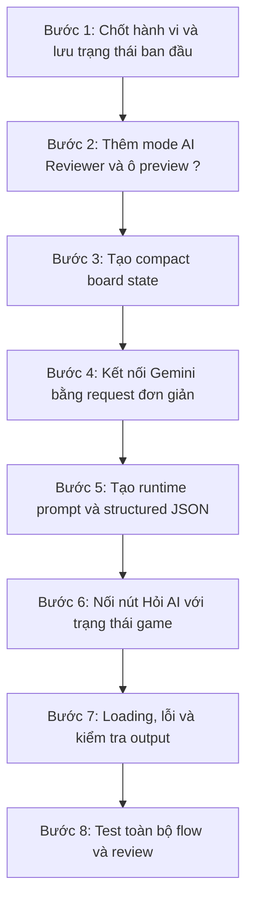

# Buổi 8: Tích hợp AI vào App - Xây dựng AI Move Reviewer cho game Caro

## Mục tiêu bài học

Sau buổi học này, học sinh sẽ:

- Biến game Caro đang ở chế độ **chơi ngay** thành game có thêm chế độ **AI Move Reviewer**.
- Khi bật AI Move Reviewer, chọn một ô sẽ chỉ hiển thị dấu `?`, chưa đặt quân ngay.
- Chuẩn hóa trạng thái bàn cờ 15×15 theo dạng tọa độ gọn.
- Gọi trực tiếp Gemini API từ Flutter và nhận structured JSON.
- Hiển thị điểm đánh giá, nhận xét, lý do và nguy cơ của nước đi.
- Biết chia feature thành các bước nhỏ, kiểm tra xong từng bước rồi mới đi tiếp.
- Dùng Codex để thực hiện từng bước theo đúng yêu cầu và checklist.

---

## 1. Sản phẩm cần hoàn thành

### Khi AI Move Reviewer đang tắt

```text
Chạm một ô trống
       ↓
Đặt X hoặc O ngay
       ↓
Đổi lượt
```

Đây là cách game của phần lớn học sinh đang hoạt động.

### Khi AI Move Reviewer đang bật

```text
Chạm một ô trống
       ↓
Ô hiển thị dấu ?
       ↓
Chưa đặt X/O và chưa đổi lượt
       ↓
Người chơi có thể:

[ Hỏi AI ]   [ Đánh ô này ]   [ Chọn lại ]
```

Sau khi nhấn **Hỏi AI**:

```text
AI COACH

Điểm: ★★★★☆
Đánh giá: Nước đi tốt

Lý do:
Nước này giúp mở rộng đường chéo của X.

Cần chú ý:
Đối thủ đang tạo một đường ngang nguy hiểm.

[ Đánh ô này ]   [ Chọn lại ]
```

### Quy tắc bắt buộc

```text
[ ] Dấu ? chỉ là preview, không phải một quân cờ.
[ ] Khi hiện ?, lượt chơi chưa thay đổi.
[ ] AI chỉ nhận xét, không tự đặt quân.
[ ] Chỉ khi bấm "Đánh ô này", X/O mới được đặt.
[ ] Bấm "Chọn lại" phải xóa dấu ?.
[ ] Chọn một ô trống khác phải chuyển dấu ? sang ô mới.
[ ] Tắt AI Move Reviewer thì game quay lại chế độ chạm là đánh ngay.
[ ] Restart game phải xóa dấu ?, kết quả AI và trạng thái loading/error.
```

---

## 2. Cách thực hành trong buổi học

Feature được chia thành 8 bước:



Quy tắc của buổi học:

> Chưa đạt checkpoint của bước hiện tại thì chưa chuyển sang bước tiếp theo.

Mỗi bước đều có:

1. Mục tiêu.
2. Yêu cầu sản phẩm.
3. Prompt giao cho Codex.
4. Checkpoint để kiểm tra.

---

## 3. Bước 1 - Chốt hành vi và tạo điểm khôi phục

### Mục tiêu

Đảm bảo game hiện tại vẫn chạy đúng trước khi thêm AI Move Reviewer.

### Việc cần làm

1. Chạy game hiện tại.
2. Chơi thử ít nhất một ván.
3. Kiểm tra chạm ô đang đặt quân ngay.
4. Chạy các lệnh kiểm tra hiện có của project.
5. Tạo một commit hoặc điểm khôi phục trước khi sửa feature mới.

### Prompt cho Codex

```text
Hãy kiểm tra trạng thái hiện tại của game Caro trước khi chúng ta thêm
AI Move Reviewer.

Yêu cầu:
- Chưa thay đổi code.
- Chạy các lệnh analyze/test phù hợp với project.
- Xác nhận game hiện tại đang ở flow chạm ô trống là đặt quân ngay.
- Liệt kê ngắn những hành vi cần giữ nguyên: đổi lượt, kiểm tra thắng,
  restart game và không cho đánh vào ô đã có quân.
- Cho tôi biết project đã sẵn sàng để bắt đầu feature mới hay chưa.
```

### Checkpoint 1

```text
[ ] Game chạy được.
[ ] X/O đổi lượt đúng.
[ ] Không đánh được vào ô đã có quân.
[ ] Game xác định được người thắng.
[ ] Restart hoạt động.
[ ] Analyze/test hiện tại không có lỗi nghiêm trọng.
[ ] Đã có điểm khôi phục trước khi sửa.
```

Nếu một mục chưa đạt, sửa game nền trước. Chưa thêm Gemini ở bước này.

---

## 4. Bước 2 - Thêm mode AI Move Reviewer và ô preview `?`

### Mục tiêu

Hoàn thiện toàn bộ trải nghiệm chọn nước đi **mà chưa gọi AI**.

### Yêu cầu sản phẩm

Thêm một control để bật/tắt **AI Move Reviewer**.

Khi mode đang tắt:

```text
Chạm ô → đặt quân ngay như game cũ
```

Khi mode đang bật:

```text
Chạm ô → hiện ? → chưa đặt quân → chưa đổi lượt
```

Thêm ba action:

- **Hỏi AI:** tạm thời có thể disable hoặc hiện thông báo “Sẽ làm ở bước sau”.
- **Đánh ô này:** xác nhận và đặt quân hiện tại vào ô đang có `?`.
- **Chọn lại:** bỏ ô đang chọn.

### Prompt cho Codex

```text
Hãy thực hiện Bước 2 của tính năng AI Move Reviewer cho game Caro hiện tại.

Mục tiêu:
- Thêm khả năng bật/tắt AI Move Reviewer.
- Khi tắt: giữ nguyên hành vi chạm ô là đánh ngay.
- Khi bật: chạm ô trống chỉ chọn ô và hiển thị dấu ?.
- Dấu ? chưa được tính là X/O, chưa đổi lượt và chưa chạy kiểm tra thắng.
- Có nút "Đánh ô này" để xác nhận nước đi.
- Có nút "Chọn lại" để bỏ lựa chọn.
- Nút "Hỏi AI" có thể chưa hoạt động ở bước này.

Hành vi cần có:
- Chọn ô khác thì dấu ? chuyển sang ô mới.
- Không chọn được ô đã có quân.
- Tắt mode, restart hoặc kết thúc game phải xóa ô đang preview.
- Flow chơi ngay cũ vẫn hoạt động khi mode tắt.

Ràng buộc:
- Chưa thêm Gemini.
- Chưa thêm package HTTP.
- Không thay đổi luật thắng hiện tại.
- Tự thích nghi với cấu trúc project hiện có.

```

### Checkpoint 2A - Mode tắt

```text
[ ] Chạm ô trống vẫn đặt X/O ngay.
[ ] Lượt đổi như trước.
[ ] Luật thắng vẫn đúng.
```

### Checkpoint 2B - Mode bật

```text
[ ] Chạm ô trống hiện ?.
[ ] Board chưa chứa thêm X/O.
[ ] Lượt chơi chưa đổi.
[ ] Chạm ô khác chuyển ? sang ô mới.
[ ] Chạm ô đã có quân không làm thay đổi selection.
[ ] "Chọn lại" xóa ?.
[ ] "Đánh ô này" thay ? bằng X/O và đổi lượt.
[ ] Restart xóa selection.
```

Chỉ chuyển sang bước 3 khi cả mode bật và mode tắt đều chạy đúng.

---

## 5. Bước 3 - Tạo compact board state

### Mục tiêu

Chuyển trạng thái game thành dữ liệu ngắn gọn để gửi cho AI.

Không gửi toàn bộ bàn cờ 15×15 với hàng trăm ô trống. Chỉ gửi tọa độ những ô
đã có quân và ô đang preview.

### Dạng dữ liệu mong muốn

```text
size=15
win=5
rule=freestyle
turn=X
x=7,7;8,8;9,9
o=7,8;8,7;9,7
selected=10,10
```

Quy ước:

- Tọa độ bắt đầu từ `0`.
- Một vị trí có dạng `row,column`.
- Nhiều vị trí cách nhau bằng dấu `;`.
- Ô có dấu `?` nằm trong `selected`.
- `selected` chưa được thêm vào danh sách X hoặc O.

### Prompt cho Codex

```text
Hãy thực hiện Bước 3: tạo compact board state cho game hiện tại.

Output cần có:
- size: kích thước bàn cờ.
- win: số quân liên tiếp để thắng.
- rule: freestyle.
- turn: người chơi hiện tại.
- x: tọa độ các quân X, dạng row,column;row,column.
- o: tọa độ các quân O, dạng row,column;row,column.
- selected: tọa độ ô đang có dấu ?.

Yêu cầu:
- Chỉ lấy các ô đã có X/O, không gửi ô trống.
- Không đưa selected vào danh sách X/O.
- Dùng tọa độ bắt đầu từ 0.
- Viết test phù hợp với cấu trúc project hiện tại.
- Tạo cách để tôi xem compact state trong lúc debug.

Ràng buộc:
- Chưa gọi Gemini.
- Chưa sửa giao diện AI result.
- Không thay đổi game logic.

Sau khi làm xong, chạy analyze/test và cho tôi ví dụ output thật từ game.
```

### Checkpoint 3

Tạo một tình huống bàn cờ nhỏ để tự đối chiếu:

```text
X tại 0,0 và 2,2
O tại 1,1 và 3,3
Đang chọn 4,4
Lượt hiện tại là X
```

Output phải thể hiện đúng:

```text
x=0,0;2,2
o=1,1;3,3
selected=4,4
turn=X
```

Checklist:

```text
[ ] X và O không bị lẫn.
[ ] Không đảo hàng và cột.
[ ] Không có tọa độ ô trống.
[ ] Selected chưa xuất hiện trong X/O.
[ ] Bàn trống không làm encoder bị lỗi.
[ ] Analyze/test đạt.
```

---

## 6. Bước 4 - Kết nối Gemini bằng request đơn giản

### Mục tiêu

Xác nhận Flutter gọi được Gemini trước khi gửi dữ liệu game thật.

### Chuẩn bị

1. Mở Google AI Studio.
2. Tạo Gemini API key.
3. Chọn model đang dùng được cho buổi học.
4. Thêm package HTTP phù hợp vào project.
5. Khai báo API key trực tiếp trong source code để demo nhanh trên lớp.

Model gợi ý cho bài thực hành:

```text
gemini-3.1-flash-lite
```

Giáo viên kiểm tra lại model và quota trong AI Studio trước ngày dạy.

### Request thử nghiệm

Ở bước này chưa dùng bàn cờ. Nút **Hỏi AI** chỉ cần gửi một yêu cầu cố định:

```text
Hãy trả lời đúng một câu:
Xin chào, tôi là huấn luyện viên game Caro.
```

### Prompt cho Codex

```text
Hãy thực hiện Bước 4: kết nối trực tiếp Flutter với Gemini API.

Yêu cầu:
- Dùng HTTP request trực tiếp từ app Flutter.
- Khai báo Gemini API key trực tiếp trong source để demo trên lớp.
- Dùng model gemini-3.1-flash-lite hoặc model tôi cung cấp.
- Tạo một request thử nghiệm với nội dung cố định:
  "Hãy trả lời đúng một câu: Xin chào, tôi là huấn luyện viên game Caro."
- Tạm nối request này với nút "Hỏi AI".
- Hiển thị loading trong lúc chờ.
- Hiển thị text trả về hoặc thông báo lỗi dễ hiểu.

Ràng buộc:
- Chưa gửi trạng thái bàn cờ.
- Chưa yêu cầu structured JSON.
- Chưa xây giao diện score/reason/risk.
- Tự thích nghi với kiến trúc hiện tại của project.

Sau khi làm xong, chạy analyze và hướng dẫn tôi kiểm tra request thật.
```

### Checkpoint 4

```text
[ ] Bấm Hỏi AI có trạng thái loading.
[ ] App nhận được một câu trả lời từ Gemini.
[ ] Không bấm gửi nhiều request trong lúc loading.
[ ] API lỗi không làm app crash.
[ ] Analyze đạt.
```

Nếu chưa nhận được câu trả lời, kiểm tra key, model, mạng và HTTP status trước
khi chuyển sang bước 5.

---

## 7. Bước 5 - Tạo runtime prompt và structured JSON

### Mục tiêu

Thay request cố định bằng request đánh giá nước đi thật.

### Runtime prompt cần có

```text
Vai trò:
Bạn là huấn luyện viên game Caro dành cho học sinh.

Luật:
- Bàn cờ có kích thước theo dữ liệu được gửi.
- Thắng khi có số quân liên tiếp bằng win.
- Luật freestyle.
- Tọa độ bắt đầu từ 0.

Trạng thái:
- Lượt hiện tại.
- Danh sách quân X.
- Danh sách quân O.
- Ô đang được cân nhắc.

Nhiệm vụ:
- Chấm nước đi từ 1 đến 5.
- Nhận xét ngắn.
- Giải thích bằng tiếng Việt dễ hiểu.
- Nêu một nguy cơ cần chú ý.

Ràng buộc:
- Không tự thay đổi bàn cờ.
- Không khẳng định đây là nước đi tối ưu tuyệt đối.
- Không trả lời dài dòng.
```

### Output bắt buộc

```json
{
  "score": 4,
  "verdict": "Nước đi tốt",
  "reason": "Nước này giúp mở rộng đường chéo của X.",
  "risk": "Đối thủ đang tạo một đường ngang nguy hiểm."
}
```

Ý nghĩa:

| Trường | Quy tắc |
|---|---|
| `score` | Số nguyên từ 1 đến 5 |
| `verdict` | Nhận xét ngắn |
| `reason` | Giải thích lợi ích của nước đi |
| `risk` | Nguy cơ hoặc điểm cần chú ý |

### Prompt cho Codex

```text
Hãy thực hiện Bước 5: chuyển request Gemini sang đánh giá nước đi thật.

Input:
- Dùng compact board state đã hoàn thành ở bước 3.
- Bao gồm size, win, rule, turn, x, o và selected.

Runtime prompt:
- Gemini đóng vai huấn luyện viên Caro dành cho học sinh.
- Chấm nước đi từ 1 đến 5.
- Giải thích ngắn bằng tiếng Việt.
- Nêu một nguy cơ cần chú ý.

Structured output bắt buộc:
{
  "score": số nguyên từ 1 đến 5,
  "verdict": chuỗi ngắn,
  "reason": chuỗi giải thích,
  "risk": chuỗi cảnh báo
}

Yêu cầu:
- Cấu hình response dạng JSON có schema nếu API/model hỗ trợ.
- Parse response thành model dữ liệu phù hợp với project hiện tại.
- Viết test cho parser với response đúng, thiếu trường và score ngoài 1 đến 5.

Ràng buộc:
- Chưa cần làm giao diện AI Coach đẹp.
- Không tự đặt quân sau khi có response.
- Không thay đổi ô selected khi request đang chạy.

Sau khi làm xong, chạy analyze/test và cho tôi xem một JSON response thật.
```

### Checkpoint 5

```text
[ ] Request chứa đúng trạng thái hiện tại.
[ ] Selected đúng với ô có dấu ?.
[ ] Response parse được thành 4 trường.
[ ] Score nằm trong 1–5.
[ ] Response thiếu trường bị từ chối.
[ ] AI không tự đặt quân.
[ ] Analyze/test đạt.
```

Giáo viên có thể cho 2–3 học sinh dùng cùng một bàn cờ để so sánh prompt và
response.

---

## 8. Bước 6 - Nối AI review với trải nghiệm game

### Mục tiêu

Hoàn thành flow người dùng:

```text
Bật AI Move Reviewer
       ↓
Chọn ô ?
       ↓
Hỏi AI
       ↓
Xem review
       ↓
Đánh ô này hoặc Chọn lại
```

### Trạng thái giao diện cần có

| Trạng thái | Giao diện |
|---|---|
| Chưa chọn ô | Disable Hỏi AI |
| Đã chọn ô | Bật Hỏi AI và Đánh ô này |
| Đang gọi API | Loading, disable gửi lại |
| Thành công | Hiện score, verdict, reason, risk |
| Lỗi | Hiện thông báo và nút thử lại |

### Prompt cho Codex

```text
Hãy thực hiện Bước 6: hoàn thiện trải nghiệm AI Move Reviewer.

Flow:
1. Bật AI Move Reviewer.
2. Chạm ô trống để hiện ?.
3. Nhấn Hỏi AI.
4. Hiển thị loading.
5. Hiển thị score, verdict, reason và risk.
6. Người chơi chọn Đánh ô này hoặc Chọn lại.

Yêu cầu:
- Hỏi AI chỉ bật khi có ô selected hợp lệ.
- Không gửi nhiều request khi đang loading.
- Chọn ô mới phải xóa review cũ.
- Chọn lại phải xóa ?, review và error.
- Đánh ô này phải dùng đúng quân/lượt hiện tại rồi mới đổi lượt.
- Restart hoặc tắt AI Move Reviewer phải xóa toàn bộ trạng thái review.
- AI không tự gọi hành động đánh quân.
- Giao diện giữ cùng style với game hiện tại.

Ràng buộc:
- Tự thích nghi với cấu trúc project hiện có.
- Không rewrite toàn bộ màn hình game.
- Không thay đổi luật thắng.

Sau khi làm xong, chạy analyze/test và cung cấp checklist test thủ công.
```

### Checkpoint 6

```text
[ ] Không có selected → Hỏi AI bị disable.
[ ] Có selected → Hỏi AI được bật.
[ ] Loading hiển thị rõ.
[ ] Kết quả có đủ 4 trường.
[ ] Chọn ô mới xóa kết quả cũ.
[ ] Chọn lại xóa ? và review.
[ ] Đánh ô này mới đặt X/O.
[ ] Sau khi đánh, lượt đổi đúng.
[ ] Restart xóa toàn bộ state AI.
[ ] Mode tắt vẫn chơi ngay như game cũ.
```

---

## 9. Bước 7 - Xử lý lỗi và kiểm tra output AI

### Mục tiêu

Đảm bảo response bất thường không làm game crash hoặc đặt sai quân.

### Các trường hợp cần xử lý

| Tình huống | Kết quả mong muốn |
|---|---|
| Không có mạng | Hiện lỗi kết nối, giữ ô `?` |
| Request timeout | Cho phép thử lại |
| HTTP 403 | Báo lỗi API key/quyền truy cập |
| HTTP 429 | Báo AI đang bận hoặc hết giới hạn |
| Response không phải JSON | Không crash |
| Thiếu trường | Từ chối response |
| Score nhỏ hơn 1 hoặc lớn hơn 5 | Từ chối response |
| Người chơi đổi ô khi đang chờ | Không hiển thị review cho nhầm ô |

Điểm cuối cùng đặc biệt quan trọng:

```text
Request bắt đầu cho ô A
        ↓
Người chơi chuyển sang ô B
        ↓
Response của ô A trả về
        ↓
Không được hiển thị response đó như review của ô B
```

### Prompt cho Codex

```text
Hãy thực hiện Bước 7: rà soát lỗi và tính nhất quán của AI Move Reviewer.

Kiểm tra và bổ sung:
- Mất mạng.
- Timeout.
- HTTP 403.
- HTTP 429.
- Response không phải JSON.
- Thiếu score/verdict/reason/risk.
- Score ngoài 1 đến 5.
- Người chơi đổi selection hoặc restart trong lúc request đang chạy.

Yêu cầu:
- App không crash.
- Không tự đánh quân khi response lỗi.
- Lỗi không làm thay đổi lượt chơi.
- Review chỉ được hiển thị nếu vẫn thuộc đúng ô đã gửi request.
- Sau lỗi, người chơi có thể thử lại hoặc chọn ô khác.
- Bổ sung test phù hợp với cấu trúc project.

Sau khi làm xong, chạy analyze/test và liệt kê cách tái hiện từng lỗi.
```

### Checkpoint 7

```text
[ ] Tắt mạng rồi Hỏi AI: app không crash.
[ ] Thử lại sau lỗi vẫn hoạt động.
[ ] Response sai không được hiển thị như kết quả hợp lệ.
[ ] Lượt và bàn cờ không thay đổi khi API lỗi.
[ ] Review không bị gắn nhầm sang ô khác.
[ ] Analyze/test đạt.
```

---

## 10. Bước 8 - Test toàn bộ flow và review

### Mục tiêu

Kiểm tra sản phẩm từ góc nhìn người chơi, không chỉ kiểm tra từng hàm riêng lẻ.

### Kịch bản A - Chơi bình thường

```text
1. Tắt AI Move Reviewer.
2. Chạm một ô trống.
3. X/O phải được đặt ngay.
4. Chơi đến khi có người thắng.
```

Kết quả:

```text
[ ] Game cũ không bị phá.
[ ] Đổi lượt và thắng/thua đúng.
```

### Kịch bản B - Hỏi AI rồi đánh

```text
1. Bật AI Move Reviewer.
2. Chọn một ô.
3. Xác nhận ô hiện ?.
4. Nhấn Hỏi AI.
5. Đợi review.
6. Nhấn Đánh ô này.
```

Kết quả:

```text
[ ] AI review đúng ô đã chọn.
[ ] Chỉ sau bước 6 quân mới được đặt.
[ ] Lượt đổi đúng.
```

### Kịch bản C - Hỏi AI rồi chọn lại

```text
1. Chọn ô A và Hỏi AI.
2. Chọn lại.
3. Chọn ô B.
4. Hỏi AI lần nữa.
```

Kết quả:

```text
[ ] Review cũ bị xóa.
[ ] Request mới dùng ô B.
[ ] Ô A vẫn trống.
```

### Kịch bản D - API lỗi

```text
1. Bật AI Move Reviewer.
2. Chọn một ô.
3. Tạo tình huống mất mạng hoặc key/model sai.
4. Nhấn Hỏi AI.
```

Kết quả:

```text
[ ] Có thông báo lỗi.
[ ] Dấu ? vẫn đúng.
[ ] Lượt chưa đổi.
[ ] Có thể thử lại hoặc chọn lại.
```

### Prompt review cuối

```text
Hãy review toàn bộ tính năng AI Move Reviewer hiện tại.

Spec cần đạt:
- Mode tắt: chạm là đánh ngay.
- Mode bật: chạm chỉ hiện ?.
- Hỏi AI đánh giá selected move.
- AI không tự đánh quân.
- Đánh ô này mới xác nhận nước đi.
- Chọn lại/restart/tắt mode xóa state AI.
- Compact board không gửi ô trống.
- Structured JSON có score, verdict, reason, risk.
- Loading/error hoạt động.
- Không gắn response cho nhầm selection.

Hãy:
1. Kiểm tra diff và hành vi hiện tại.
2. Liệt kê lỗi theo mức Critical, Important, Minor.
3. Chỉ sửa các lỗi Critical/Important sau khi tôi duyệt.
4. Chạy analyze, test và build phù hợp.
5. Chỉ nói hoàn thành khi có kết quả kiểm tra thật.
```

### Checkpoint 8 - Hoàn thành

```text
[ ] Bốn kịch bản A, B, C, D đều đạt.
[ ] Không còn lỗi Critical/Important.
[ ] Analyze đạt.
[ ] Test đạt.
[ ] Build web/mobile theo mục tiêu của project đạt.
[ ] Học sinh demo được flow trong 2 phút.
```

---

## 11. Thử thách mở rộng

Chỉ làm sau khi 8 bước chính đã hoàn thành.

### A. Gợi ý ba cấp độ

```text
Cấp 1: Chỉ gợi ý chiến thuật.
Cấp 2: Gợi ý khu vực.
Cấp 3: Hiện tọa độ đề xuất.
```

### B. Thay đổi phong cách AI Coach

```text
Nghiêm túc / vui nhộn / động viên / robot
```

### C. Nhận xét sau trận đấu

AI nhận lịch sử nước đi và trả về:

```json
{
  "goodPoint": "Bạn kiểm soát trung tâm tốt.",
  "mainMistake": "Bạn bỏ qua nguy cơ ở lượt 8.",
  "advice": "Hãy kiểm tra nước thắng của đối thủ trước mỗi lượt."
}
```

### D. Bình luận viên

Chỉ gọi AI khi có sự kiện đáng chú ý:

```text
X vừa tạo bốn quân liên tiếp và còn một đầu trống.
Phong cách: bình luận viên thể thao vui nhộn.
```

---

## 13. Tổng kết bài học

Luồng sản phẩm:

```text
Chơi ngay:
Tap → X/O → đổi lượt

AI Move Reviewer:
Tap → ? → Hỏi AI → Review → người chơi quyết định → X/O
```

Luồng dữ liệu:

```text
Board hiện tại
   ↓
Compact board state
   ↓
Runtime prompt
   ↓
Gemini API
   ↓
Structured JSON
   ↓
Kiểm tra output
   ↓
AI Coach UI
```

Điểm quan trọng nhất:

> Dấu `?` tạo ra khoảng dừng để người chơi hỏi AI trước khi quyết định. AI chỉ
> đưa ra nhận xét; thao tác **Đánh ô này** mới thay đổi trạng thái game.

---

## Tài liệu tham khảo

- [Gemini Interactions API - Text generation](https://ai.google.dev/gemini-api/docs/text-generation)
- [Gemini Structured outputs](https://ai.google.dev/gemini-api/docs/structured-output)
- [Gemini API troubleshooting](https://ai.google.dev/gemini-api/docs/troubleshooting)
- [Gemini API pricing và Free Tier](https://ai.google.dev/gemini-api/docs/pricing)

---

_Chúc các em hoàn thành từng checkpoint thật chắc trước khi sang bước tiếp theo! 💪_
