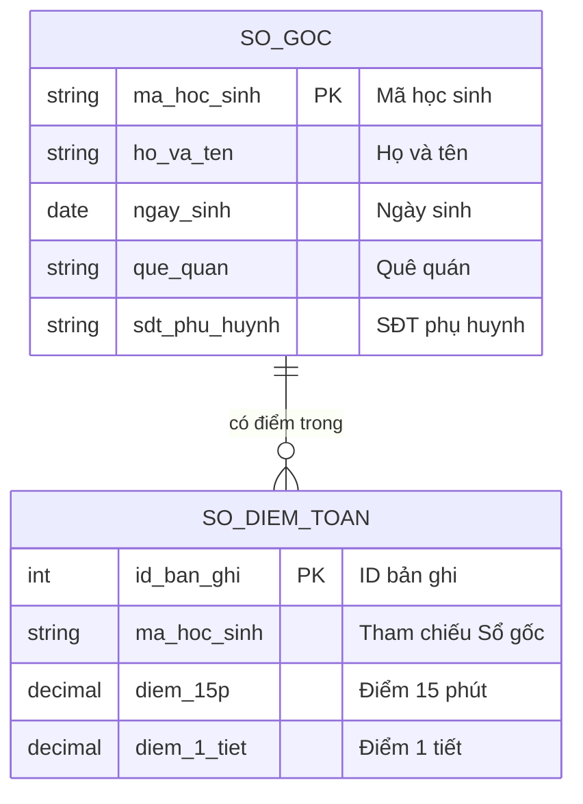
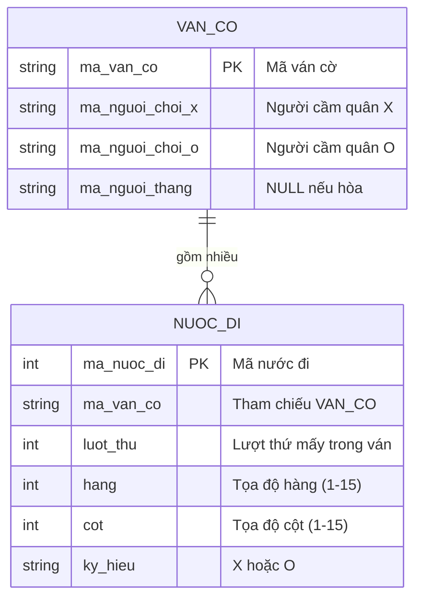
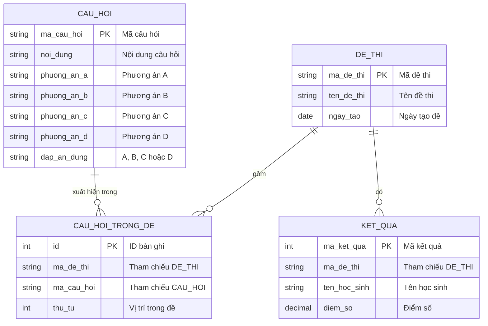

# Bài 15: Từ mô hình quản lý thực tế đến tư duy Cơ sở dữ liệu (Database)

## Mục tiêu bài học

- Nhận thức được nhu cầu tổ chức dữ liệu thông qua các bài toán quản lý thực tế.
- Khái quát hóa được phương pháp lưu trữ thông tin có cấu trúc bằng bảng tính.
- Hiểu và phân biệt được các khái niệm cốt lõi của Cơ sở dữ liệu: Bảng (Table), Bản ghi (Row/Record), Trường dữ liệu (Column/Field), Khóa chính (Primary Key).
- Nhận biết được Kiểu dữ liệu (Data Type), bốn thao tác dữ liệu cơ bản (CRUD) và cách đọc Sơ đồ quan hệ dữ liệu (ERD).
- Vận dụng AI để phân tích tính năng ứng dụng và mô hình hóa dữ liệu, trình bày thiết kế dưới dạng tài liệu (bản thiết kế) chuẩn bị cho việc khởi tạo Cơ sở dữ liệu ở bài sau.

## 1. Bài toán tổ chức dữ liệu trong thực tế

Để hiểu lý do hệ thống phần mềm cần Cơ sở dữ liệu, chúng ta bắt đầu bằng mô hình quản lý thông tin trường học.

Trong một lớp học, mỗi giáo viên bộ môn và giáo viên chủ nhiệm đều cần quản lý thông tin học sinh. Ban đầu, giả sử mỗi cuốn sổ đều ghi chép đầy đủ mọi thông tin chi tiết của học sinh kèm theo điểm số.

**Sổ điểm môn Toán:**

| Họ và tên   | Ngày sinh | Quê quán | SĐT Phụ huynh | Điểm 15p | Điểm 1 tiết |
| :------------- | :--------- | :--------- | :-------------- | :--------- | :------------- |
| Nguyễn Văn A | 15/03/2009 | Hà Nội   | 0912345678      | 8.5        | 9.0            |
| Trần Thị B   | 22/07/2009 | Nam Định | 0987654321      | 9.0        | 8.5            |

**Sổ điểm danh (Lớp trưởng):**

| Họ và tên   | Ngày sinh | Quê quán | SĐT Phụ huynh | 01/09    | 02/09    | 03/09    |
| :------------- | :--------- | :--------- | :-------------- | :------- | :------- | :------- |
| Nguyễn Văn A | 15/03/2009 | Hà Nội   | 0912345678      | Có mặt | Vắng    | Có mặt |
| Trần Thị B   | 22/07/2009 | Nam Định | 0987654321      | Có mặt | Có mặt | Có mặt |

Phương pháp này nảy sinh hai vấn đề nghiêm trọng:

1. **Dư thừa dữ liệu (Data Duplication):** Các thông tin cố định như Ngày sinh, Quê quán bị lặp lại ở mọi cuốn sổ, làm lãng phí giấy mực và công sức ghi chép.
2. **Khó khăn khi cập nhật:** Nếu học sinh Nguyễn Văn A thay đổi số điện thoại phụ huynh, thông tin này phải được cập nhật đồng loạt trên sổ của giáo viên chủ nhiệm, sổ điểm môn Toán, môn Văn và sổ điểm danh. Nếu bỏ sót, dữ liệu sẽ không đồng nhất.

## 2. Giải pháp đối chiếu và sự ra đời của mô hình quản lý mới

Để giải quyết vấn đề trên, nhà trường áp dụng một phương pháp quản lý tối ưu hơn: Sử dụng một "Sổ gốc" lưu trữ thông tin cố định và cấp cho mỗi học sinh một mã định danh duy nhất (Mã học sinh). Các cuốn sổ phát sinh sau đó chỉ cần tham chiếu đến mã này.

Có thể minh họa mô hình này trực quan thông qua công cụ Bảng tính (Spreadsheet).

**Bảng 1: Sổ gốc (Danh sách học sinh)**

| Mã học sinh | Họ và tên   | Ngày sinh | Quê quán  | SĐT Phụ huynh |
| :------------ | :------------- | :--------- | :---------- | :-------------- |
| HS001         | Nguyễn Văn A | 15/03/2009 | Hà Nội    | 0912345678      |
| HS002         | Trần Thị B   | 22/07/2009 | Nam Định  | 0987654321      |
| HS003         | Nguyễn Văn A | 10/11/2009 | Hải Phòng | 0905112233      |

*Lưu ý:* Việc sử dụng "Mã học sinh" là bắt buộc để phân biệt các cá nhân trùng tên (như hai bạn Nguyễn Văn A).

**Bảng 2: Sổ phát sinh (Sổ điểm Toán)**

| ID Bản ghi | Mã học sinh | Điểm 15p | Điểm 1 tiết |
| :---------- | :------------ | :--------- | :------------- |
| 1           | HS001         | 8.5        | 9.0            |
| 2           | HS002         | 9.0        | 8.5            |
| 3           | HS003         | 7.0        | 6.5            |

*Lưu ý:* Sổ điểm cũng có cột "ID Bản ghi" là mã định danh riêng cho từng dòng của chính nó. Cột "Mã học sinh" ở đây không phải mã định danh của sổ điểm, mà là giá trị dùng để tham chiếu ngược về Sổ gốc (cơ chế tham chiếu này sẽ được tìm hiểu kỹ hơn ở bài 16 với khái niệm Khóa ngoại).

Cách tiếp cận này chính là nền tảng hình thành nên cấu trúc Cơ sở dữ liệu trong khoa học máy tính: Chia tách dữ liệu để tránh dư thừa và dùng mã định danh để liên kết chúng lại với nhau.

## 3. Khái niệm Cơ sở dữ liệu (Database)

Cách tổ chức dữ liệu qua các bảng tính trên tương đồng với mô hình Cơ sở dữ liệu quan hệ (Relational Database) — mô hình tổ chức dữ liệu thành các bảng có liên kết với nhau, được sử dụng phổ biến nhất hiện nay.

### 3.1. Bảng đối chiếu thuật ngữ

| Mô hình bảng tính      | Cơ sở dữ liệu (Database) | Giải thích chức năng                                              |
| :------------------------- | :--------------------------- | :-------------------------------------------------------------------- |
| Tập hợp các trang tính | Database                     | Hệ thống lưu trữ tổng thể                                       |
| Trang tính (Sheet)        | Table (Bảng)                | Tập hợp dữ liệu về một đối tượng (ví dụ: Bảng học sinh) |
| Hàng (Row)                | Record (Bản ghi)            | Chứa dữ liệu của một đối tượng cụ thể                      |
| Cột (Column)              | Field (Trường dữ liệu)   | Chứa một thuộc tính của đối tượng (ví dụ: Ngày sinh)      |
| Mã định danh (Mã HS)   | Primary Key (Khóa chính)   | Giá trị định danh duy nhất cho mỗi bản ghi                     |

### 3.2. Kiểu dữ liệu (Data Type)

Trong bảng tính, một ô có thể chứa bất kỳ nội dung nào: có thể gõ "tám phẩy năm" vào ô điểm số mà không gặp cảnh báo. Cơ sở dữ liệu chặt chẽ hơn: mỗi trường dữ liệu phải được khai báo trước một **Kiểu dữ liệu (Data Type)**, và hệ thống từ chối mọi giá trị sai kiểu. Nhờ vậy, dữ liệu luôn hợp lệ và các phép tính (tính điểm trung bình, xếp hạng) luôn chính xác.

Các kiểu dữ liệu cơ bản nhất:

| Kiểu dữ liệu           | Ý nghĩa                           | Ví dụ trong bài                     |
| :------------------------ | :---------------------------------- | :------------------------------------- |
| Text (chuỗi ký tự)     | Văn bản có độ dài tùy ý     | Họ và tên, Quê quán               |
| Integer (số nguyên)     | Số không có phần thập phân    | Số trận thắng, Thời gian (giây)   |
| Decimal (số thập phân) | Số có phần thập phân           | Điểm 15 phút (8.5)                  |
| Date (ngày tháng)       | Ngày, tháng, năm                 | Ngày sinh                             |
| Boolean (đúng/sai)      | Chỉ nhận một trong hai giá trị | Có mặt / Vắng trong sổ điểm danh |

*Lưu ý:* Số điện thoại được lưu bằng kiểu Text chứ không phải kiểu số, vì hai lý do: số 0 ở đầu sẽ bị mất nếu lưu dưới dạng số nguyên (0912345678 trở thành 912345678), và không ai cần thực hiện phép tính cộng trừ trên số điện thoại.

### 3.3. Bốn thao tác cơ bản với dữ liệu (CRUD)

Mọi tính năng của ứng dụng, dù phức tạp đến đâu, khi chạm đến Cơ sở dữ liệu đều quy về bốn thao tác cơ bản, gọi tắt là **CRUD**:

| Thao tác                | Ý nghĩa                      | Ví dụ trường học                 | Ví dụ Game Caro                              |
| :----------------------- | :----------------------------- | :------------------------------------ | :--------------------------------------------- |
| **C**reate (Thêm) | Thêm bản ghi mới vào bảng | Ghi tên học sinh mới vào Sổ gốc | Lưu kết quả một ván đấu vừa kết thúc |
| **R**ead (Đọc)   | Tra cứu, hiển thị dữ liệu | Tra điểm của một học sinh        | Hiển thị bảng xếp hạng                    |
| **U**pdate (Sửa)  | Cập nhật bản ghi đã có   | Sửa số điện thoại phụ huynh     | Cộng điểm cho người chiến thắng         |
| **D**elete (Xóa)  | Xóa bản ghi khỏi bảng      | Gạch tên học sinh chuyển trường | Xóa tài khoản người chơi                 |

Khi mô tả một tính năng cho AI, việc xác định tính năng đó cần những thao tác nào trong bốn thao tác trên sẽ giúp bản mô tả rõ ràng và đầy đủ hơn.

### 3.4. Sơ đồ quan hệ dữ liệu (ERD)

Khi Cơ sở dữ liệu có từ hai bảng trở lên, kỹ sư dữ liệu sử dụng **Sơ đồ quan hệ dữ liệu (Entity Relationship Diagram — ERD)** để quan sát toàn cảnh: hệ thống có những bảng nào, mỗi bảng gồm những trường gì, và các bảng liên kết với nhau qua mã định danh nào. Mô hình quản lý trường học ở mục 2 được vẽ thành sơ đồ như sau:



Cách đọc sơ đồ:

- Mỗi khối là một bảng; ký hiệu PK đánh dấu Khóa chính.
- Đường nối giữa hai khối thể hiện sự liên kết giữa hai bảng thông qua mã định danh.
- Ký hiệu "chân chim" ở một đầu đường nối thể hiện quan hệ **một – nhiều**: một học sinh trong Sổ gốc có thể có nhiều dòng điểm trong Sổ điểm Toán.

Đây chính là dạng sơ đồ chúng ta sẽ yêu cầu AI tạo ra trong phần thực hành, đồng thời là ngôn ngữ chung để trao đổi thiết kế dữ liệu giữa các thành viên trong nhóm.

### 3.5. Vì sao cần hệ quản trị Cơ sở dữ liệu chuyên dụng

Mặc dù bảng tính đáp ứng tốt cho quản lý quy mô nhỏ, các ứng dụng thực tế đòi hỏi một hệ quản trị Cơ sở dữ liệu chuyên dụng (như PostgreSQL qua Supabase) nhằm đảm bảo tốc độ truy xuất với khối lượng dữ liệu lớn, hỗ trợ truy cập đồng thời và cung cấp cơ chế bảo mật chặt chẽ.

## 4. Thực hành: Khảo sát và mô hình hóa dữ liệu trên Bảng tính

Trong phần này, chúng ta sẽ tập trung hoàn toàn vào kỹ năng "Tư duy dữ liệu" (Data Modeling) thông qua Bảng tính trước khi áp dụng vào hệ quản trị Cơ sở dữ liệu chuyên dụng ở bài học tiếp theo.

**Bước 1: Từ giao diện (UI) đến dữ liệu — phân tích Game Caro**

Mọi màn hình của ứng dụng đều được "vẽ" từ dữ liệu lưu trong Cơ sở dữ liệu. Vì vậy, cách tự nhiên nhất để tìm ra cấu trúc bảng là đi ngược từ giao diện: quan sát màn hình cần hiển thị những thông tin gì, từ đó suy ra các trường dữ liệu cần lưu. Xét hai ví dụ từ dự án Game Caro:

*Ví dụ 1: Bảng Xếp Hạng (Leaderboard)*

Giao diện người chơi nhìn thấy trên ứng dụng:

```text
+----------------------------------+
|          BẢNG XẾP HẠNG           |
+------+---------------+-----------+
| Hạng | Người chơi    | Điểm số   |
+------+---------------+-----------+
|  1   | CaroMaster    |   150     |
|  2   | KyThuAn       |    96     |
|  3   | TanThu01      |    30     |
+------+---------------+-----------+
```

Phân tích: màn hình cần hiển thị Tên người chơi và Điểm số, vậy bảng dữ liệu phải lưu hai thông tin này; lưu thêm Số trận thắng và Tổng số trận để có căn cứ tính điểm; và cần Mã người chơi làm Khóa chính. Dữ liệu tương ứng trong Cơ sở dữ liệu:

| Mã người chơi | Tên hiển thị | Số trận thắng | Tổng số trận | Điểm số |
| :---------------- | :-------------- | :--------------- | :-------------- | :--------- |
| P001              | CaroMaster      | 50               | 60              | 150        |
| P002              | TanThu01        | 10               | 25              | 30         |
| P003              | KyThuAn         | 32               | 45              | 96         |

*Nhận xét:* Bảng dữ liệu không có cột "Hạng" và không cần lưu theo thứ tự xếp hạng. Khi hiển thị, ứng dụng đọc dữ liệu (thao tác Read) rồi sắp xếp theo Điểm số giảm dần — thứ hạng được tính ra lúc hiển thị, không phải dữ liệu cần lưu.

*Ví dụ 2: Lịch sử ván đấu (Match History)*

Giao diện người chơi nhìn thấy trên ứng dụng:

```text
+------------------------------------------+
|             LỊCH SỬ VÁN ĐẤU              |
+------------------------------------------+
| CaroMaster (X) đấu với TanThu01 (O)      |
| Người thắng: CaroMaster — 120 giây       |
+------------------------------------------+
| TanThu01 (X) đấu với KyThuAn (O)         |
| Kết quả: Hòa — 300 giây                  |
+------------------------------------------+
```

Dữ liệu tương ứng trong Cơ sở dữ liệu:

| Mã trận đấu | Mã người chơi X | Mã người chơi O | Mã người chiến thắng | Thời gian (giây) |
| :-------------- | :------------------ | :------------------ | :------------------------ | :----------------- |
| M001            | P001                | P002                | P001                      | 120                |
| M002            | P002                | P003                | (bỏ trống)              | 300                |

  *Lưu ý:* Ở trận M002, hai người chơi hòa nhau nên cột "Mã người chiến thắng" không có giá trị. Trong Cơ sở dữ liệu, một ô không chứa giá trị như vậy được gọi là NULL.

*Nhận xét:* Giao diện hiển thị tên người chơi (CaroMaster) nhưng bảng chỉ lưu mã (P001). Khi hiển thị, ứng dụng dùng mã này đối chiếu sang bảng Xếp hạng — nơi có cột Tên hiển thị — đúng nguyên tắc tham chiếu bằng mã định danh đã học ở mục 2.

**Bước 2: Sử dụng AI để gợi ý thiết kế từ mô tả tính năng**

Khi gặp một tính năng chưa có sẵn giao diện để phân tích, chúng ta mô tả tính năng bằng ngôn ngữ tự nhiên và để AI — trong vai trò kỹ sư dữ liệu — đề xuất cấu trúc bảng. Một prompt thiết kế dữ liệu hiệu quả gồm ba thành phần:

1. **Vai trò:** yêu cầu AI đóng vai kỹ sư dữ liệu.
2. **Mô tả tính năng kèm giới hạn phạm vi:** nêu rõ người dùng làm được gì với tính năng, bằng ngôn ngữ tự nhiên, và nói rõ những gì không cần làm. Không cần liệt kê các cột hay chi tiết kỹ thuật — suy ra những chi tiết đó chính là việc của AI. Phần giới hạn phạm vi là quan trọng nhất: phạm vi càng rộng, thiết kế càng phức tạp. Ví dụ, "thi trắc nghiệm" nói chung bao gồm nhiều thể loại (một lựa chọn, nhiều lựa chọn, điền từ, kéo thả...) cùng nhiều thông tin phụ; nếu không giới hạn, AI sẽ đề xuất một thiết kế đồ sộ vượt xa nhu cầu thực tế của dự án.
3. **Yêu cầu định dạng kết quả:** kết quả phải trực quan — có sơ đồ quan hệ, bảng dữ liệu mẫu và phần giải thích — và xuất ra hai định dạng: **HTML** (để trình chiếu, thuyết trình trước lớp) và **Markdown** (để làm tài liệu ngữ cảnh khi giao tiếp với AI agent ở các bước sau). Đồng thời nói rõ sản phẩm chỉ là **tài liệu thiết kế** — không phải mã SQL hay một Cơ sở dữ liệu thật — nếu không, AI sẽ có xu hướng chọn hệ quản trị (MySQL, PostgreSQL...) và viết mã cài đặt, phức tạp hóa nhiệm vụ.

Dưới đây là hai ví dụ prompt hoàn chỉnh theo cấu trúc trên.

*Ví dụ prompt 1: Lưu trữ lịch sử nước đi của một ván cờ Caro*

```text
Bạn là một kỹ sư dữ liệu. Tôi đang xây dựng game cờ Caro và muốn làm tính năng
xem lại ván đấu (replay): khi một ván cờ kết thúc, người chơi có thể mở lại ván đó
và xem từng nước đi hiện ra theo đúng thứ tự.

Chỉ cần đúng tính năng trên; không cần đi lại nước cờ (undo) hay xem trực tiếp.

Đây là giai đoạn thiết kế ở mức tài liệu: chỉ cần mô tả các bảng và vẽ sơ đồ,
không viết mã SQL và không cần quan tâm hệ quản trị cụ thể (MySQL, PostgreSQL...).

Hãy thiết kế mô hình dữ liệu cho tính năng này và trình bày kết quả thành hai file:
1. Một file HTML để trình chiếu: có sơ đồ các bảng và mối liên kết giữa chúng,
   bảng dữ liệu mẫu, và giải thích ngắn gọn lý do thiết kế.
2. Một file Markdown (database-design.md) chứa cùng nội dung, trình bày bằng
   bảng Markdown và sơ đồ Mermaid, để tôi dùng làm tài liệu ngữ cảnh khi làm việc
   với AI agent sau này.
Trong cả hai file, mỗi cột ghi rõ Kiểu dữ liệu và đánh dấu Khóa chính.
```

Kết quả mong đợi: mặc dù prompt không liệt kê bất kỳ cột nào, AI tự suy ra các thông tin cần lưu cho mỗi nước đi (thuộc ván nào, lượt thứ mấy, tọa độ ô, ký hiệu X hay O) và đề xuất hai bảng — một bảng cho ván cờ, một bảng cho từng nước đi — kèm sơ đồ quan hệ tương tự dưới đây:



Điểm mấu chốt của thiết kế: một ván cờ gồm nhiều nước đi (quan hệ một – nhiều), nên nước đi được tách thành bảng riêng và lưu kèm mã ván cờ. Tính năng replay khi đó chỉ là đọc mọi nước đi có cùng mã ván cờ và sắp xếp theo lượt tăng dần.

👉 [Mở mô phỏng tương tác: Caro Match Replay Simulator](pathname:///lessons-html/caro-database-simulator.html) — quan sát dữ liệu nguyên bản của các bảng, replay ván cờ đồng bộ với bảng dữ liệu, và tự chơi để xem từng bản ghi được ghi vào bảng theo thời gian thực.

*Ví dụ prompt 2: Thi trắc nghiệm một lựa chọn (single choice)*

```text
Bạn là một kỹ sư dữ liệu. Tôi đang xây dựng tính năng thi trắc nghiệm cho ứng dụng
học tập: giáo viên nhập câu hỏi vào ngân hàng câu hỏi chung, hệ thống chọn câu hỏi
từ ngân hàng để tạo thành đề thi, học sinh làm bài và hệ thống lưu lại điểm số.

Giới hạn: chỉ có dạng câu hỏi chọn một đáp án đúng (single choice) với 4 phương án.
Không cần các dạng câu hỏi khác hay giới hạn thời gian làm bài.

Đây là giai đoạn thiết kế ở mức tài liệu: chỉ cần mô tả các bảng và vẽ sơ đồ,
không viết mã SQL và không cần quan tâm hệ quản trị cụ thể (MySQL, PostgreSQL...).

Hãy thiết kế mô hình dữ liệu cho tính năng này và trình bày kết quả thành hai file:
1. Một file HTML để trình chiếu: có sơ đồ các bảng và mối liên kết giữa chúng,
   bảng dữ liệu mẫu, và giải thích ngắn gọn lý do thiết kế.
2. Một file Markdown (database-design.md) chứa cùng nội dung, trình bày bằng
   bảng Markdown và sơ đồ Mermaid, để tôi dùng làm tài liệu ngữ cảnh khi làm việc
   với AI agent sau này.
Trong cả hai file, mỗi cột ghi rõ Kiểu dữ liệu và đánh dấu Khóa chính.
```

Kết quả mong đợi: từ câu "hệ thống chọn câu hỏi từ ngân hàng để tạo thành đề thi", AI tự nhận ra một câu hỏi có thể xuất hiện trong nhiều đề khác nhau, và đề xuất bốn bảng — trong đó có một bảng trung gian nối Đề thi với Câu hỏi:



Hai điểm đáng chú ý trong thiết kế này:

- Đề thi và Câu hỏi có quan hệ **nhiều – nhiều** (một đề chứa nhiều câu hỏi, một câu hỏi xuất hiện trong nhiều đề), nên không thể lưu trực tiếp mã của bên này vào bảng của bên kia. AI đề xuất thêm bảng trung gian CAU_HOI_TRONG_DE để ghi lại từng cặp "đề thi – câu hỏi". Đây là ví dụ điển hình về giá trị của AI trong vai trò kỹ sư dữ liệu: từ mô tả tính năng bằng ngôn ngữ tự nhiên, AI nhận ra mối quan hệ phức tạp và tự đề xuất cấu trúc phù hợp.
- Nhờ giới hạn phạm vi "chỉ single choice với đúng 4 phương án", bốn phương án nằm gọn trong bốn cột của bảng CAU_HOI. Nếu mở rộng sang multiple choice (nhiều đáp án đúng, số phương án thay đổi), cấu trúc này không còn phù hợp — cần tách phương án thành bảng riêng. **Câu hỏi thảo luận:** hãy thử sửa prompt để hỗ trợ thêm multiple choice, sau đó so sánh hai bản thiết kế mà AI đưa ra.

**Nhiệm vụ thực hành:**

- Mỗi học sinh chọn một tính năng cho ứng dụng của mình (ví dụ: Danh sách bạn bè, Hòm thư tin nhắn) và tự viết prompt theo cấu trúc ba thành phần ở trên. Chú ý xác định rõ giới hạn phạm vi tính năng trước khi gửi cho AI.
- Kiểm tra kết quả AI trả về theo các tiêu chí: sơ đồ có đầy đủ các bảng và đường liên kết không; mỗi cột có Kiểu dữ liệu và Khóa chính không; dữ liệu mẫu có khớp với mô tả tính năng không. Nếu thiếu, yêu cầu AI bổ sung.

**Bước 3: Thiết kế cơ sở dữ liệu cho dự án nhóm (Giai đoạn tài liệu hóa)**

- Dựa trên phương pháp mô hình hóa vừa học, học sinh tiến hành thảo luận nhóm để thiết kế dữ liệu cho dự án cuối khóa của mình.
- Các nhóm chọn ra 1 đến 2 tính năng quan trọng nhất (ví dụ: "Giao dịch chi tiêu" cho ứng dụng tài chính cá nhân, hoặc "Đơn hàng" cho ứng dụng bán hàng).
- Sử dụng AI để hỗ trợ hoàn thiện cấu trúc các bảng theo mẫu prompt ở Bước 2. Sản phẩm của nhóm là một bộ tài liệu thiết kế gồm hai định dạng: file **Markdown** (bảng dữ liệu mẫu, sơ đồ Mermaid, kiểu dữ liệu, khóa chính) đóng vai trò bản vẽ kỹ thuật (Blueprint) để giao tiếp với AI agent khi khởi tạo Cơ sở dữ liệu thật ở bài 16, và file **HTML** để nhóm trình bày thiết kế trước lớp.

## Tóm tắt kiến thức

- Ghi chép trùng lặp cùng một thông tin ở nhiều nơi gây dư thừa dữ liệu và dễ dẫn đến sai lệch khi cập nhật.
- Giải pháp: tách dữ liệu thành các bảng riêng, cấp cho mỗi đối tượng một mã định danh duy nhất, các bảng khác chỉ tham chiếu đến mã này.
- Bốn khái niệm cốt lõi của Cơ sở dữ liệu: Bảng (Table), Bản ghi (Record), Trường dữ liệu (Field), Khóa chính (Primary Key).
- Mỗi trường dữ liệu có một Kiểu dữ liệu (Data Type) cố định; mọi tính năng khi chạm đến dữ liệu đều quy về bốn thao tác CRUD (Thêm – Đọc – Sửa – Xóa).
- Sơ đồ quan hệ dữ liệu (ERD) là ngôn ngữ chung để trình bày các bảng và mối liên kết giữa chúng.
- Giao diện (UI) được vẽ từ dữ liệu trong Cơ sở dữ liệu; phân tích ngược từ màn hình hiển thị là cách tự nhiên để tìm ra các trường dữ liệu cần lưu.
- Prompt thiết kế dữ liệu hiệu quả gồm ba thành phần: vai trò kỹ sư dữ liệu, mô tả tính năng kèm giới hạn phạm vi, và yêu cầu kết quả trực quan ở hai định dạng (HTML để trình chiếu, Markdown để giao tiếp với AI agent).
- Sản phẩm của bài học là bản thiết kế dữ liệu dưới dạng tài liệu, chưa phải Cơ sở dữ liệu thật.

Ở bài 16, các nhóm sẽ sử dụng Supabase CLI kết hợp AI để chuyển bản thiết kế này thành Cơ sở dữ liệu thật, đồng thời tìm hiểu cách liên kết các bảng với nhau bằng Khóa ngoại (Foreign Key).
