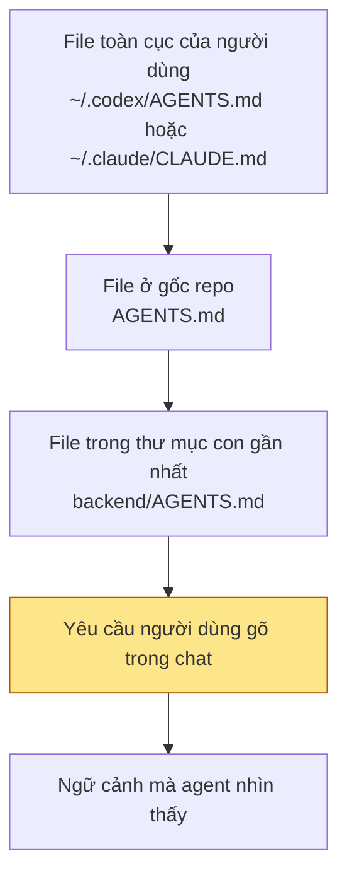
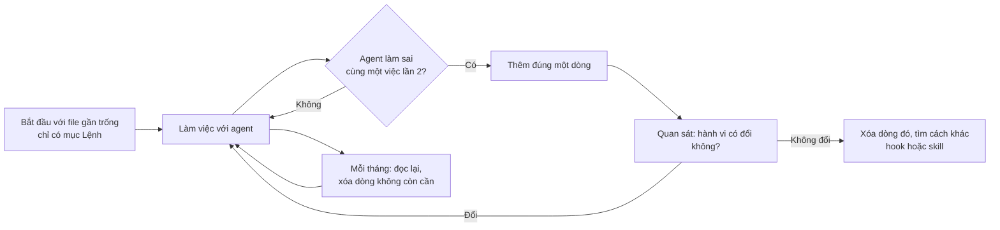

# Bài 18: Bộ nhớ của Agent và cách viết file hướng dẫn (AGENTS.md, CLAUDE.md)

## Mục tiêu bài học

- Giải thích được vì sao agent "quên" mọi thứ sau mỗi phiên làm việc và ba tầng bộ nhớ mà agent có thể dựa vào.
- Gọi đúng tên file hướng dẫn (instruction file) của từng công cụ phổ biến (Codex, GitHub Copilot, Gemini CLI, Cursor, Claude Code) và biết file nào được nạp khi nào.
- Quyết định được nội dung nào nên đưa vào file hướng dẫn, nội dung nào nên bỏ đi, dựa trên hướng dẫn chính thức của Anthropic.
- Nhận diện được các anti-pattern mới nhất (2025-2026) và hiểu vì sao chúng gây hại.
- Viết và kiểm chứng được một file `AGENTS.md` ngắn cho project nhóm.

## 1. Agent quên gì sau mỗi phiên làm việc?

Ở Bài 6, mỗi lần bắt đầu làm việc với agent, nhóm phải gõ lại "context pack": project đang ở đâu, dùng công nghệ gì, file nào cần đọc, ràng buộc nào phải tuân theo. Khi đóng cửa sổ chat và mở phiên mới, agent không còn nhớ gì cả. Lý do rất đơn giản: mô hình ngôn ngữ chỉ "nhìn thấy" những gì đang nằm trong cửa sổ ngữ cảnh (context window) của phiên hiện tại.

Để agent không phải học lại từ đầu, các công cụ hiện nay cung cấp ba tầng bộ nhớ:

| Tầng bộ nhớ | Ai viết | Sống bao lâu | Ví dụ |
| :--- | :--- | :--- | :--- |
| Cửa sổ ngữ cảnh (context window) | Người dùng và agent trong lúc chat | Hết phiên là mất | Đoạn hội thoại, file agent vừa đọc, kết quả lệnh vừa chạy |
| File hướng dẫn (instruction file) | Con người viết tay, lưu trong repo | Lâu dài, nạp lại ở mọi phiên | `AGENTS.md`, `CLAUDE.md`, `GEMINI.md`, `.github/copilot-instructions.md` |
| Bộ nhớ tự động (auto memory) | Agent tự ghi chú | Lâu dài, chỉ nạp phần đầu | Claude Code ghi vào `MEMORY.md` trong thư mục của từng project |

Bài này tập trung vào tầng thứ hai, vì đó là tầng do chính chúng ta kiểm soát và là "điểm đòn bẩy" lớn nhất khi làm việc với agent.

*Lưu ý:* Tài liệu chính thức của Anthropic nhấn mạnh rằng agent coi các file này là **ngữ cảnh, không phải cấu hình bắt buộc** (context, not enforced configuration). Nghĩa là file hướng dẫn giống lời dặn của người quản lý hơn là hàng rào kỹ thuật. Muốn chặn tuyệt đối một hành động, phải dùng cơ chế khác (xem mục 3).

## 2. Mỗi công cụ gọi file này là gì?

Mỗi công cụ đặt tên file khác nhau, nhưng ý tưởng giống nhau: một file Markdown nằm ở gốc repo, được tự động nạp vào ngữ cảnh khi agent bắt đầu làm việc.

| Công cụ | Tên file | Vị trí | Quy tắc lồng nhau (nesting) | Gợi ý độ dài |
| :--- | :--- | :--- | :--- | :--- |
| Chuẩn mở AGENTS.md (Linux Foundation, AAIF) | `AGENTS.md` | Gốc repo, có thể thêm trong thư mục con | File gần nhất với file đang sửa thắng; lệnh chat của người dùng thắng tất cả | Không quy định chính thức |
| OpenAI Codex | `AGENTS.md`, `AGENTS.override.md` | `~/.codex/` (toàn cục), gốc repo, mọi thư mục con | Nối từ gốc xuống thư mục hiện tại, file càng gần càng ưu tiên | Tổng cộng tối đa 32 KiB (mặc định), vượt là bị cắt âm thầm |
| GitHub Copilot | `.github/copilot-instructions.md`, `.github/instructions/*.instructions.md`, `AGENTS.md` | Thư mục `.github/` hoặc gốc repo | File `*.instructions.md` có `applyTo` để chỉ áp dụng cho một số đường dẫn | "Không dài quá 2 trang" |
| Google Gemini CLI | `GEMINI.md` | `~/.gemini/`, gốc project, thư mục con | Nối tất cả file tìm được; có thể đổi tên sang `AGENTS.md` qua `settings.json` | Không quy định |
| Cursor | `.cursor/rules/*.mdc`, `AGENTS.md` | Thư mục `.cursor/rules/` | Bốn chế độ kích hoạt qua frontmatter; `.cursorrules` cũ đã bị đánh dấu lỗi thời | Dưới 500 dòng mỗi rule |
| Claude Code (Anthropic) | `CLAUDE.md`, `.claude/rules/*.md`, `CLAUDE.local.md` | `~/.claude/`, gốc project, thư mục con | Nối từ gốc xuống; file trong thư mục con chỉ nạp khi agent đọc file trong đó | Dưới 200 dòng mỗi file |

Cách các file được nạp có thể hình dung như sau:



Càng đi xuống dưới, hướng dẫn càng cụ thể và càng được ưu tiên. Yêu cầu gõ trực tiếp trong chat luôn thắng mọi file.

**Chiến lược một file cho nhóm dùng nhiều công cụ**

Trong một nhóm, bạn A dùng Codex, bạn B dùng Copilot, bạn C thử Claude Code. Thay vì viết ba file giống nhau rồi để chúng lệch dần, cách được khuyến nghị hiện nay là:

1. Viết `AGENTS.md` làm nguồn sự thật duy nhất (Codex, Copilot, Cursor, Gemini CLI đều đọc được).
2. Với Claude Code, tạo `CLAUDE.md` chỉ chứa một dòng cầu nối, rồi thêm các ghi chú riêng cho Claude phía dưới nếu cần:

```markdown
@AGENTS.md
```

3. Với Gemini CLI, khai báo trong `.gemini/settings.json` để công cụ đọc thẳng `AGENTS.md`:

```json
{ "context": { "fileName": ["AGENTS.md", "GEMINI.md"] } }
```

*Lưu ý:* Tính đến tháng 09/2026, Claude Code vẫn **không** tự đọc `AGENTS.md`. Dòng `@AGENTS.md` ở trên là cách cầu nối được Anthropic ghi trong tài liệu chính thức.

## 3. Nên viết gì vào file hướng dẫn (theo Anthropic)

Tài liệu "Best practices" của Anthropic tóm gọn triết lý bằng một câu hỏi kiểm tra cho từng dòng:

> "Would removing this cause Claude to make mistakes? If not, cut it."
> (Bỏ dòng này đi thì agent có làm sai không? Nếu không, xóa nó.)

Lý do: cửa sổ ngữ cảnh là tài nguyên hữu hạn. Càng nhiều dòng thừa, agent càng khó nhận ra dòng quan trọng. Anthropic gọi thẳng hiện tượng này là "file hướng dẫn quá tải làm agent bỏ qua chính những chỉ dẫn thật sự".

**Bốn nhóm nội dung nên có**

| Nhóm | Ví dụ | Vì sao agent không tự đoán được |
| :--- | :--- | :--- |
| Lệnh chạy, test, kiểm tra | `flutter test`, `supabase db push`, `dart analyze` | Mỗi project có cách chạy khác nhau, đoán sai là mất thời gian |
| Quy ước khác với mặc định | Comment bằng tiếng Việt, dùng Riverpod thay vì setState | Mặc định của agent là quy ước phổ biến trên Internet, không phải của nhóm |
| Bẫy (gotcha) riêng của project | Bảng `game_matches` có RLS, phải đăng nhập mới đọc được | Không có trong code hoặc rất khó nhận ra khi đọc code |
| Ranh giới hành động | Luôn làm / Hỏi trước / Không bao giờ | Agent không biết nhóm sợ điều gì |

Cách viết ranh giới theo phân tích 2.500 repo của GitHub (2025): chia thành ba mục rõ ràng "Luôn làm", "Hỏi trước khi làm", "Không bao giờ làm". Đây là dạng chỉ dẫn được agent tuân theo ổn định nhất.

**Nội dung không nên có**

- Những gì agent tự đọc được từ code: cây thư mục, danh sách thư viện trong `pubspec.yaml`, mô tả từng file. Công cụ `/doctor` của Claude Code được tạo ra để cắt chính những phần này.
- Quy ước chuẩn của ngôn ngữ (agent đã biết Dart đặt tên biến kiểu camelCase).
- Hướng dẫn dài kiểu tutorial, tài liệu API chi tiết. Hãy để link hoặc đường dẫn file thay vì dán nội dung.
- Lời khuyên hiển nhiên: "viết code sạch", "hãy cẩn thận", "tối ưu khi có thể".

**Ba đường ranh: file hướng dẫn, skill, hook**

| Loại nội dung | Nơi đặt | Dấu hiệu nhận biết |
| :--- | :--- | :--- |
| Sự thật (fact) về project | File hướng dẫn (`AGENTS.md`) | Một câu ngắn, đúng ở mọi phiên |
| Quy trình (procedure) nhiều bước | Skill (`SKILL.md`), đã học ở Bài 6 | Bạn phải dán cùng một checklist vào chat lần thứ ba |
| Việc bắt buộc phải xảy ra mỗi lần | Hook hoặc cấu hình quyền của công cụ | "Không bao giờ sửa `.env`", "luôn chạy formatter sau khi sửa file" |

Anthropic viết rõ: một dòng như "không bao giờ sửa `.env`" trong file hướng dẫn là **một lời yêu cầu, không phải một bảo đảm** (a request, not a guarantee). Muốn bảo đảm, phải dùng hook.

Quy tắc kích hoạt đơn giản để nhớ:

- Agent làm sai cùng một việc **hai lần**: thêm một dòng vào file hướng dẫn.
- Bạn dán cùng một đoạn hướng dẫn vào chat **ba lần**: chuyển thành skill.
- Việc **phải** xảy ra mọi lúc: dùng hook, không dùng văn xuôi.

**Độ dài**

| Nguồn | Khuyến nghị |
| :--- | :--- |
| Anthropic (tài liệu chính thức, 2026) | Dưới 200 dòng mỗi file `CLAUDE.md` |
| Cursor (tài liệu chính thức) | Dưới 500 dòng mỗi rule, tách thành nhiều file nhỏ |
| GitHub Copilot | Không dài quá 2 trang, mỗi câu tự đủ nghĩa |
| HumanLayer (2025), đội ngũ làm công cụ agent | Thực tế giữ dưới 60 dòng |

## 4. Ví dụ: AGENTS.md cho project game Caro của nhóm

Xét hai phiên bản `AGENTS.md` cho project Caro online mà các nhóm đang phát triển.

**Phiên bản 1: nhiều lỗi thường gặp**

```markdown
# AGENTS.md

Bạn là một trợ lý lập trình hữu ích, thông minh và cẩn thận.        (1)

## Cấu trúc project                                                  (2)
lib/
  main.dart
  screens/
    home_screen.dart
    game_screen.dart
    ...
supabase/
  migrations/
  ...

## Thư viện đang dùng                                                (2)
flutter_riverpod 2.5.1, supabase_flutter 2.8.0, go_router 14.2.0, ...

## Quy tắc code style                                                (3)
- Dùng 2 dấu cách để thụt đầu dòng
- Dấu phẩy cuối (trailing comma) sau mỗi tham số
- Dòng không quá 80 ký tự
- Đặt tên class theo PascalCase, biến theo camelCase
(... 25 dòng nữa ...)

## QUAN TRỌNG                                                        (4)
- QUAN TRỌNG: LUÔN chạy test trước khi commit
- QUAN TRỌNG: KHÔNG BAO GIỜ sửa file .env
- QUAN TRỌNG: LUÔN viết comment tiếng Việt
- QUAN TRỌNG: HÃY CẨN THẬN với database                                (5)

## Kết nối
Supabase URL: https://abcxyz.supabase.co (project cũ, đã đổi từ tháng 5)  (6)
```

Các vấn đề:

1. Nhân vật (persona) mơ hồ. Không thay đổi hành vi của agent, chỉ tốn chỗ.
2. Cây thư mục và danh sách thư viện: agent đọc trực tiếp từ `pubspec.yaml` và thư mục nhanh hơn và chính xác hơn. Hai tháng sau file này sẽ sai.
3. Quy tắc định dạng thuộc về `dart format` và `analysis_options.yaml`, không phải việc của mô hình ngôn ngữ.
4. Nhấn mạnh tất cả các dòng thì không dòng nào nổi bật.
5. "Hãy cẩn thận" không phải chỉ dẫn, agent không biết cụ thể phải làm gì.
6. Thông tin lỗi thời chưa ai xóa. Agent sẽ tin và dùng.

**Phiên bản 2: ngắn, chỉ giữ những gì agent không tự biết**

```markdown
# AGENTS.md

Game Caro online: Flutter (mobile + web) với Supabase (Auth, Postgres, Storage).
Thiết kế chi tiết ở docs/design.md, không lặp lại ở đây.

## Lệnh
- Chạy app: flutter run -d chrome
- Test: flutter test
- Kiểm tra lỗi: dart analyze (phải sạch lỗi trước khi mở PR)
- Tạo migration: supabase migration new <ten_ngan_gon>, rồi supabase db push

## Quy ước khác mặc định
- State management: Riverpod, không dùng setState cho dữ liệu dùng chung.
- Comment và commit message viết bằng tiếng Việt.
- Tên migration dạng snake_case, có động từ: create_game_matches, add_index_moves.

## Bẫy cần biết
- Bảng game_matches và moves có RLS. Đọc dữ liệu khi chưa đăng nhập sẽ trả về rỗng, không phải lỗi.
- Trường result chỉ nhận 'win', 'loss', 'draw'.

## Ranh giới
- Luôn: chạy dart analyze và flutter test trước khi báo "xong".
- Hỏi trước: khi đổi schema database hoặc thêm thư viện mới.
- Không bao giờ: sửa .env, xóa migration đã push, commit thẳng lên nhánh main.
```

Khoảng 25 dòng. Mọi dòng đều trả lời được câu hỏi "bỏ đi thì agent có làm sai không?".

**Nối với context pack của Bài 6**

| Mục trong context pack (Bài 6) | Đi về đâu trong Bài 18 |
| :--- | :--- |
| Trạng thái project hiện tại, đang làm tính năng gì | Gõ trong chat mỗi phiên (thay đổi liên tục, không đưa vào file) |
| Nguồn cần đọc (file thiết kế, schema) | Một dòng trỏ tới `docs/design.md` trong `AGENTS.md` |
| Ràng buộc kỹ thuật cố định | Mục "Quy ước" và "Bẫy" trong `AGENTS.md` |
| Checklist review output của AI | Skill, hoặc mục "Ranh giới" nếu chỉ một câu |

## 5. Anti-pattern mới nhất (2025-2026)

| # | Anti-pattern | Vì sao có hại | Nguồn |
| :--- | :--- | :--- | :--- |
| 1 | Để công cụ tự sinh file rồi dùng luôn, không sửa | Nghiên cứu ETH Zurich: file do LLM sinh ra làm tỷ lệ thành công giảm khoảng 3% và tăng chi phí khoảng 20% | Gloaguen và cộng sự, 02/2026 |
| 2 | File "nồi lẩu" chứa mọi thứ | Anthropic: agent bỏ qua nửa số chỉ dẫn vì dòng quan trọng bị chìm | Anthropic Best practices, 2026 |
| 3 | Lặp lại những gì code đã nói (cây thư mục, thư viện, kiến trúc) | Nhanh lỗi thời; nghiên cứu cho thấy phần tổng quan repo "không giúp ích" | Anthropic `/doctor`; ETH Zurich 2026 |
| 4 | Viết quy tắc định dạng bằng văn xuôi | "Đừng bắt LLM làm việc của linter" | HumanLayer, 11/2025 |
| 5 | Viết hàng rào an toàn dưới dạng câu văn | Là lời yêu cầu, không phải bảo đảm; cần hook hoặc cấu hình quyền | Anthropic, 2026 |
| 6 | Viết QUAN TRỌNG / IN HOA ở nhiều dòng | Nhấn mạnh tất cả thì không gì nổi bật; chỉ nhấn một dòng hay bị bỏ qua | Anthropic Best practices |
| 7 | Chỉ dẫn mơ hồ và nhân vật chung chung ("cẩn thận", "trợ lý hữu ích") | Không thay đổi hành vi, bị bỏ qua ổn định trong mọi lần thử | GitHub 2025; Cursor; Crosley 02/2026 |
| 8 | Ghi yêu cầu về văn phong trả lời hoặc trỏ tới tài liệu bên ngoài repo | GitHub cảnh báo các chỉ dẫn này "có thể gây vấn đề" ở repo lớn | GitHub Docs, 2026 |
| 9 | File cũ không ai dọn, các file lồng nhau mâu thuẫn | Agent "có thể chọn ngẫu nhiên một trong hai"; file trở thành ảnh chụp quá khứ | Anthropic; Unblocked 08/2026 |
| 10 | Vượt ngân sách 32 KiB của Codex | Các file phía sau bị bỏ qua âm thầm, không có cảnh báo | OpenAI Codex Docs |

## 6. Nghiên cứu nói gì?

Năm 2026 có ba nghiên cứu đáng chú ý, và kết quả không hoàn toàn đồng thuận. Điều đó cũng là một bài học: đừng tin lời hứa "thêm file là agent giỏi hơn", hãy tự đo.

**Gloaguen và cộng sự (ETH Zurich), "Evaluating AGENTS.md", arXiv 2602.11988, 02/2026.** Chạy Claude Code, Codex và Qwen Code trên 438 bài toán sửa lỗi thật. File do LLM sinh ra làm tỷ lệ giải quyết giảm khoảng 3%. File do lập trình viên viết tay chỉ tăng khoảng 4%. Cả hai loại đều tăng chi phí 19 đến 23% vì agent đọc thêm file và chạy thêm test. Phát hiện quan trọng: agent tuân theo file rất tốt, thậm chí "quá vâng lời" (too obedient). Kết luận của nhóm nghiên cứu: chỉ ghi những chi tiết agent không tự suy ra được.

**Lulla và cộng sự, "On the Impact of AGENTS.md Files on the Efficiency of AI Coding Agents", arXiv 2601.20404, 01/2026.** Phân tích 124 pull request thật trên 10 repo. Repo có `AGENTS.md` viết tay giảm thời gian chạy trung vị 28,6% và giảm token đầu ra 16,6%, tỷ lệ hoàn thành không đổi. Nghĩa là file tốt không nhất thiết làm agent "thông minh hơn", nhưng làm nó đi thẳng tới đích hơn.

**McMillan, "Instruction Adherence in Coding Agent Configuration Files", arXiv 2605.10039, 05/2026.** Thử 1.650 phiên Claude Code, thay đổi độ dài file, vị trí dòng, tách hay gộp file, có mâu thuẫn hay không. Không biến nào tạo khác biệt đo được. Thứ ảnh hưởng mạnh nhất là **thời gian trong phiên**: mỗi bước làm thêm, xác suất tuân thủ giảm khoảng 5,6%.

Ba bài học rút ra cho nhóm:

1. Tự viết tay, không giao file này cho AI viết rồi dùng luôn.
2. Giữ phiên làm việc ngắn, chia việc lớn thành nhiều phiên. File hướng dẫn không cứu được một phiên đã quá dài.
3. Luôn cho agent một cách tự kiểm chứng (lệnh test, lệnh analyze). Đây là điều lãnh đạo dự án Claude Code gọi là "quan trọng nhất".

## 7. Quy trình viết và bảo trì



Các nguyên tắc vận hành, theo lời khuyên của Boris Cherny (người dẫn dắt dự án Claude Code, 01/2026) và tài liệu Anthropic:

- Đưa file vào git. Cả nhóm cùng sửa, nhiều lần mỗi tuần, review như review code.
- Mỗi dòng phải có lý do. Nếu không ai nhớ vì sao có dòng đó, xóa.
- Kiểm chứng file được nạp đúng bằng lệnh của từng công cụ:

| Công cụ | Cách kiểm tra |
| :--- | :--- |
| Codex | `codex "Tóm tắt các hướng dẫn bạn đang nhận được"` |
| Gemini CLI | `/memory show` |
| Claude Code | `/context` hoặc `/memory` |
| Copilot (VS Code) | Mở panel Chat, xem mục References của câu trả lời |

## 8. Thực hành

**Bước 1: Rà soát context pack của nhóm (10 phút)**

Mở lại context pack nhóm đã viết ở Bài 6. Với từng dòng, đánh dấu một trong ba lựa chọn: Giữ (đưa vào `AGENTS.md`), Xóa (agent tự biết hoặc hay đổi), Chuyển (thành skill vì là quy trình nhiều bước).

**Bước 2: Viết `AGENTS.md` (15 phút)**

Tạo file `AGENTS.md` ở gốc repo project nhóm, dưới 40 dòng, theo đúng bốn mục của phiên bản 2 ở mục 4: Lệnh, Quy ước khác mặc định, Bẫy cần biết, Ranh giới. Nếu nhóm có bạn dùng Claude Code, tạo thêm `CLAUDE.md` chỉ chứa dòng `@AGENTS.md`.

**Bước 3: Kiểm chứng (10 phút)**

1. Yêu cầu agent tóm tắt hướng dẫn nó đang nhận được. Đối chiếu với file.
2. Giao một việc nhỏ có thể quan sát, ví dụ "thêm một test cho hàm kiểm tra thắng thua". Xem agent có chạy đúng lệnh test trong mục Lệnh không, có hỏi trước khi đổi schema không.
3. Ghi lại một hành vi đã thay đổi so với khi chưa có file.

**Bước 4: Đổi chéo và review (10 phút)**

Đổi file với nhóm bên cạnh, chấm theo checklist:

```text
[ ] Dưới 40 dòng, không có cây thư mục hay danh sách thư viện
[ ] Mọi lệnh trong mục Lệnh đều chạy được thật
[ ] Không có dòng nào kiểu "hãy cẩn thận", "trợ lý hữu ích"
[ ] Tối đa một dòng được nhấn mạnh
[ ] Quy tắc định dạng nằm trong analysis_options.yaml, không nằm trong file này
[ ] Mục Ranh giới có đủ ba phần: Luôn / Hỏi trước / Không bao giờ
```

**Nhiệm vụ về nhà:**

1. Commit `AGENTS.md` (và `CLAUDE.md` cầu nối nếu có) lên repo nhóm, mở pull request để cả nhóm review.
2. Trong một tuần làm việc, mỗi khi agent làm sai cùng một việc hai lần, thêm một dòng và ghi ngày thêm vào commit message.
3. Cuối tuần, nộp bản `AGENTS.md` kèm ba dòng ghi chú: dòng nào đã thêm, vì sao, hành vi agent đổi thế nào.

## Tóm tắt kiến thức

- Agent không nhớ gì giữa các phiên. File hướng dẫn là bộ nhớ dài hạn do con người viết, được nạp tự động ở mọi phiên.
- Mỗi công cụ có tên file riêng (`AGENTS.md`, `CLAUDE.md`, `GEMINI.md`, `copilot-instructions.md`). Chuẩn mở `AGENTS.md` được nhiều công cụ nhất hỗ trợ, nên dùng làm nguồn sự thật và cầu nối một dòng cho công cụ còn lại.
- Chỉ viết những gì agent không tự suy ra được: lệnh, quy ước khác mặc định, bẫy, ranh giới. Câu hỏi kiểm tra: bỏ dòng này thì agent có làm sai không?
- Sự thật đi vào file hướng dẫn, quy trình đi vào skill, việc bắt buộc đi vào hook. File hướng dẫn là lời yêu cầu, không phải bảo đảm.
- Giữ file ngắn (Anthropic: dưới 200 dòng, thực tế tốt là vài chục dòng), tự viết tay, không dùng bản tự sinh chưa sửa.
- Nghiên cứu 2026 cho thấy file tốt giúp agent chạy nhanh hơn và rẻ hơn, nhưng độ dài phiên làm việc ảnh hưởng đến độ tuân thủ nhiều hơn cấu trúc file.
- Bảo trì như code: trong git, cả nhóm sửa, thêm một dòng khi sai lần hai, xóa dòng không còn cần.

Ở buổi tiếp theo, nhóm sẽ dùng chính `AGENTS.md` này khi tổ chức công việc trên GitHub cùng agent, để mọi thành viên và mọi công cụ làm việc theo cùng một bộ quy ước.

## Tài liệu tham khảo

- Anthropic, "How Claude remembers your project" (tài liệu Claude Code, 2026): https://code.claude.com/docs/en/memory
- Anthropic, "Best practices for Claude Code" (2026): https://code.claude.com/docs/en/best-practices
- Anthropic, "Effective context engineering for AI agents" (09/2025): https://www.anthropic.com/engineering/effective-context-engineering-for-ai-agents
- Anthropic, "Equipping agents for the real world with Agent Skills" (10/2025): https://www.anthropic.com/engineering/equipping-agents-for-the-real-world-with-agent-skills
- AGENTS.md, chuẩn mở của Agentic AI Foundation (Linux Foundation): https://agents.md/
- OpenAI, "Custom instructions with AGENTS.md" (Codex): https://developers.openai.com/codex/guides/agents-md
- GitHub Docs, "Adding repository custom instructions for GitHub Copilot" (2026): https://docs.github.com/en/copilot/how-tos/copilot-on-github/customize-copilot/add-custom-instructions/add-repository-instructions
- GitHub Blog, "How to write a great agents.md: lessons from over 2,500 repositories" (11/2025): https://github.blog/ai-and-ml/github-copilot/how-to-write-a-great-agents-md-lessons-from-over-2500-repositories/
- Google, "GEMINI.md context files" (Gemini CLI, 06/2026): https://geminicli.com/docs/cli/gemini-md/
- Cursor Docs, "Rules": https://cursor.com/docs/context/rules
- Gloaguen và cộng sự, "Evaluating AGENTS.md: Are Repository-Level Context Files Helpful for Coding Agents?" (02/2026): https://arxiv.org/abs/2602.11988
- Lulla và cộng sự, "On the Impact of AGENTS.md Files on the Efficiency of AI Coding Agents" (01/2026): https://arxiv.org/abs/2601.20404
- McMillan, "Instruction Adherence in Coding Agent Configuration Files" (05/2026): https://arxiv.org/abs/2605.10039
- HumanLayer, "Writing a good CLAUDE.md" (11/2025): https://www.humanlayer.dev/blog/writing-a-good-claude-md
