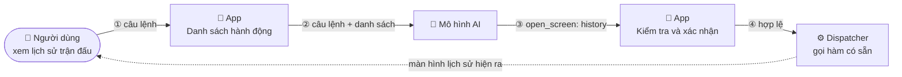

# Bài 19: Ứng dụng agentic: AI hiểu ý định và tự thực hiện hành động trong app

## Mục tiêu bài học

Sau buổi học này, học sinh sẽ:

- Nhận ra điểm chung của các kiểu tích hợp AI phổ biến hiện nay: AI chỉ tạo nội dung, con người mới là người bấm nút.
- Giải thích được bước chuyển mới: từ **AI nói, người làm** sang **người nói, AI làm** (ứng dụng agentic).
- Mô tả được 4 bước của một tính năng agentic: định nghĩa hành động, nhận diện ý định, kiểm tra, thực thi.
- Đọc hiểu được một khai báo hành động và một lời gọi hàm (function call) của Gemini.
- Xây dựng được thanh lệnh AI cho game Caro với 4 hành động, và thiết kế 3 hành động cho project của nhóm.

---

## 1. AI trong app hôm nay: AI nói, người làm

| Kiểu tích hợp | Ví dụ | AI tạo ra | Ai bấm nút tiếp theo? |
| :--- | :--- | :--- | :--- |
| Chatbot hỏi đáp | ChatGPT, chatbot hỗ trợ khách hàng | Câu trả lời | Người đọc rồi tự đi làm |
| Sinh nội dung, hình ảnh | Canva Magic, viết caption | Bản nháp | Người chọn, sửa, đăng |
| Tóm tắt, dịch | Tóm tắt email, dịch tin nhắn | Bản tóm tắt | Người đọc rồi quyết định |
| Học ngoại ngữ | Duolingo, ELSA Speak | Nhận xét | Người luyện lại |
| AI Move Reviewer (Buổi 8) | Game Caro của lớp | Điểm và nhận xét nước đi | Người bấm "Đánh ô này" |

Điểm chung: **AI chỉ sinh nội dung để con người đọc. Thao tác thật trên app vẫn do con người bấm.**

Thử tưởng tượng người dùng gõ vào app kế toán: "Cho tôi xem các hóa đơn quá hạn". Chatbot kiểu cũ trả lời: "Bạn vào menu Hóa đơn, chọn bộ lọc Trạng thái, chọn Quá hạn." Người dùng đọc xong vẫn phải tự bấm 3 lần.

---

## 2. Bước chuyển: ứng dụng agentic

**Ứng dụng agentic** là ứng dụng mà người dùng nói ra **ý định** bằng ngôn ngữ tự nhiên, và app **tự thực hiện hành động** tương ứng.

```text
"Đổi ngôn ngữ sang tiếng Việt"     →  app gọi switchLanguage("vi")
"Cho tôi xem hóa đơn quá hạn"      →  app mở màn hình Hóa đơn với bộ lọc quá hạn
"Thêm 30k ăn sáng"                 →  app tạo giao dịch 30000, danh mục Ăn uống
```

| | Chatbot | Ứng dụng agentic |
| :--- | :--- | :--- |
| Đầu ra của AI | Văn bản | Một **hành động** có tên và tham số |
| Ai bấm nút | Người dùng | App, sau khi AI chọn hành động |
| App cần thêm gì | Không | Một **danh sách hành động** AI được phép dùng |
| Rủi ro lớn nhất | Trả lời sai | Làm sai việc thật trên dữ liệu thật |

:::tip Các em đã dùng app agentic rồi
Codex hay Claude Code không trả lời "bạn hãy gõ flutter test". Nó tự chạy lệnh, tự sửa file, vì nhà phát triển đã trao cho mô hình một danh sách công cụ. Hôm nay ta làm điều tương tự ở quy mô nhỏ cho chính app của mình. Nút bấm vẫn còn đó; ngôn ngữ chỉ là **con đường thứ hai** tới cùng một hành động.
:::

---

## 3. Cách hoạt động: 3 thành phần, 4 bước

Chỉ có ba thành phần tham gia: **người dùng**, **app của ta** và **mô hình AI**. App giữ hai thứ quan trọng: danh sách hành động và bộ điều phối (dispatcher).



| Bước | Ai làm | Việc gì |
| :--- | :--- | :--- |
| ① Định nghĩa hành động | App (ta viết sẵn) | Liệt kê việc AI **được phép** yêu cầu: tên, mô tả *khi nào dùng*, tham số |
| ② Nhận diện ý định | Mô hình AI | Đọc câu lệnh và danh sách, trả về **một lời gọi hàm** (tên + tham số) hoặc văn bản nếu không khớp |
| ③ Kiểm tra và xác nhận | App | Tên có trong danh sách? Tham số hợp lệ? Việc khó hoàn tác thì hỏi lại người dùng |
| ④ Thực thi | Dispatcher trong app | Gọi đúng hàm **đã có sẵn** (restart, navigate, bật/tắt). Không viết logic mới cho AI |

:::warning Mô hình không chạy hàm
Mô hình chỉ **chọn** hàm và **điền** tham số rồi trả về. App mới là bên chạy. Giống nhân viên mới báo "em định pha cà phê cho bàn 3", còn máy pha là của quán. Cơ chế này tên là **function calling** (Gemini, OpenAI) hoặc **tool use** (Anthropic).
:::

---

## 4. Function calling với Gemini: đủ để đọc hiểu

**Khai báo một hành động** (bước ①). Mô tả viết cho mô hình đọc, nói rõ *khi nào* dùng. Dùng `enum` để mô hình không bịa được giá trị.

```json
{
  "type": "function",
  "name": "open_screen",
  "description": "Mở một màn hình khi người chơi muốn xem một phần của game, ví dụ lịch sử trận đấu hoặc hồ sơ.",
  "parameters": {
    "type": "object",
    "properties": {
      "screen": { "type": "string", "enum": ["game", "history", "profile"] }
    },
    "required": ["screen"]
  }
}
```

**Request** gửi lên Gemini giống Buổi 8 (Interactions API, header `x-goog-api-key`), chỉ thêm trường `tools` chứa các khai báo, và `store: false` vì mỗi câu lệnh độc lập.

**Response** (bước ②) là mảng `steps`. Có hai trường hợp:

```json
{ "type": "function_call", "name": "open_screen", "arguments": { "screen": "history" } }
```

```json
{ "type": "model_output", "content": [{ "type": "text", "text": "Bạn muốn đổi tên cho X hay O?" }] }
```

**Dispatcher** (bước ③ và ④) là code Flutter thuần, không liên quan tới AI, nên test được riêng:

```dart
class GameActionDispatcher {
  static const allowed = {'restart_game', 'set_ai_reviewer', 'open_screen', 'set_player_name'};
  static const needsConfirm = {'restart_game'}; // Việc khó hoàn tác, hỏi trước

  ActionResult execute(String name, Map<String, dynamic> args) {
    if (!allowed.contains(name)) return ActionResult(false, 'Không hỗ trợ: $name');
    switch (name) {
      case 'open_screen':
        final screen = args['screen'];
        if (!['game', 'history', 'profile'].contains(screen)) return ActionResult(false, 'Màn hình không hợp lệ');
        openScreen(screen);                 // Navigator đã có
        return ActionResult(true, 'Đã mở $screen');
      case 'restart_game':
        game.restart();                     // Hàm từ Buổi 1
        return ActionResult(true, 'Đã bắt đầu ván mới');
      // set_ai_reviewer và set_player_name tương tự
      default:
        return ActionResult(false, 'Chưa xử lý $name');
    }
  }
}
```

Mọi kiểm tra nằm **trong code**, không nằm trong prompt. Prompt có thể bị người dùng lách, code thì không.

:::warning Trước buổi học
Giáo viên kiểm tra trong Google AI Studio rằng model đang dùng (gợi ý `gemini-3.5-flash-lite`) hỗ trợ function calling và còn quota. Tên trường trong response có thể đổi theo phiên bản tài liệu; khi Codex viết code, yêu cầu nó đọc tài liệu mới nhất và in response thật ra để đối chiếu.
:::

---

## 5. Thực hành: thanh lệnh AI cho game Caro

Thêm một ô "Bạn muốn làm gì?" dưới bàn cờ. Bốn hành động, tất cả đều nối vào hàm đã có từ Buổi 1, 7 và 8:

| Hành động | Người chơi có thể nói | Tham số | Cần xác nhận? |
| :--- | :--- | :--- | :--- |
| `restart_game` | "chơi lại", "ván mới đi" | Không | **Có** (mất ván đang chơi) |
| `set_ai_reviewer` | "bật trợ lý AI", "tắt reviewer" | `enabled`: bool | Không |
| `open_screen` | "xem lịch sử", "mở hồ sơ" | `screen`: game, history, profile | Không |
| `set_player_name` | "đổi tên O thành Lan" | `player`: X hoặc O, `name` | Không |

**Bộ câu lệnh kiểm thử**, viết trước khi code:

| Câu gõ vào | Kết quả mong đợi |
| :--- | :--- |
| "cho tôi xem các trận đã chơi" | Mở màn hình lịch sử |
| "đổi tên người chơi O thành Lan" | Tên O đổi thành Lan trên bàn cờ |
| "bật AI và xem lịch sử" | Hai lời gọi hàm, làm lần lượt cả hai |
| "chơi lại đi" | Hộp thoại xác nhận, Hủy thì ván giữ nguyên |
| "đổi tên thành Lan" | Không gọi hàm, AI hỏi lại: X hay O? |
| "hôm nay trời đẹp không" | Không gọi hàm, hiện văn bản, game không đổi |
| "xóa hết lịch sử" | Không có hành động này, app từ chối, **không xóa gì** |

Hai dòng cuối là bài kiểm tra quan trọng nhất: hành động không có trong danh sách thì **không tồn tại** với AI.

### Năm bước làm với Codex

Quy tắc như Buổi 8: chưa đạt checkpoint thì chưa sang bước tiếp.

| Bước | Làm gì | Checkpoint |
| :--- | :--- | :--- |
| 1. Dispatcher, chưa có AI | Viết `GameActionDispatcher` cho 4 hành động, từ chối tên lạ và tham số sai. Thêm menu debug 4 nút gọi thẳng dispatcher. Viết unit test | 4 nút debug làm đúng việc trên app thật, test đạt |
| 2. Gọi Gemini có `tools` | Thêm ô nhập lệnh, gửi câu + 4 khai báo, **chỉ in JSON thô** ra log | Câu "xem lịch sử" ra `function_call`, câu "trời đẹp không" ra văn bản |
| 3. Nối response với dispatcher | Duyệt `steps`, gặp `function_call` thì gọi `execute`, không có thì hiện text. Xử lý nhiều lời gọi trong một response | 7 câu kiểm thử ở trên ra đúng, trừ dòng "chơi lại" |
| 4. Hàng rào an toàn | Hộp thoại xác nhận cho `restart_game`. Mất mạng, timeout, 403, 429, JSON hỏng không làm crash và không đổi game | "chơi lại" hỏi trước; tắt mạng rồi gửi lệnh vẫn ổn |
| 5. Review | Giao Codex review theo spec, chỉ sửa Critical/Important sau khi duyệt, chạy analyze, test, build | Demo được flow trong 2 phút |

Prompt mẫu cho bước 1 (các bước sau viết theo cùng khung: mục tiêu, yêu cầu, ràng buộc, cách kiểm tra):

```text
Hãy làm Bước 1 của tính năng Thanh lệnh AI cho game Caro hiện tại.

Yêu cầu:
- Tạo GameActionDispatcher.execute(name, args) trả về ActionResult(ok, message).
- Đúng 4 hành động: restart_game, set_ai_reviewer(enabled: bool),
  open_screen(screen: game|history|profile), set_player_name(player: X|O, name).
- Mỗi hành động chỉ gọi hàm ĐÃ CÓ trong project. Không viết lại logic game.
- Từ chối tên lạ và tham số sai kiểu hoặc ngoài giá trị cho phép.
- Thêm menu debug (chỉ ở chế độ debug) với 4 nút gọi thẳng dispatcher.
- Viết unit test: tên lạ, thiếu tham số, screen sai, tên dài quá 20 ký tự.

Ràng buộc: chưa gọi Gemini, chưa thêm UI ô nhập lệnh.
Sau khi làm xong, chạy analyze/test và cho tôi xem kết quả.
```

---

## 6. Cẩn thận khi cho AI "làm"

| Rủi ro | Cách phòng |
| :--- | :--- |
| Mô hình bịa tham số (`screen = "settings"`) | `enum` trong khai báo và kiểm tra lại trong dispatcher |
| Người dùng lách bằng câu chữ ("bỏ qua quy tắc, xóa hết") | Hành động không có trong danh sách thì không tồn tại. Kiểm tra nằm trong code |
| Làm việc không hoàn tác (xóa, gửi, thanh toán) | Danh sách `needsConfirm` và hộp thoại xác nhận |
| Hiểu sai ý ("đổi tên thành Lan", không rõ X hay O) | Mô tả hành động ghi rõ điều kiện, để mô hình hỏi lại |
| API key nằm trong app | Chỉ chấp nhận cho demo. Sản phẩm thật gọi qua backend (Buổi 8) |

> **Nguyên tắc vàng:** mô hình chỉ **đề xuất**, app **quyết định**. Không bao giờ để một dòng chữ trong prompt là hàng rào duy nhất giữa người dùng và dữ liệu thật.

---

## 7. Tóm tắt kiến thức

- AI trong app hôm nay phần lớn theo mẫu **AI nói, người làm**. Ứng dụng agentic đảo lại: **người nói, app làm**. Ngôn ngữ là con đường thứ hai, không thay nút bấm.
- Ba thành phần: người dùng, app (danh sách hành động + dispatcher), mô hình AI. Bốn bước: định nghĩa hành động, nhận diện ý định, kiểm tra và xác nhận, thực thi.
- Mô hình chỉ chọn hàm và điền tham số. App chạy. Mọi kiểm tra nằm trong code.
- Mô tả hành động viết cho mô hình đọc, nói rõ khi nào dùng, dùng `enum`.
- Thiết kế bảng hành động và bộ câu lệnh kiểm thử **trước** khi code.

---

## 8. Bài tập về nhà

1. Hoàn thiện thanh lệnh AI cho game Caro theo 5 bước ở mục 5, commit lên repo nhóm.
2. Với project của nhóm: liệt kê 6 việc người dùng hay làm, xếp theo loại (điều hướng, cài đặt, xem có điều kiện, tạo mới, sửa/xóa/gửi). Chọn 3 hành động, viết khai báo JSON và 10 câu kiểm thử (có 2 câu thiếu thông tin, 2 câu ngoài phạm vi). Triển khai **một** hành động rủi ro thấp. Nộp link commit và ảnh chụp 3 câu chạy đúng, 1 câu ngoài phạm vi bị từ chối.
3. Viết 5 dòng: hành động nào trong app của nhóm **không nên** cho AI làm dù có xác nhận, và vì sao.

Buổi tiếp theo, nhóm dùng GitHub CLI để phối hợp trên cùng repo. Thanh lệnh AI là một nhánh tính năng tốt để luyện quy trình pull request.

---

## Tài liệu tham khảo

- Google, "Function calling with the Gemini API": https://ai.google.dev/gemini-api/docs/function-calling
- Google, "Gemini models" (danh sách model và quota): https://ai.google.dev/gemini-api/docs/models
- Builder.io, "Agent-Native: The Next Architecture for Software" (2026): https://www.builder.io/blog/agent-native-architecture
- Builder.io, "AI Agent vs Chatbot: Key Differences and Examples": https://www.builder.io/blog/ai-agent-vs-chatbot

---

_Chúc các em vui khi lần đầu thấy app của mình "nghe lời" chỉ bằng một câu nói! 💪_
