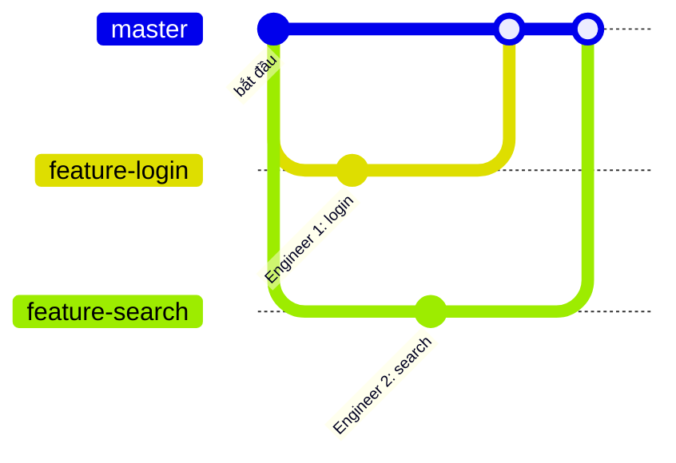
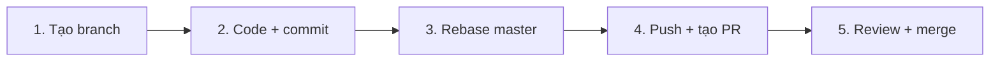
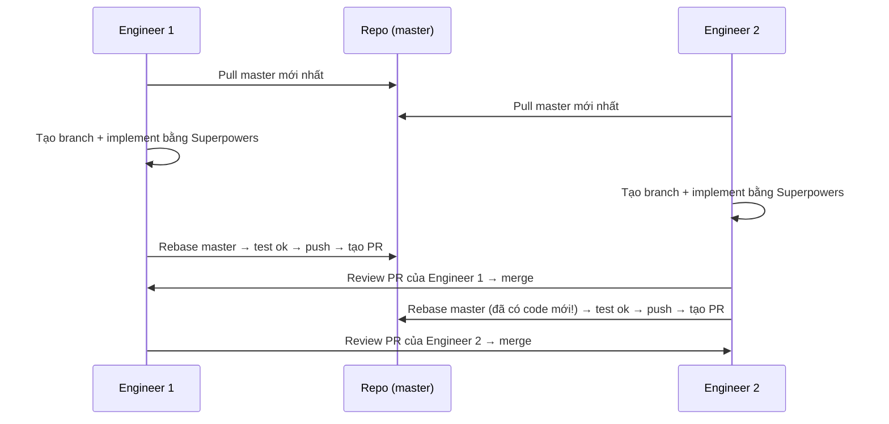

# Buổi 20: Sử dụng GitHub CLI để phối hợp làm việc trên cùng repo

## 🎯 Mục tiêu bài học

- Hiểu các keyword: **branch, commit, push, merge, rebase, PR, conflict**.
- Biết nói gì với agent ở từng bước khi làm chung 1 repo.
- Nắm vòng đời một feature: tạo branch → merge PR.
- Hiểu git nằm ở đâu trong workflow Superpowers.

:::tip
Học sinh **không tự gõ lệnh git**. Agent chạy lệnh — các em chỉ cần **hiểu ý nghĩa** để giao việc và review.
:::

---

## 1. Vì sao cần quy trình?

Cả nhóm sửa thẳng vào `master` thì code đè lên nhau. Quy tắc: **mỗi feature một branch**, xong tạo PR để nhóm review trước khi vào `master`.



---

## 2. Từ điển keyword 📚

| Keyword | Hiểu đơn giản |
|---|---|
| `repo` | Ngôi nhà chung chứa code của nhóm |
| `branch` | Bản sao riêng để làm việc, không ảnh hưởng người khác |
| `commit` | Một lần "lưu game" — chụp lại thay đổi kèm mô tả |
| `push` | Đẩy commit từ máy mình lên GitHub |
| `pull` | Kéo code mới nhất từ GitHub về máy |
| `merge` | Trộn code từ branch này vào branch khác |
| `rebase` | Xếp commit của mình lên trên code mới nhất |
| `Pull Request (PR)` | "Code tôi xong rồi, mọi người xem rồi cho vào chung nhé" |
| `conflict` | Hai người sửa cùng một chỗ — phải chọn giữ bên nào |
| `gh` | GitHub CLI — lệnh để agent làm việc với GitHub |

---

## 3. Vòng đời một feature 💪



### Bước 1: Tạo branch khi bắt đầu feature

Không code thẳng trên `master`.

**Nói với agent:**

```text
Tạo branch feature/search-book từ master mới nhất, rồi bắt đầu làm tính năng tìm kiếm sách.
```

**Agent chạy:**

```bash
git checkout master && git pull origin master
git checkout -b feature/search-book
```

### Bước 2: Commit trong lúc làm

Xong một phần có ý nghĩa thì commit — nhỏ và thường xuyên.

**Agent chạy:**

```bash
git add .
git commit -m "Thêm ô tìm kiếm ở màn hình danh sách sách"
```

### Bước 3: Lấy master mới nhất trước khi push

Trong lúc mình làm, master có thể đã có code mới. Hai cách lấy về:

| Cách | Hiểu đơn giản |
|---|---|
| `merge` | Trộn master vào branch mình — lịch sử có thêm 1 commit trộn |
| `rebase` | Nhấc commit của mình đặt lên trên master mới nhất — lịch sử gọn hơn |

**Nói với agent:**

```text
Rebase branch này lên master mới nhất. Có conflict thì giải thích cho tôi trước khi sửa.
```

**Agent chạy:**

```bash
git fetch origin
git rebase origin/master
```

:::warning Conflict là chuyện bình thường
Hai người sửa cùng một chỗ, không phải lỗi của ai. Hỏi agent: *"Bên nào sửa gì, nên giữ bên nào?"* — rồi quyết định, agent sửa giúp.
:::

### Bước 4: Push và tạo PR

**Nói với agent:**

```text
Push branch này lên GitHub và tạo PR vào master. Mô tả: làm gì, sửa file nào, đã kiểm tra ra sao.
```

**Agent chạy:**

```bash
git push origin feature/search-book
gh pr create --title "Thêm tính năng tìm kiếm sách" --body "..."
```

### Bước 5: Review và merge

Đừng merge thứ mình không hiểu — nhờ agent tóm tắt trước.

**Nói với agent:**

```text
Tóm tắt PR #12: thay đổi gì, có đụng code tính năng khác không, có gì cần lưu ý trước khi merge?
```

**Agent chạy:**

```bash
gh pr view 12
gh pr diff 12
gh pr merge 12
```

Checklist trước khi merge:

```text
[ ] Hiểu PR này làm gì
[ ] Không sửa lan man ngoài phạm vi
[ ] Không đụng code tính năng của người khác
[ ] Đã chạy thử / analyze không lỗi
```

---

## 4. Git trong workflow Superpowers ⚡

Dùng Superpowers (buổi 6) thì agent **tự động** làm đúng quy trình trên:

| Pha Superpowers | Git tự chèn vào |
|---|---|
| 1. Brainstorm + spec | Chưa đụng git |
| 2. Viết plan | Tạo **branch riêng** |
| 3. Execute + validate | **Commit** sau mỗi bước |
| 4. Review + hoàn thành | Skill `finishing-a-development-branch` hỏi: merge, **tạo PR**, hay dọn branch? |

Agent tự tạo branch hay tự commit là quy trình đúng, không phải "tự tiện". Việc của mình: đọc tên branch, commit message và duyệt PR.

---

## 5. Thực hành trên lớp 🎮

Nhóm 2 người, cùng 1 repo, mỗi người 1 yêu cầu:

- **Engineer 1:** thêm lọc theo danh mục.
- **Engineer 2:** thêm sắp xếp theo ngày.

Làm song song, **người này review và merge PR của người kia**.



:::tip
Ai tạo PR sau phải rebase lại vì master vừa nhận code của người kia — lúc này dễ gặp conflict thật.
:::

### Một session hoàn chỉnh — 5 bước

```text
1. Checkout master, pull code mới nhất.
2. Tạo branch cho feature của mình.
3. Implement theo 4 pha Superpowers (agent tự commit từng bước).
4. Rebase master mới nhất → test/analyze lại → ok mới push + tạo PR.
5. Teammate đọc hiểu PR rồi mới merge.
```

### Prompt cho người làm feature

```text
Tôi bắt đầu session làm feature [tên feature] trên repo chung của nhóm.
- Checkout master, pull code mới nhất, tạo branch mới cho feature.
- Implement theo workflow Superpowers, commit từng bước với message rõ ràng.
- Xong: rebase lên master mới nhất (có conflict thì giải thích cho tôi trước),
  chạy lại test/analyze, ok mới push và tạo PR vào master.
Không merge PR — teammate của tôi sẽ review và merge.
```

### Prompt cho người review

```text
Tóm tắt PR #[số] của teammate tôi: thay đổi gì, sửa file nào,
có đụng code feature của tôi không, test đã chạy chưa?
Tôi đọc hiểu và thấy ổn rồi thì merge PR này vào master.
```

:::note Ghi chú cho giáo viên
Muốn cả lớp thấy conflict thật: giao 2 feature cố tình đụng cùng một file.
:::

---

## ✅ Tóm tắt kiến thức

```text
branch   = chỗ làm việc riêng, không đụng ai
commit   = lưu lại thay đổi kèm mô tả
rebase master = lấy code mới nhất về trước khi push
push     = đưa code mình lên GitHub
PR       = xin nhóm review trước khi cho vào chung
conflict = 2 người sửa cùng chỗ, bình thường, agent hỗ trợ sửa
Superpowers = agent tự làm đúng quy trình git, mình chỉ cần hiểu để review
```

---

## 📝 Bài tập về nhà

1. **Giải nghĩa keyword:** viết lại 10 keyword bằng lời của mình, mỗi từ 1 câu.
2. **Làm 1 feature đúng quy trình:** giao agent làm một thay đổi nhỏ, đi đủ 5 bước từ branch đến PR. Chụp lại link PR.
3. **Đọc PR của bạn:** nhờ agent tóm tắt 1 PR của người khác và viết 3 dòng nhận xét.

---

_Chúc các em phối hợp nhóm thật mượt! 💪_
