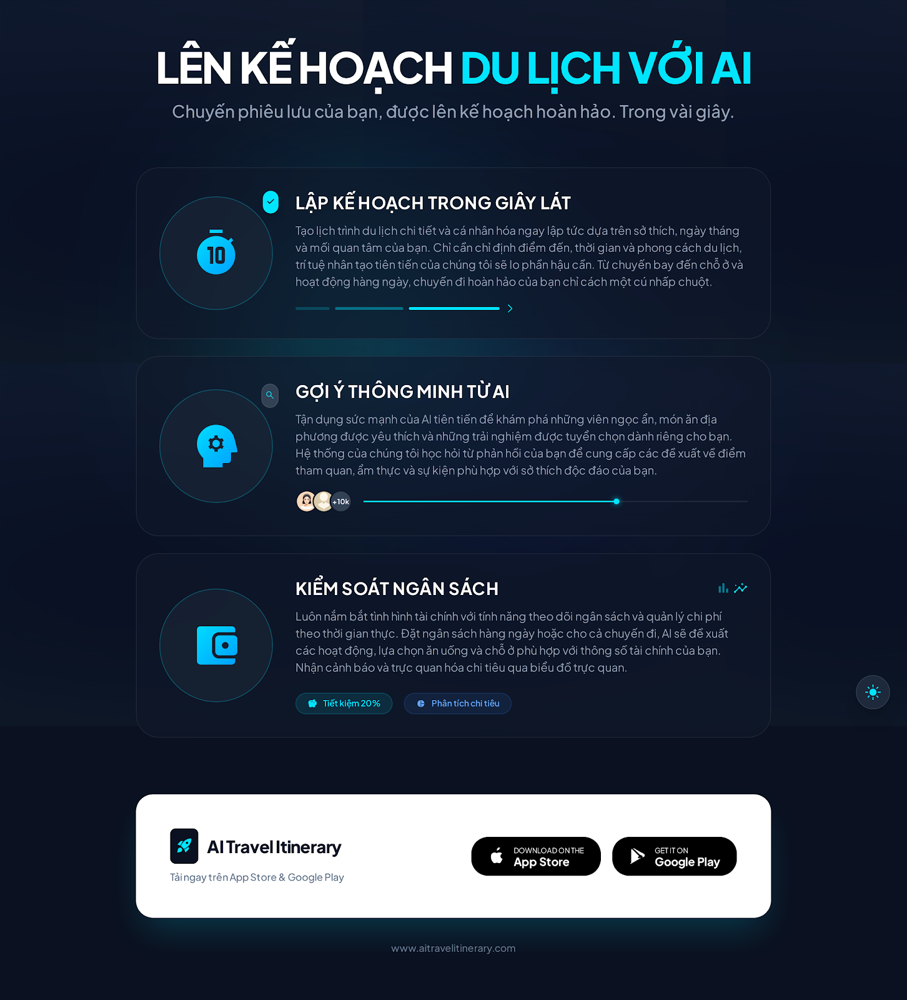
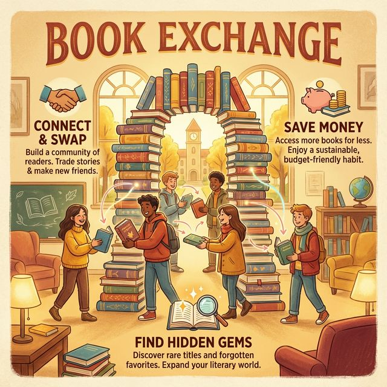
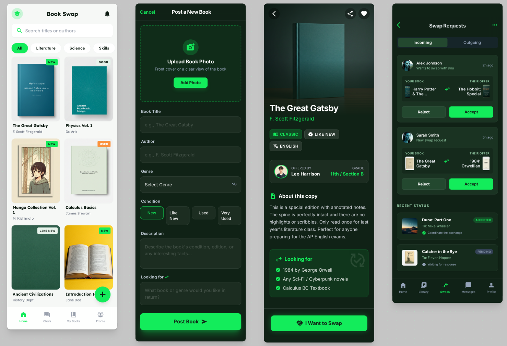
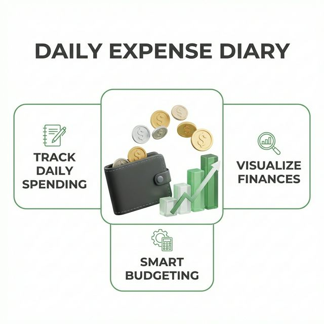
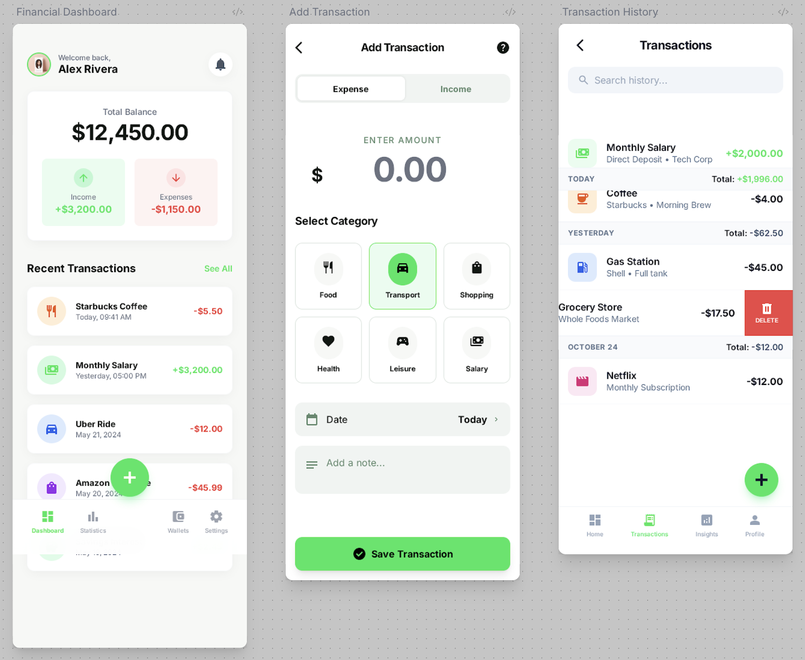

# Tổng Quan Infographic & Mockup

Dự án cuối khóa:

## 1. AI Travel Itinerary (Lịch Trình Du Lịch Thông Minh)
**Mô tả Concept:** Ứng dụng lập kế hoạch du lịch thông minh giúp người dùng tạo lịch trình chi tiết chỉ trong vài giây.
- **Tính năng chính:** Nhập điểm đến, sở thích và ngân sách để AI tự động gợi ý lịch trình từng ngày, bao gồm địa điểm ăn uống, tham quan và chi phí dự kiến.
- **Điểm nổi bật:** Timeline trực quan, dễ dàng chỉnh sửa và tối ưu hóa ngân sách.

### Poster Infographic

### Giao diện Ứng dụng (Mockup)

---

## 2. Book Exchange (Sàn Trao Đổi Sách)
**Mô tả Concept:** Nền tảng kết nối cộng đồng học sinh/sinh viên để trao đổi sách cũ.
- **Tính năng chính:** Đăng sách cần đổi, tìm kiếm sách theo thể loại, chat trực tiếp để thỏa thuận.
- **Điểm nổi bật:** Tiết kiệm chi phí mua sách, khuyến khích văn hóa đọc và bảo vệ môi trường bằng cách tái sử dụng sách.

### Poster Infographic

### Giao diện Ứng dụng (Mockup)

---

## 3. Daily Expense Diary (Sổ Thu Chi Cá Nhân)
**Mô tả Concept:** Ứng dụng quản lý tài chính cá nhân đơn giản dành cho học sinh, sinh viên.
- **Tính năng chính:** Ghi chép thu chi hàng ngày nhanh chóng, xem báo cáo thống kê theo biểu đồ, đặt hạn mức chi tiêu.
- **Điểm nổi bật:** Giao diện tối giản, dễ sử dụng, giúp hình thành thói quen quản lý tài chính từ sớm.

### Poster Infographic

### Giao diện Ứng dụng (Mockup)

---

## 4. Smart Diet (Trợ Lý Dinh Dưỡng AI)
**Mô tả Concept:** Ứng dụng gợi ý bữa ăn thông minh dựa trên trạng thái cơ thể và mục tiêu của người dùng.
- **Tính năng chính:** Gợi ý món ăn dựa trên nguyên liệu có sẵn và trạng thái (Tập gym, Học bài, Nghỉ ngơi). Đặc biệt có chế độ "Cheat Mode" cho những ngày muốn ăn uống thoải mái.
- **Điểm nổi bật:** Cân bằng giữa sức khỏe và sở thích, cá nhân hóa thực đơn theo nhu cầu thực tế.

### Poster Infographic

### Giao diện Ứng dụng (Mockup)

---
